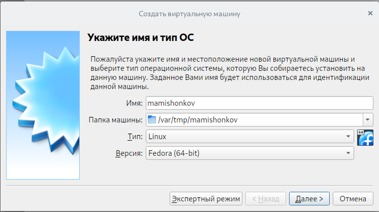
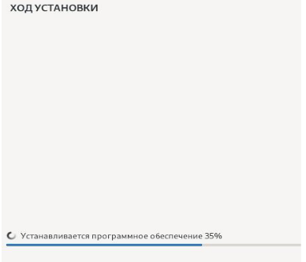
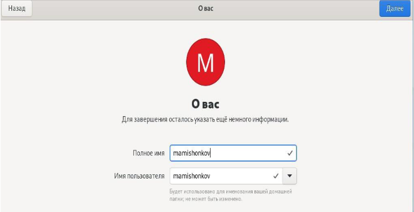
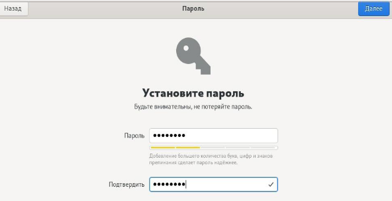
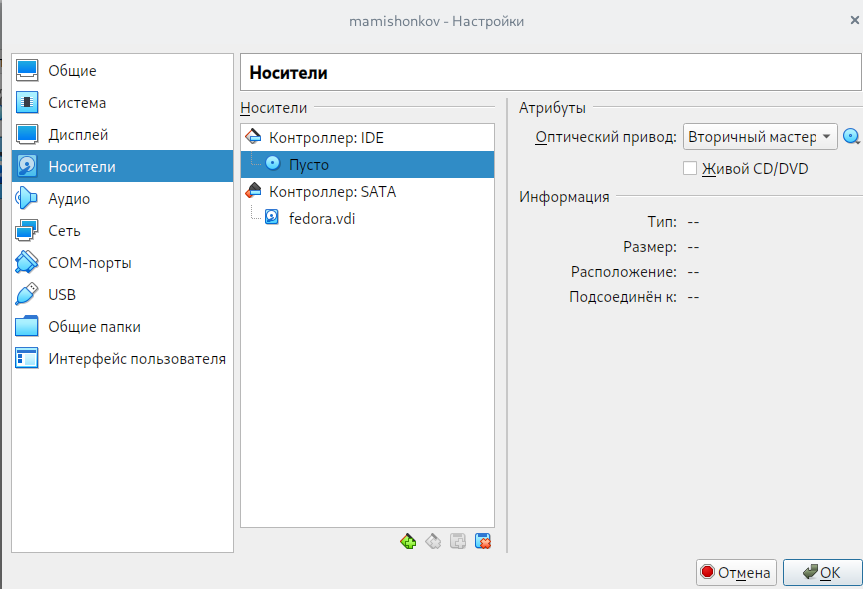
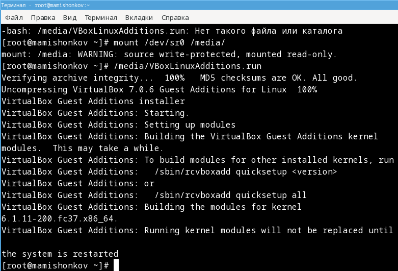
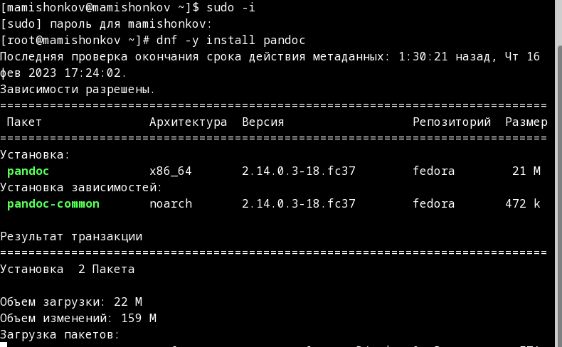
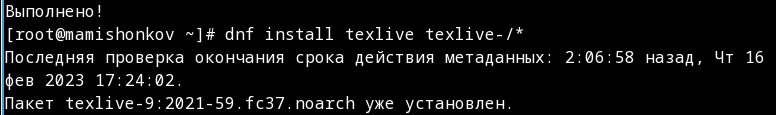

---
## Front matter
lang: ru-RU
title: Отчёт по лабораторной работе №1
subtitle: дисциплина "Операционные системы"
author:
  - Мишонков М. А.
institute:
  - Российский университет дружбы народов, Москва, Россия
date: 18 января 2023

## i18n babel
babel-lang: russian
babel-otherlangs: english

## Formatting pdf
toc: false
toc-title: Содержание
slide_level: 2
aspectratio: 169
section-titles: true
theme: metropolis
header-includes:
 - \metroset{progressbar=frametitle,sectionpage=progressbar,numbering=fraction}
 - '\makeatletter'
 - '\beamer@ignorenonframefalse'
 - '\makeatother'
---

# Вводная часть

## Цель работы

Целью данной лабораторной работы является установка операционной системы Linux (дистрибутив Fedora 36) на виртуальную машину VirtualBox и настройка минимально необходимых параметров для дальнейшей работы с системой. 

# Основная часть

## Создание виртуальной машины

- Создадим виртуальную машину, указав имя виртуальной машины и тип операционной системы.

## Запуск операционной системы

- После установки необходимых параметров запустим установку операционной системы.

## Имя пользователя и пароль 

- Для завершения установки операционной системы укажем имя пользователя и установим пароль.

## Изъятие образа диска

- После окончательной установки очень важно перезагрузить машину и изъять диск из привода.

## Необходимые установки

- В меню виртуальной машины подключим образ диска дополнений гостевой ОС и подмонтируем диск. 

## Необходимые установки

- Установим драйвера: /media/VBoxLinuxAdditions.run, после чего перезагрузим виртуальную машину. 

## Установка pandoc

- Установим pandoc.

## Установка TeXlive

- Установим TeXlive. Видим, что он установился.

# Заключение 

## Вывод

В ходе выполнения данной лабораторной работы я установил операционную систему Linux (дистрибутив Fedora 36) на вирутальную машину VIrtualBox и настроил минимально необходимые параметры для дальнейшей работы с ситемой.

