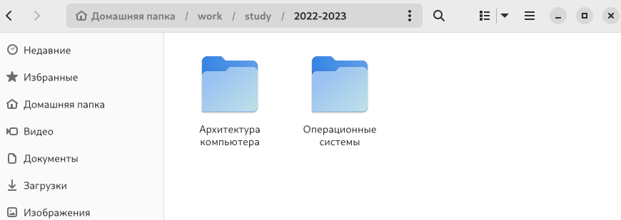
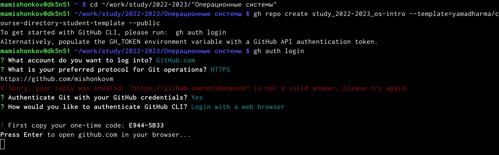
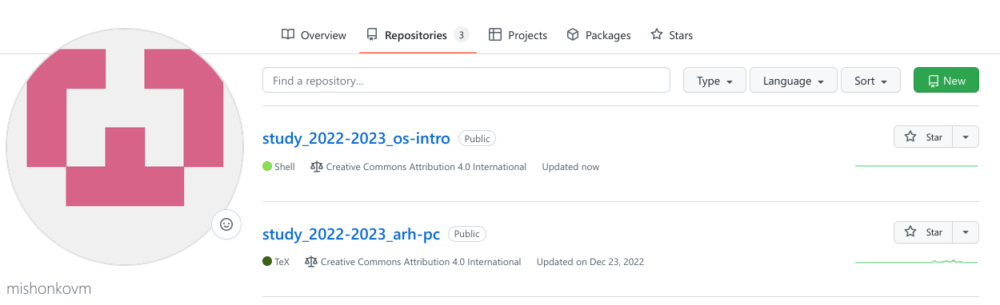
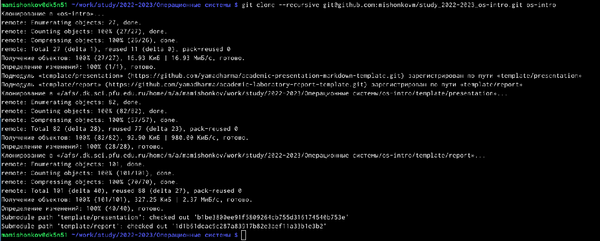
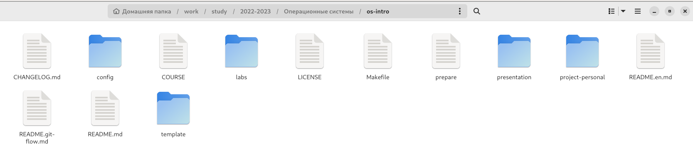
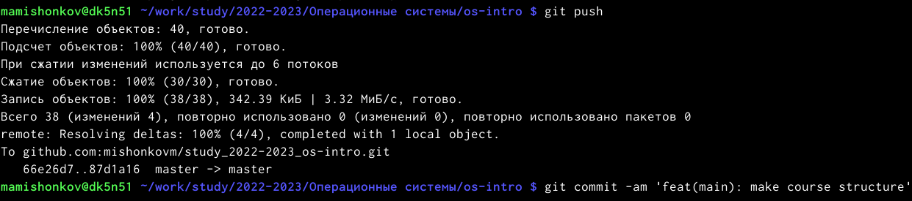
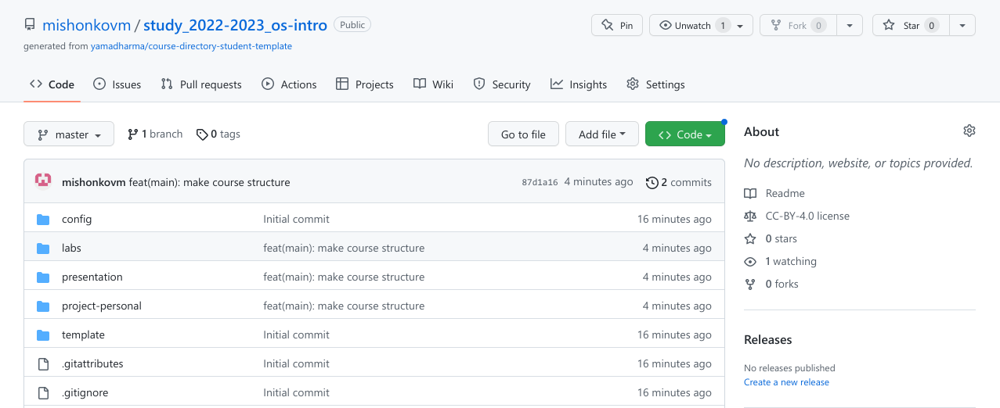

---
## Front matter
lang: ru-RU
title: Отчёт по лабораторной работе №2
subtitle: дисциплина "Операционные системы"
author:
  - Мишонков М. А.
institute:
  - Российский университет дружбы народов, Москва, Россия
date: 18 февраля 2023

## i18n babel
babel-lang: russian
babel-otherlangs: english

## Formatting pdf
toc: false
toc-title: Содержание
slide_level: 2
aspectratio: 169
section-titles: true
theme: metropolis
header-includes:
 - \metroset{progressbar=frametitle,sectionpage=progressbar,numbering=fraction}
 - '\makeatletter'
 - '\beamer@ignorenonframefalse'
 - '\makeatother'
---

# Вводная часть

## Цель работы

Целью данной лабораторной работы является изучение идеологии и применения средств системы контроля версий Git, а также приобретение практических навыков работы с ней.

# Основная часть

## Создание каталога "Операционные системы"

- Создадим каталог "Операционные системы"

## Создание репозитория на GitHub

- Заходим в созданный каталог "Операционные системы", вводим команду для создания репозитория.

## Создание репозитория на GitHub

- После процесса авторизации видим, что репозиторий был создан. 

## Клонирование репозитория 

- Клонируем созданный репозиторий. 

## Удаление фийлов и создание каталогов 

- Удалим лишние файлы и создадим необходимые каталоги.

## Отправка файлов на сервер

- Добавим все изменения и совершим коммит, запушим все изменения. 

## Отправка файлов на сервер

- Видим, что нужные нам файлы выгрузились на GitHub.

# Заключение

## Вывод

В ходе выполнения данной лабораторной работы я создал каталог "Операционные системы" и новый репозиторий на сервере GitHub на основе шаблона, внёс в него изменения. Также я создал рабочее пространство для выполнения следующих лабораторных работ. 
