---
## Front matter
title: "Отчёт по лабораторной работе №2"
subtitle: "*дисциплина: Операционные системы*"
author: "Максим Александрович Мишонков"

## Generic otions
lang: ru-RU
toc-title: "Содержание"

## Bibliography
bibliography: bib/cite.bib
csl: pandoc/csl/gost-r-7-0-5-2008-numeric.csl

## Pdf output format
toc: true # Table of contents
toc-depth: 2
lof: true # List of figures
fontsize: 12pt
linestretch: 1.5
papersize: a4
documentclass: scrreprt
## I18n polyglossia
polyglossia-lang:
  name: russian
  options:
	- spelling=modern
	- babelshorthands=true
polyglossia-otherlangs:
  name: english
## I18n babel
babel-lang: russian
babel-otherlangs: english
## Fonts
mainfont: PT Serif
romanfont: PT Serif
sansfont: PT Sans
monofont: PT Mono
mainfontoptions: Ligatures=TeX
romanfontoptions: Ligatures=TeX
sansfontoptions: Ligatures=TeX,Scale=MatchLowercase
monofontoptions: Scale=MatchLowercase,Scale=0.9
## Biblatex
biblatex: true
biblio-style: "gost-numeric"
biblatexoptions:
  - parentracker=true
  - backend=biber
  - hyperref=auto
  - language=auto
  - autolang=other*
  - citestyle=gost-numeric
## Pandoc-crossref LaTeX customization
figureTitle: "Рис."
tableTitle: "Таблица"
listingTitle: "Листинг"
lofTitle: "Список иллюстраций"
lolTitle: "Листинги"
## Misc options
indent: true
header-includes:
  - \usepackage{indentfirst}
  - \usepackage{float} # keep figures where there are in the text
  - \floatplacement{figure}{H} # keep figures where there are in the text
---

# Цель работы

Целью данной лабораторной работы является изучение идеологии и применения средств системы контроля версий Git, а также приобретение практических навыков работы с ней.

# Задание

Научиться работать с системой контроля версий Git.

# Теоретическое введение

**Системы контроля версий (Version Control System, VCS)** применяются при работе нескольких человек над одним проектом. Обычно основное дерево проекта хранится в локальном или удалённом репозитории, к которому настроен доступ для участников проекта. При внесении изменений в содержание проекта система контроля версий позволяет их фиксировать, совмещать изменения, произведённые разными участниками проекта, производить откат к любой более ранней версии проекта, если это требуется.

Системы контроля версий поддерживают возможность отслеживания и разрешения конфликтов, которые могут возникнуть при работе нескольких человек над одним файлом. 

# Выполнение лабораторной работы

1. Создал каталог "Операционные системы". (рис. [-@fig:001], [-@fig:002])

{ #fig:001 width=70% }

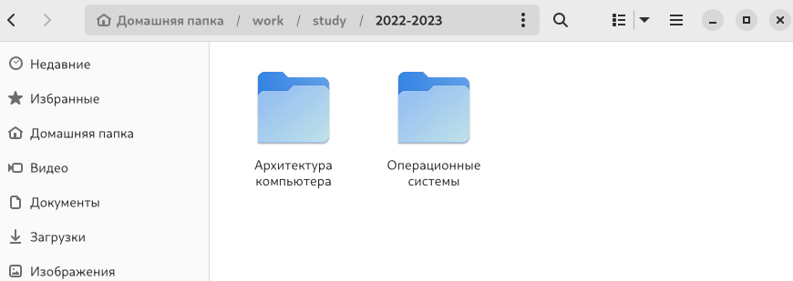{ #fig:002 width=70% }

2. Перешёл в каталог "Операционные системы" и начал процесс создания репозитория на GitHub. (рис. [-@fig:003], [-@fig:004], [-@fig:005], [-@fig:006], [-@fig:007], [-@fig:008], [-@fig:009])

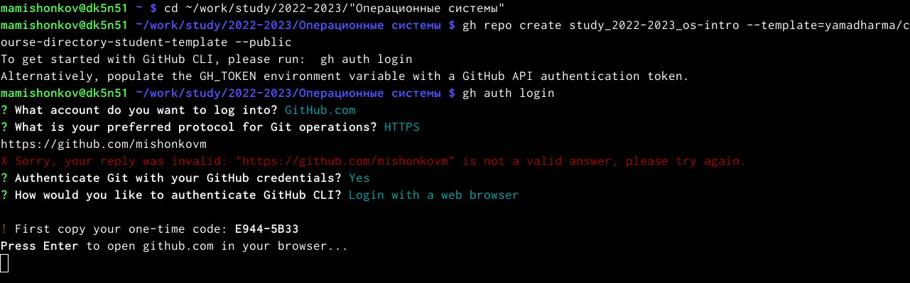{ #fig:003 width=70% }

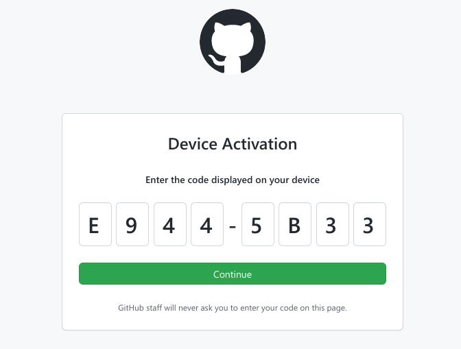{ #fig:004 width=70% }

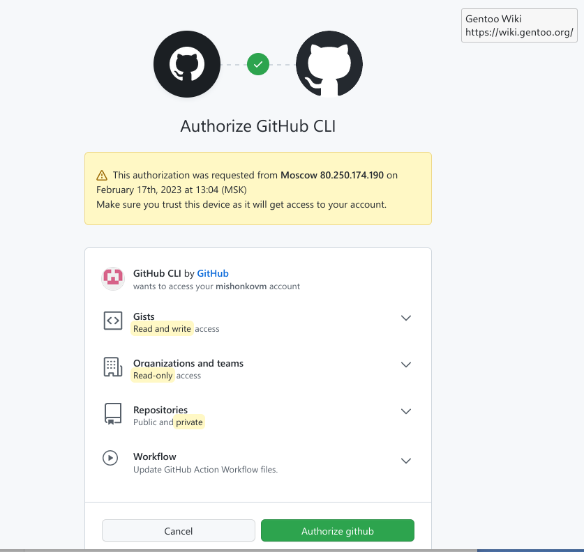{ #fig:005 width=70% }

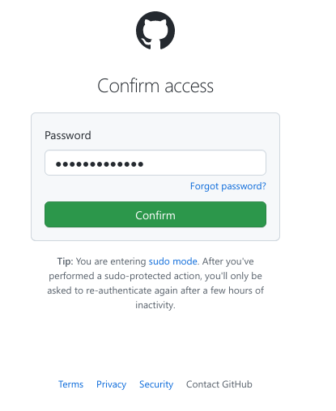{ #fig:006 width=70% }

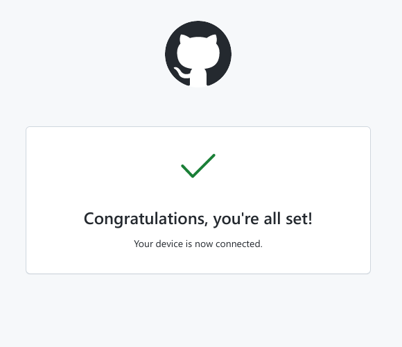{ #fig:007 width=70% }

{ #fig:008 width=70% }

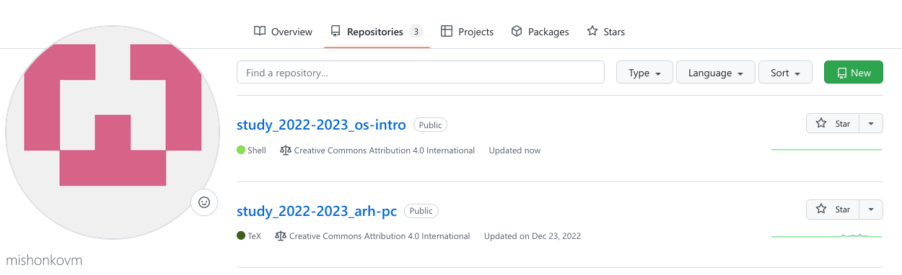{ #fig:009 width=70% }

3. Клонировал созданный репозиторий. (рис. [-@fig:010])

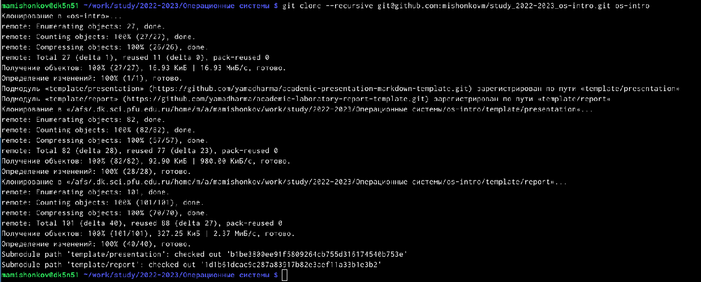{ #fig:010 width=70% }

4. Удалил лишние файлы и создал необходимые каталоги. (рис. [-@fig:011], [-@fig:012])

{ #fig:011 width=70% }

{ #fig:012 width=70% }

5. Отправил файлы на сервер. (рис. [-@fig:013], [-@fig:014], [-@fig:015], [-@fig:016], [-@fig:017])

{ #fig:013 width=70% }

{ #fig:014 width=70% }

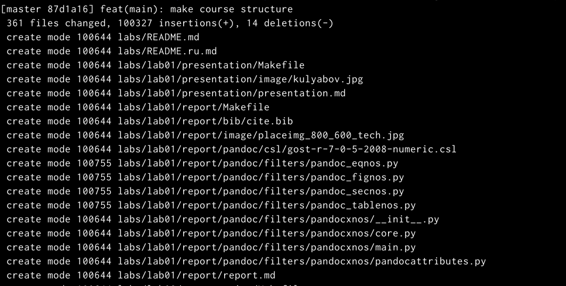{ #fig:015 width=70% }

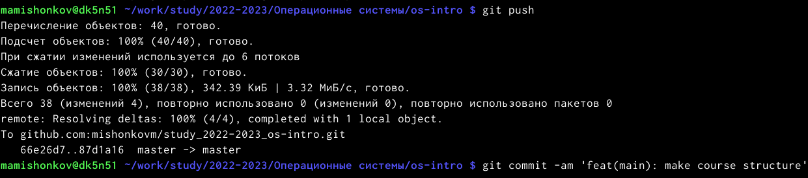{ #fig:016 width=70% }

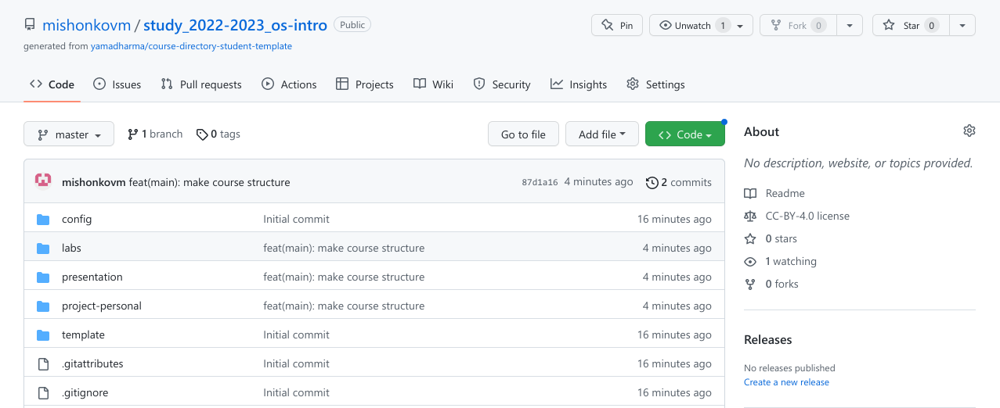{ #fig:017 width=70% }

**Ответы на контрольные вопросы**

1. Система управления версиями (Version Control System, VCS) — программное обеспечение для облегчения работы с изменяющейся информацией. Система управления версиями позволяет хранить несколько версий одного и того же документа, при необходимости возвращаться к более ранним версиям, определять, кто и когда сделал то или иное изменение, и многое другое.

2. В классических системах контроля версий используется централизованная модель, предполагающая наличие единого репозитория для хранения файлов. Выполнение большинства функций по управлению версиями осуществляется специальным сервером.Участник проекта (пользователь) перед началом работы посредством определённыхкоманд получает нужную ему версию файлов. После внесения изменений, пользователь размещает новую версию в хранилище. При этом предыдущие версии не удаляютсяиз центрального хранилища и к ним можно вернуться в любой момент. Сервер может сохранять неполную версию изменённых файлов, а производить так называемую дельта-компрессию—сохранять только изменения между последовательными версиями,чтопозволяет уменьшить объём хранимых данных.
Системы контроля версий также могут обеспечивать дополнительные, более гибкие функциональные возможности. Например,они могут поддерживать работу с нескольки-ми версиями одного файла,сохраняя общую историю изменений до точки ветвления версий и собственные истории изменений каждой ветви. Крометого, обычно доступна информация о том, кто из участников, когда и какие изменения вносил. Обычно такого рода информация хранится в журнале изменений, доступ к которому можно ограничить.

3. Централизованные системы — это системы, которые используют архитектуру клиент / сервер, где один или несколько клиентских узлов напрямую подключены к центральному серверу. Пример - Wikipedia. В децентрализованных системах каждый узел принимает свое собственное решение. Конечное поведение системы является совокупностью решений отдельных узлов. Пример — Bitcoin. В классических системах контроля версий используется централизованная модель, предполагающая наличие единого репозитория для хранения файлов.Выполнение большинства функций по управлению версиями осуществляется специальным сервером. 

4. Создадим локальный репозиторий. Сначала сделаем предварительную конфигурацию, указав имя и email владельца репозитория:
git config --global user.name"Имя Фамилия"
git config --global user.email"work@mail"
и настроив utf-8 в выводе сообщенийgit:
git config --global quotepath false
Для инициализации локального репозитория, расположенного, например, в каталоге ~/tutorial, необходимо ввести в командной строке:
cd
mkdir tutorial
cd tutorial
git init

5. Для последующей идентификации пользователя на сервере репозиториев необходимо сгенерировать пару ключей (приватный и открытый): ssh-keygen -C"Имя Фамилия <work@mail>". Ключи сохраняться в каталоге~/.ssh/. Скопировав из локальной консоли ключ в буфер обмена cat ~/.ssh/id_rsa.pub | xclip -sel clip вставляем ключ в появившееся на сайте поле.

6. У Git две основных задачи: первая — хранить информацию о всех изменениях в вашем коде, начиная с самой первой строчки, а вторая — обеспечение удобства командной работы над кодом.

7. Основные команды git:
Наиболее часто используемые команды git: – создание основного дерева репозитория:git init–получение обновлений (изменений)текущего дерева из центрального репозитория:git pull–отправка всех произведённых изменений локального дерева в центральный репози-торий:git push–просмотр списка изменённых файлов втекущей директории:git status–просмотртекущих изменения:git diff–сохранениетекущих изменений:–добавить все изменённые и/или созданные файлы и/или каталоги:git add .–добавить конкретные изменённые и/или созданные файлы и/или каталоги:git add имена_файлов – удалить файл и/или каталог из индекса репозитория (приэтомфайл и/илик аталог остаётся в локальной директории): git rm имена_файлов – сохранение добавленных изменений: – сохранить все добавленные изменения и все изменённые файлы: git commit -am 'Описание коммита'–сохранить добавленные изменения с внесением комментария через встроенный редактор:git commit–создание новой ветки, базирующейся натекущей: git checkout -b имя_ветки–переключение на некоторую ветку: git checkout имя_ветки (при переключении на ветку, которой ещё нет в локальном репозитории, она будет создана и связана с удалённой) – отправка изменений конкретной ветки в центральный репозиторий: git push origin имя_ветки–слияние ветки стекущим деревом:git merge --no-ff имя_ветки–удаление ветки: – удаление локальной уже слитой с основным деревом ветки:git branch -d имя_ветки–принудительное удаление локальной ветки:git branch -D имя_ветки–удаление ветки с центрального репозитория: git push origin :имя_ветки

8. Использования git при работе с локальными репозиториями (добавления текстового документа в локальный репозиторий):
git add hello.txt
git commit -am'Новый файл

9. Проблемы, которые решают ветки git:
- нужно постоянно создавать архивы с рабочим кодом 
- сложно "переключаться" между архивами 
- сложно перетаскивать изменения между архивами 
- легко что-то напутать или потерять

10. Во время работы над проектомтак или иначе могутсоздаваться файлы,которые нетребуется добавлять в последствии в репозиторий. Например, временные файлы, со-здаваемые редакторами,или объектные файлы, создаваемые компиляторами.Можно прописать шаблоны игнорируемых при добавлении в репозиторийтипов файлов в файл.gitignore с помощьюс ервисов. Для этого сначала нужно получить списоки меющихся шаблонов: curl -L -s https://www.gitignore.io/api/list
Затем скачать шаблон,например, для C и C++ 
curl -L -s https://www.gitignore.io/api/c >> .gitignore
curl -L -s https://www.gitignore.io/api/c++ >> .gitignore

# Выводы

В ходе выполнения данной лабораторной работы я создал каталог "Операционные системы" и новый репозиторий на сервере GitHub на основе шаблона, внёс в него изменения. Также я создал рабочее пространство для выполнения следующих лабораторных работ. 

