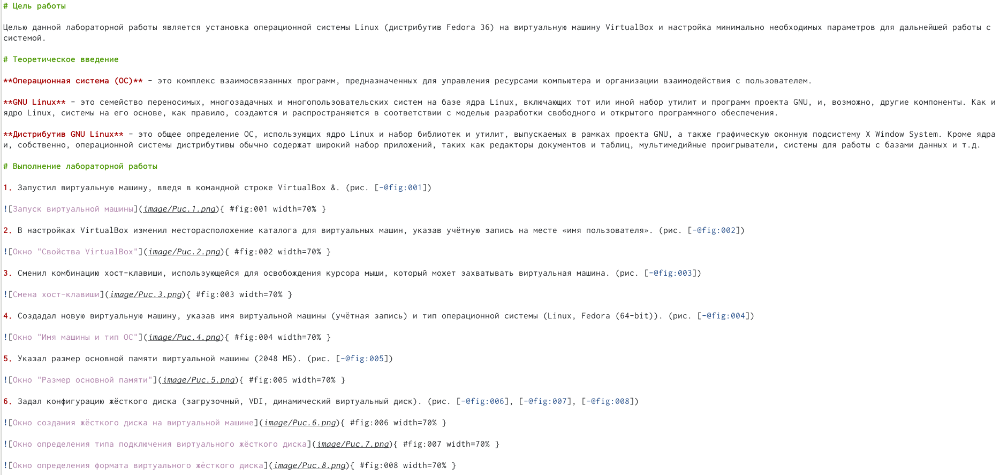
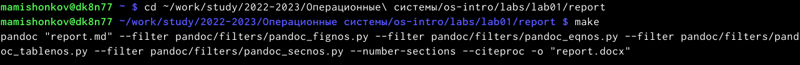
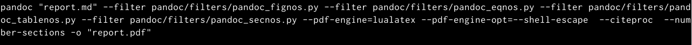

---
## Front matter
lang: ru-RU
title: Отчёт по лабораторной работе №3
subtitle: дисциплина "Операционные системы"
author:
  - Мишонков М. А.
institute:
  - Российский университет дружбы народов, Москва, Россия
date: 21 февраля 2023

## i18n babel
babel-lang: russian
babel-otherlangs: english

## Formatting pdf
toc: false
toc-title: Содержание
slide_level: 2
aspectratio: 169
section-titles: true
theme: metropolis
header-includes:
 - \metroset{progressbar=frametitle,sectionpage=progressbar,numbering=fraction}
 - '\makeatletter'
 - '\beamer@ignorenonframefalse'
 - '\makeatother'
---

# Вводная часть

## Цель работы

Научиться оформлять отчёты при помощи легковесного языка разметки Markdown.

# Основная часть

## Оформление лабораторной работы №2 в Markdown

- Напишем отчёт к лабораторной работе №2 в Markdown.

## Компиляция файлов

- Скомпилируем файлы docx и pdf при помощи команды make к лабораторной работе №2.

## Компиляция файлов

- Видим, что файлы были скомпилированы.

# Заключение

## Вывод

В ходе выполнения данной лабораторной работы я научился выполнять отчёты при помощи легковесного языка разметки Markdown, оформил отчёт по лабораторной работе №2 в Markdown.
