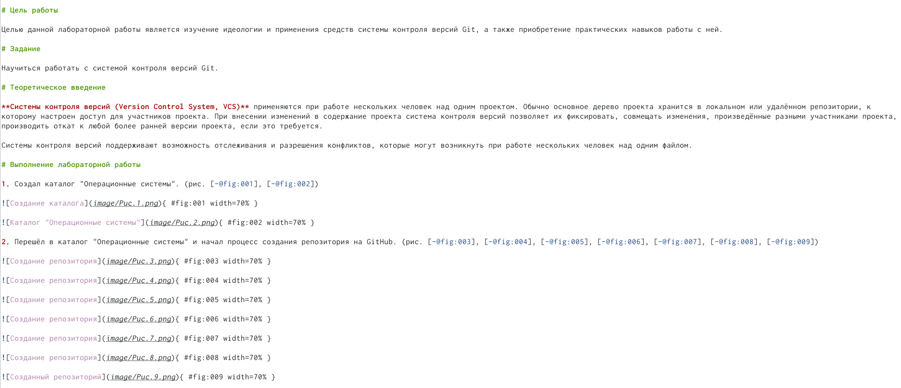
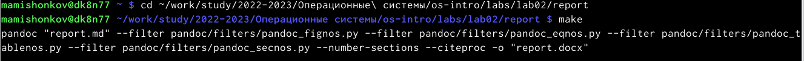
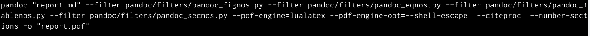
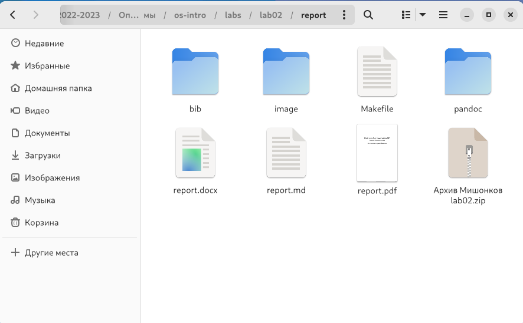

---
## Front matter
title: "Отчёт по лабораторной работе №3"
subtitle: "дисциплина: Операционные системы"
author: "Максим Александрович Мишонков"

## Generic otions
lang: ru-RU
toc-title: "Содержание"

## Bibliography
bibliography: bib/cite.bib
csl: pandoc/csl/gost-r-7-0-5-2008-numeric.csl

## Pdf output format
toc: true # Table of contents
toc-depth: 2
lof: true # List of figures
fontsize: 12pt
linestretch: 1.5
papersize: a4
documentclass: scrreprt
## I18n polyglossia
polyglossia-lang:
  name: russian
  options:
	- spelling=modern
	- babelshorthands=true
polyglossia-otherlangs:
  name: english
## I18n babel
babel-lang: russian
babel-otherlangs: english
## Fonts
mainfont: PT Serif
romanfont: PT Serif
sansfont: PT Sans
monofont: PT Mono
mainfontoptions: Ligatures=TeX
romanfontoptions: Ligatures=TeX
sansfontoptions: Ligatures=TeX,Scale=MatchLowercase
monofontoptions: Scale=MatchLowercase,Scale=0.9
## Biblatex
biblatex: true
biblio-style: "gost-numeric"
biblatexoptions:
  - parentracker=true
  - backend=biber
  - hyperref=auto
  - language=auto
  - autolang=other*
  - citestyle=gost-numeric
## Pandoc-crossref LaTeX customization
figureTitle: "Рис."
tableTitle: "Таблица"
listingTitle: "Листинг"
lofTitle: "Список иллюстраций"
lolTitle: "Листинги"
## Misc options
indent: true
header-includes:
  - \usepackage{indentfirst}
  - \usepackage{float} # keep figures where there are in the text
  - \floatplacement{figure}{H} # keep figures where there are in the text
---

# Цель работы

Научиться оформлять отчёты при помощи легковесного языка разметки Markdown.

# Задание

Оформить отчёт по лабораторной работе №2 в Markdown.

# Теоретическое введение

**Markdown** - это облегчённый язык разметки, созданный с целью обозначения форматирования в простом тексте, с максимальным сохранением его читаемости человеком, и пригодный для машинного преобразования в языки для продвинутых публикаций.

# Выполнение лабораторной работы

1. Написал отчёт к лабораторной работе №2 в Markdown. (рис. [-@fig:001])

{ #fig:001 width=70% }

2. Скомпилировал файлы docx и pdf при помощи команды make. (рис. [-@fig:002], [-@fig:003])

{ #fig:002 width=70% }

{ #fig:003 width=70% }

3. Зашёл в папку report и убедился, что файлы были созданы. (рис. [-@fig:004])

{ #fig:004 width=70% }

# Выводы

В ходе выполнения данной лабораторной работы я научился работать в Markdown, оформил отчёт по лабораторной работе №2 в Markdown.

