---
## Front matter
lang: ru-RU
title: Отчёт по лабораторной работе №4
subtitle: дисциплина "Операционные системы"
author:
  - Мишонков М. А.
institute:
  - Российский университет дружбы народов, Москва, Россия
date: 3 марта 2023

## i18n babel
babel-lang: russian
babel-otherlangs: english

## Formatting pdf
toc: false
toc-title: Содержание
slide_level: 2
aspectratio: 169
section-titles: true
theme: metropolis
header-includes:
 - \metroset{progressbar=frametitle,sectionpage=progressbar,numbering=fraction}
 - '\makeatletter'
 - '\beamer@ignorenonframefalse'
 - '\makeatother'
---

# Вводная часть

## Цель

Целью данной лабораторной работы является приобретение практических навыков взаимодействия пользователя с системой посредством командной строки.

# Основная часть 

## Имя домашнего каталога

- Определил полное имя домашнего каталога.

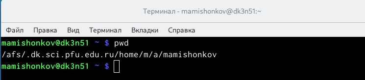

## Каталог /tmp и его содержимое

- Перешёл в каталог /tmp и вывел его содержимое при помощи команды ls.

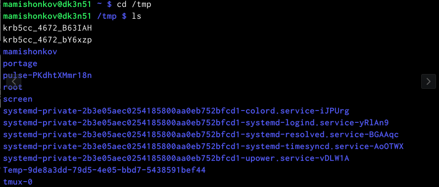

## Команда ls для каталога /tmp с различными опциями

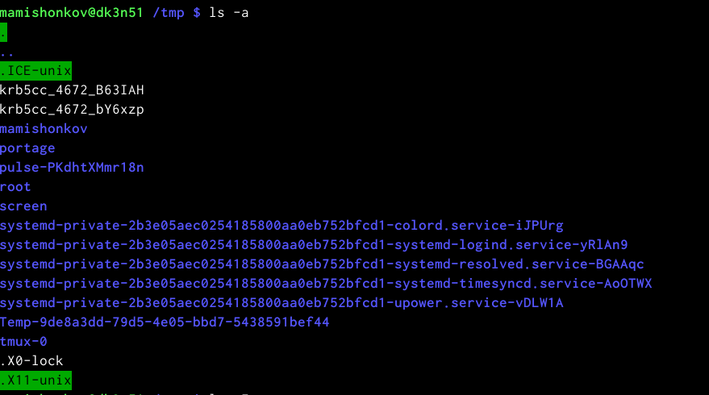

## Команда ls для каталога /tmp с различными опциями

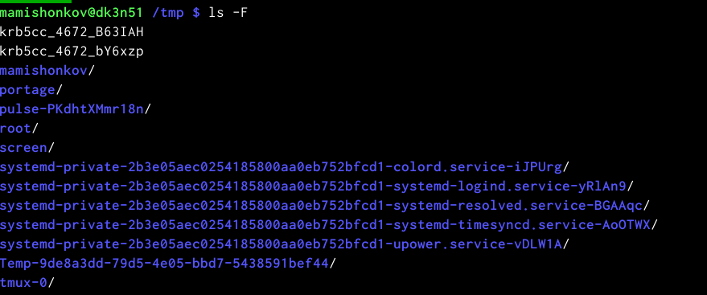

## Команда ls для каталога /tmp с различными опциями

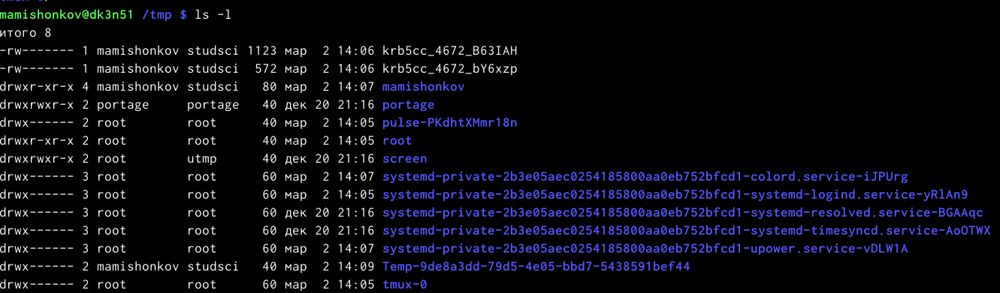

## Команда ls для каталога /tmp с различными опциями

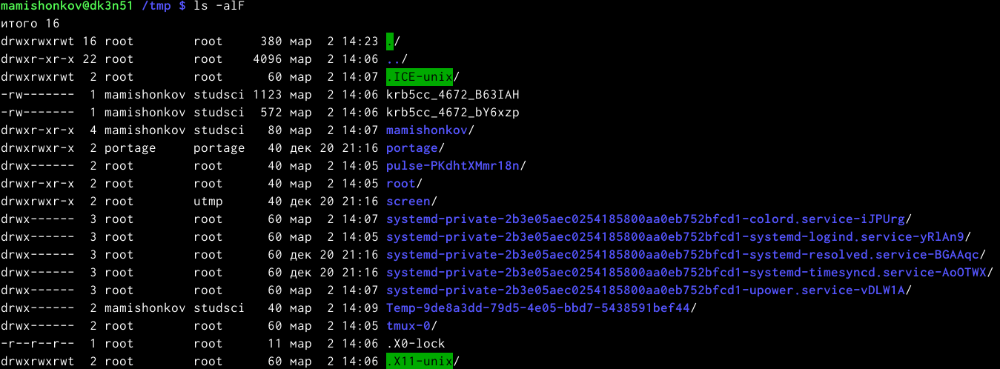

## Подкаталог с именем cron

- Определил, есть ли в каталоге /var/spool подкаталог с именем cron. Видим, что данный подкаталог существует.

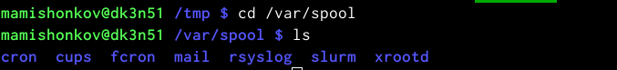

## Содержимое домашнего каталога 

- Перешёл в домашний каталог и вывел его содержимое.

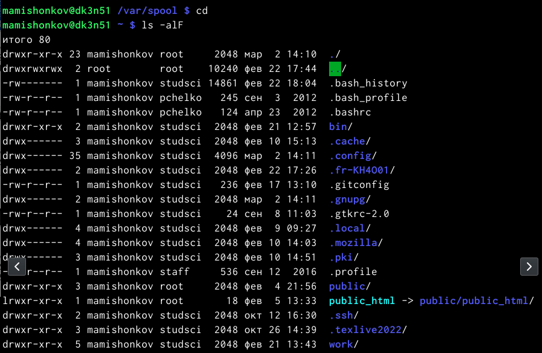

## Каталог с именем newdir и каталог с именем morefun

- В домашнем каталоге создал новый каталог с именем newdir, создал в нём каталог с именем morefun.

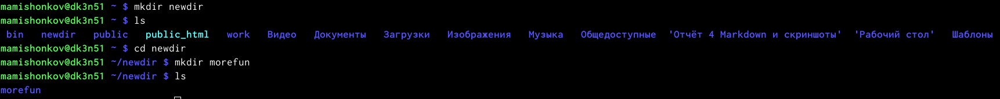

## Каталоги с именами letters, memo, misk

- В домашнем каталоге создал одной командой три новых каталога с именами letters, memo, misk, затем удалил эти каталоги одной командой. 

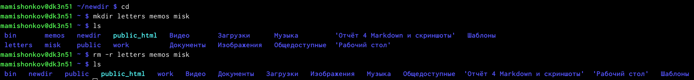

## Удаление каталогов

- Попробовал удалить раннее созданный каталог ~/newdir командой rm. Каталог не был удалён, так как данный каталог содержит подкаталог и требует при удалении использовать опцию -r. Удалил каталог ~/newdir/morefun. 

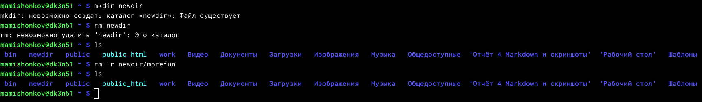

## Просмотр команд для man

- При помощи команды man определил, какую опцию команды ls нужно использовать для просмотра содержимого не только указанного каталога, но и подкаталогов, входящих в него. Определил набор опций команды ls, позволяющей отсортировать по времени последнего изменения выводимый список содержимого каталога с развёрнутым описанием файлов. Используя команду man для команд cd, pwd, mkdir, rmdir, rm, просмотрел описание соответствующих команд.

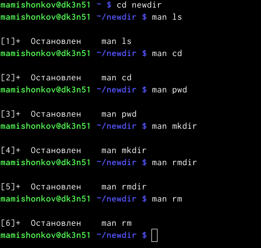

## Man ls

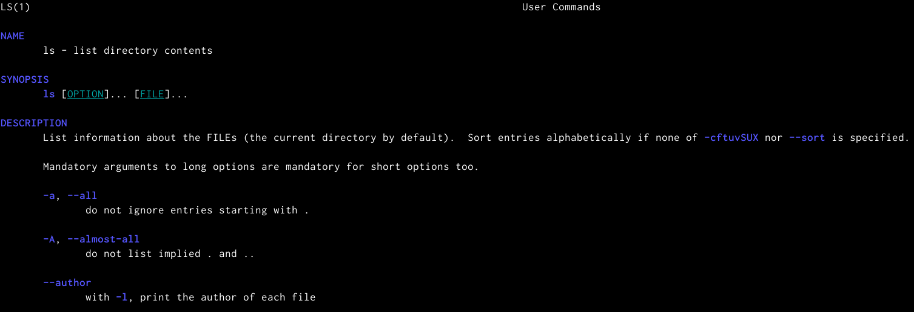

## Man cd

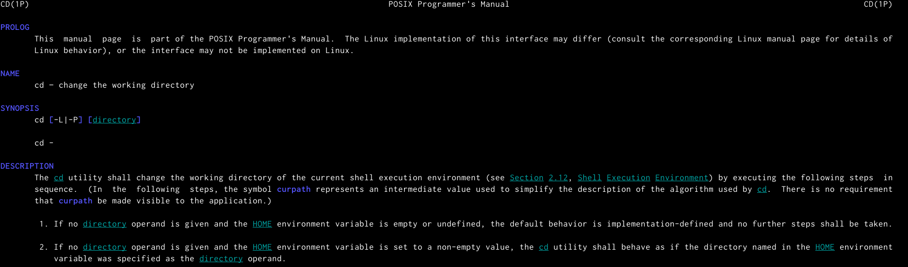

## Man pwd

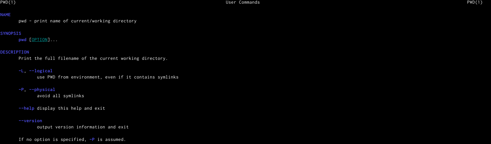

## Man mkdir

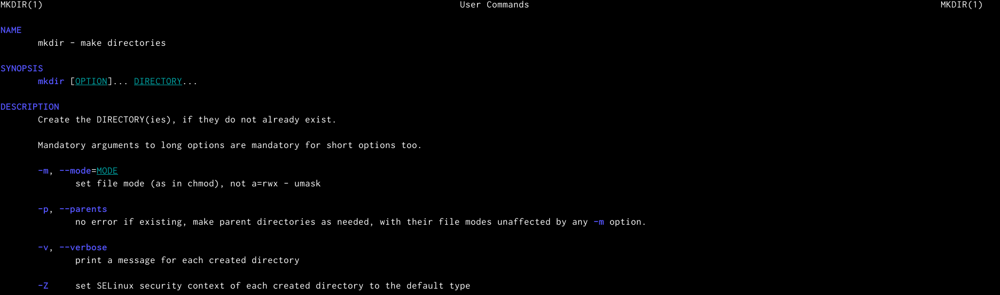

## Man rmdir

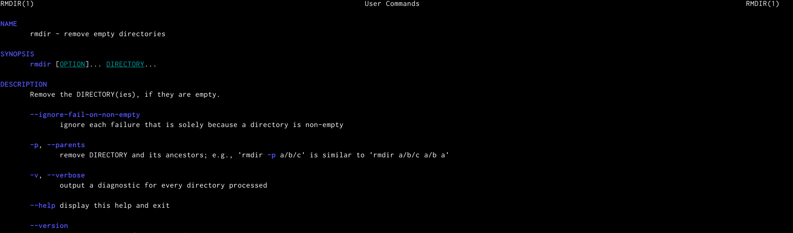

## Man rm

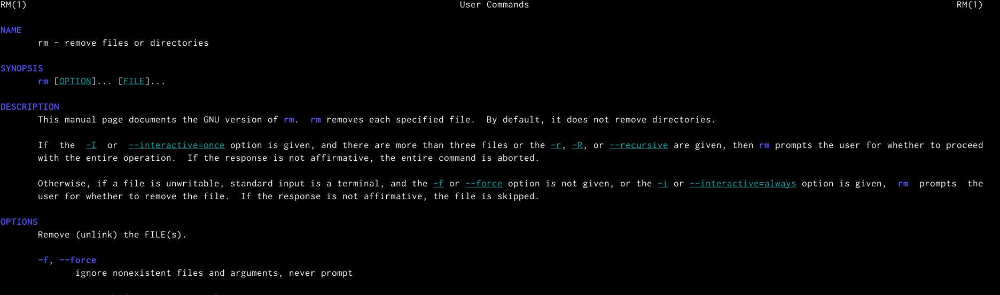

## Команда history

- Используя информацию, полученную при помощи команды history, выполнил модификацию и исполнение нескольких команд из буфера команд.

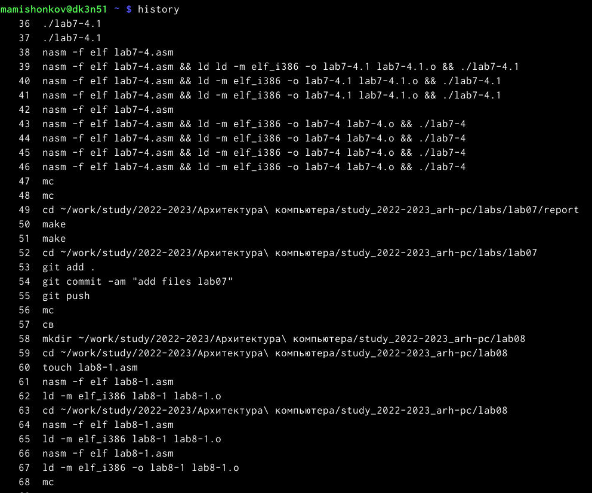

## Команда history

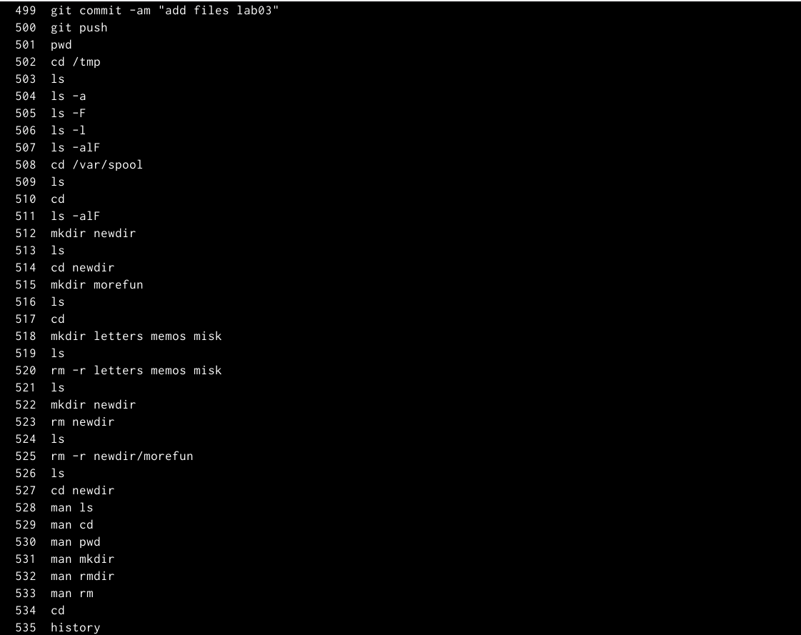

## Модификация и исполнение команд из буфер команд

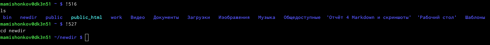

# Заключение

## Вывод

В ходе выполнения данной лабораторной работы я приобрёл навыки взаимодействия пользователя с системой посредством командной строки.
