---
## Front matter
lang: ru-RU
title: Отчёт по лабораторной работе №5
subtitle: дисциплина "Операционные системы"
author:
  - Мишонков М.А.
institute:
  - Российский университет дружбы народов, Москва, Россия
date: 10 марта 2023

## i18n babel
babel-lang: russian
babel-otherlangs: english

## Formatting pdf
toc: false
toc-title: Содержание
slide_level: 2
aspectratio: 169
section-titles: true
theme: metropolis
header-includes:
 - \metroset{progressbar=frametitle,sectionpage=progressbar,numbering=fraction}
 - '\makeatletter'
 - '\beamer@ignorenonframefalse'
 - '\makeatother'
---

# Вводная часть

## Цель

Целью данной лабораторной работы является ознакомление с файловой системой linux, именами и содержанием каталогов. Приобретение практических навыков по применению команд для работы с файлами и каталогами, по управлению процессами, по проверке использования диска и обслуживанию файловой системы.

# Основная часть

## Выполнение примеров, описанных в лабораторной работы

- Создал файл abc1, скопировал его в файл april и файл may. Создал каталог monthly, скопировал файлы april и may в каталог monthly. Скопировал файл monthly/may в файл с именем june. Создал каталог monthly.00, скопировал каталог monthly в каталог monthly.00 и в катлог /tmp.

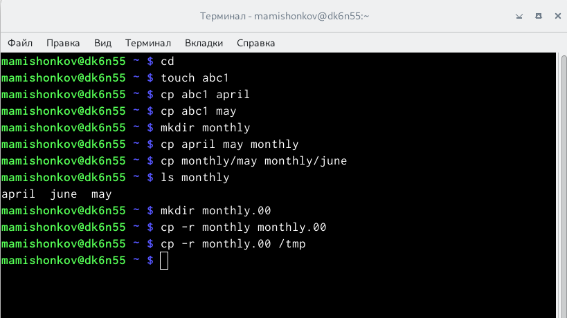

## Перемещение и переименование файлов и каталогов

- Изменил название файла april на july в домашнем каталоге. Переместил файл july в каталог monthly.00. Переменовал каталог monthly.00 в monthly.01. Переместил каталог monthly.00 в каталог reports. Переименовал каталог reports/monthly.01 в reports/monthly.

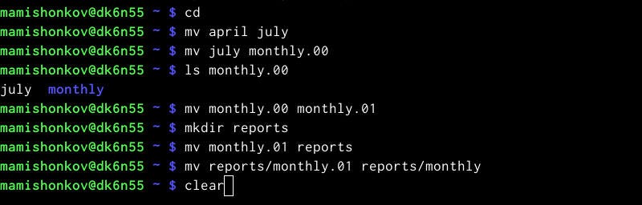

## Копирование файла в домашний каталог

- Скопировал файл /usr/include/sys/io.h в домашний каталог и назвал его equipment.

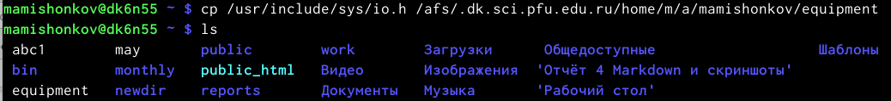

## Создание каталога и перемещение в него файла

- В домашнем каталоге создал директорию ski.plases. Переместил файл equipment в созданный каталог.

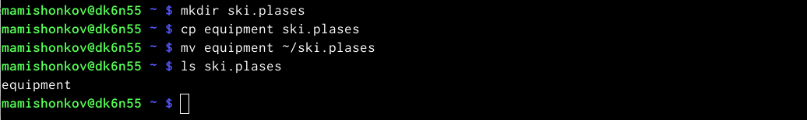

## Переименование файла

- Переименовал файл ~/ski.plases/equipment в ~/ski.plases/equiplist.

## Создание файла в одном каталоге и копирование его в другой каталог с другим именем

- Создал в домашнем каталоге файл abc1 и скопировал его в каталог ~/ski.plases, назвав его equiplist2.

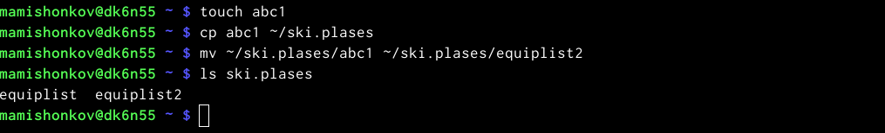

## Перемещение файлов

- Создал каталог equiplist в каталоге ~/ski.plases. Переместил файлы equiplist и equiplist2 в каталог equipment.

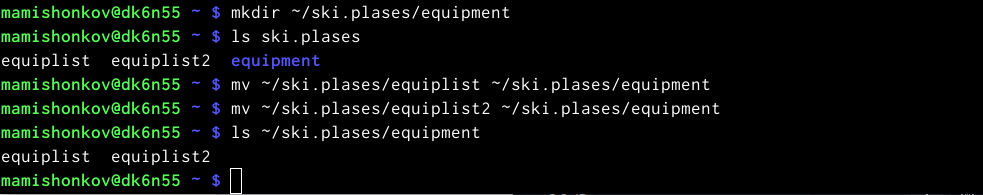

## Перемещение каталога

- Создал каталог newdir. Переместил его в каталог ski.plases и назвал его plans. 

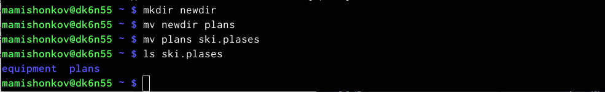

## Определение опций команды chmod

- Определил опции команды chmod, необходимые для того, чтобы присвоить файлам права доступа, считая, что в начале таких прав нет.

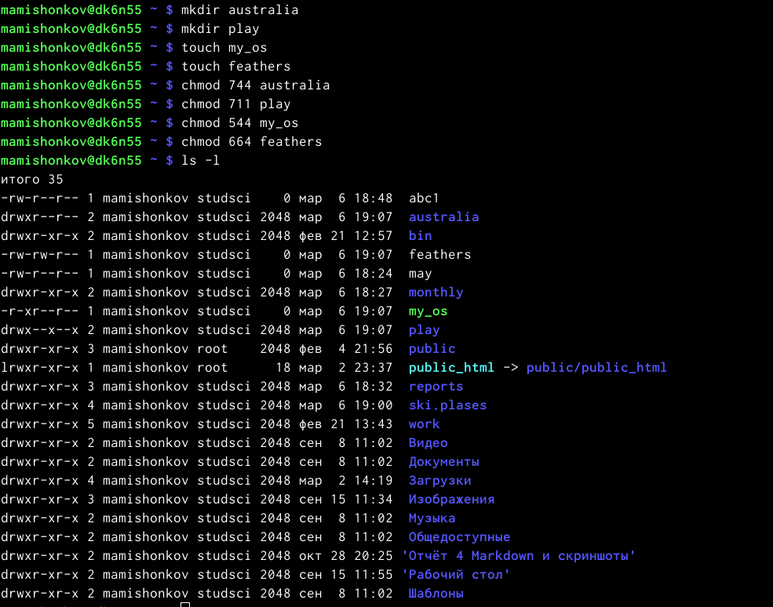

## Просмотр содержимого файла

- Просмотрел содержимое файла /etc/password.

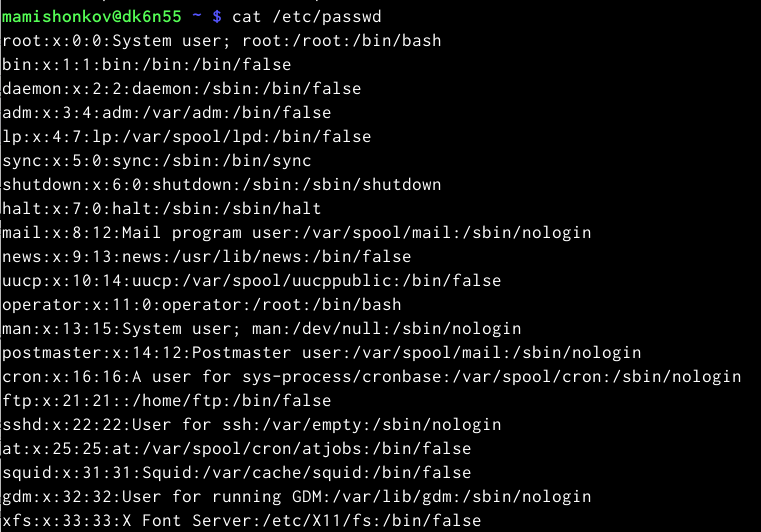

## Создание каталогов, изменение прав владельца

- Скопировал файл ~/feathers в файл ~/file.old. Переместил файл ~/file.old В катлог ~/play. Скопировал каталог ~/play в каталог ~/fun. Переместил каталог ~/fun в каталог ~/play и назвал его games. Лишил владельца файла feathers прав на чтение. Если мы попытаемся просмотреть файл feathers командой cat, то получим отказ в доступе, так как мы лишили владельца прав на чтение.Если мы попытаемся скопировать файл feathers, то также получим отказ.

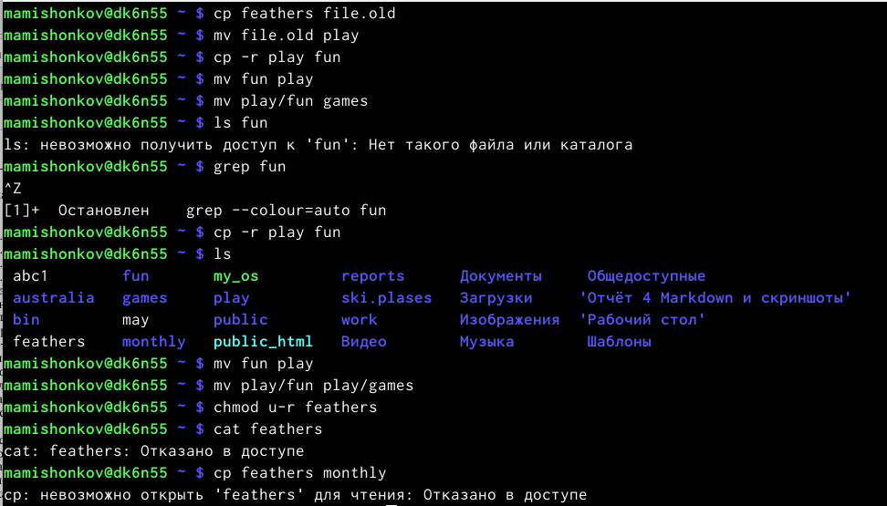

## Изменение прав владельца

- Дал владельцу файла feathers право на чтение, лишил владельца каталога play права на выполнение. При переходе в него получил отказ в доступе. Дал владельцу каталога play право на выполнение.

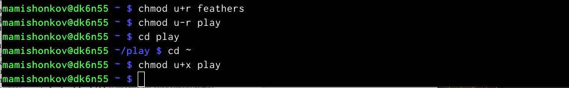

## Команда mount

- Прочитал man по командам mount, fsck, mkfs, kill. Команда mount предназначена для монтирования файловой системы. Она служит для подключения файловых систем разных устройств к дереву. Например, команда "mount -t vfstype device dir" предлагает ядру смонтировать файловую систему указанного типа, расположенную на определённом устройстве, к заданному каталогу. Команда fsck - утилита командной строки, которая позволяет выполнять проверки согласованности и интерактивное исправление в одной или нескольких файловых системах Linux. Например, если нужно восстановить файловую систему на неотором устройстве /dev/sdb2, следует воспользоваться командой "sudo fsck -y/dev/sdb2". Команда mkfs создаёт новую файловую систему Linux. Например, команда "mkfs -t ext/2/dev/hdb1" создаёт файловую систему типа ext 2 в разделе /dev/hdb1. Команда kill посылает сигнал процессу или выводит список допустимых сигналов. Например. команда "lill -KILL 3121" посылает сигнал KILL процессу с PID 3121, чтобы принудительно завершить процесс.

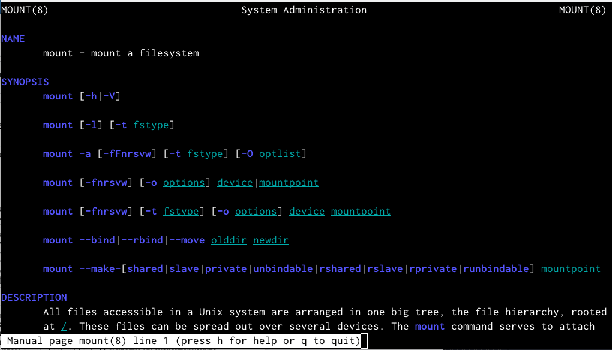

## Команда fsck

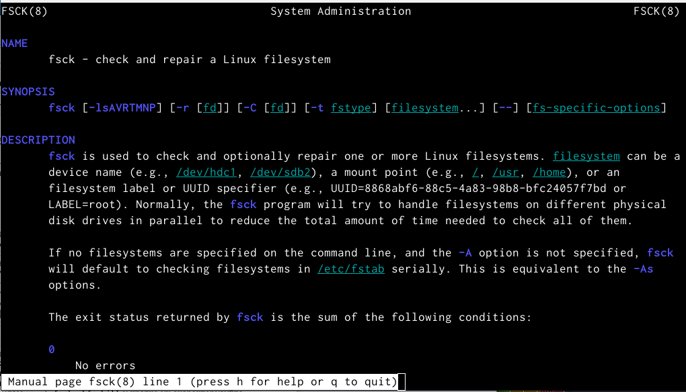

## Команда mkfs

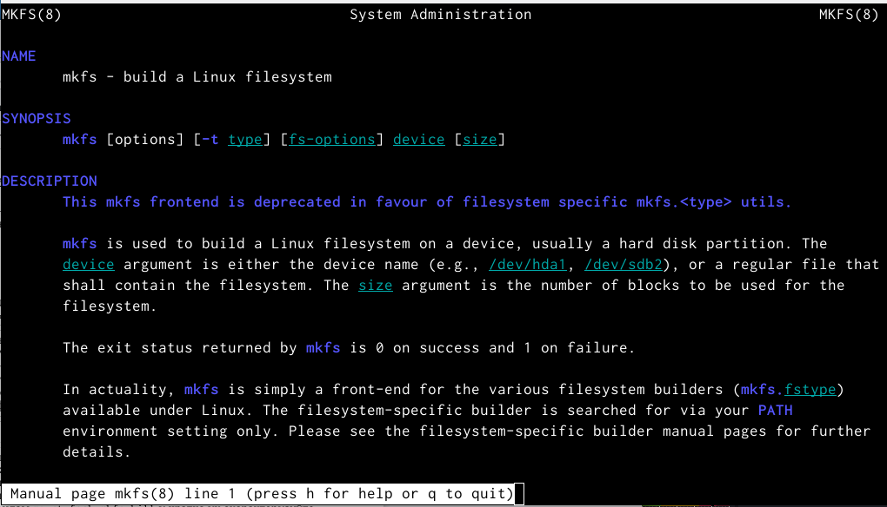

## Команда kill

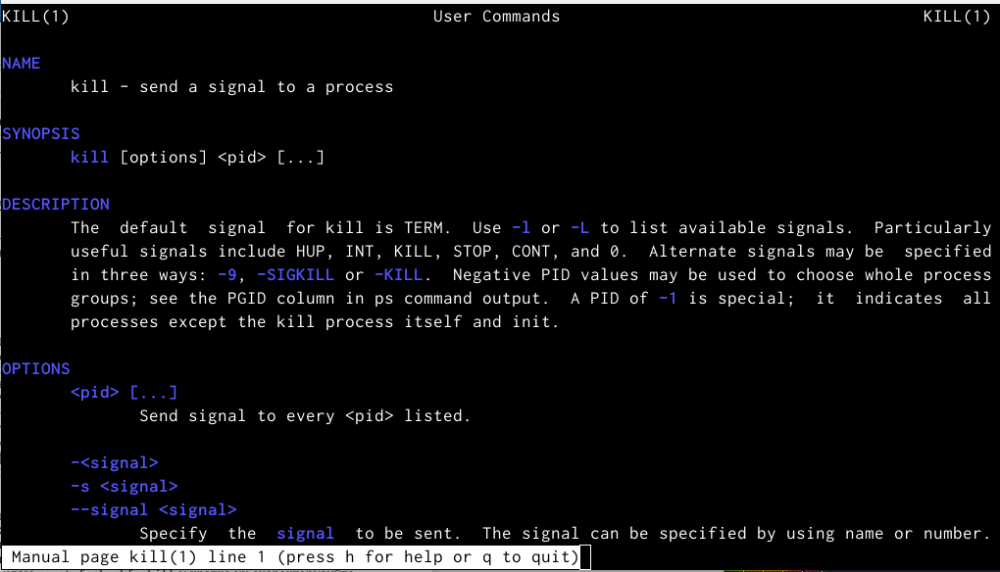

## Команды

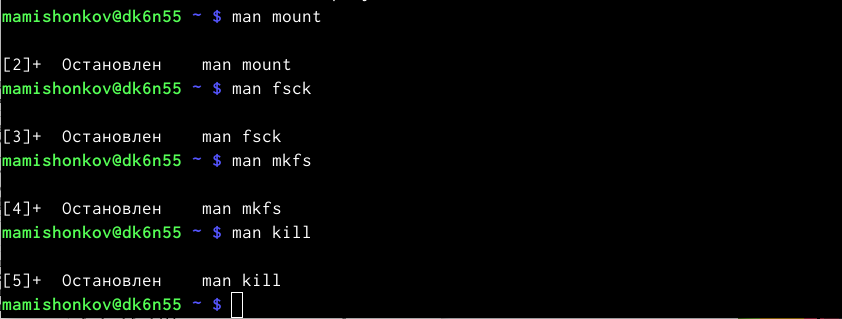

# Заключение

## Вывод

В ходе выполнения данной лабораторной работы я ознакомился с файловой системой linux, именами и содержанием каталогов, приобрёл практические навыки по применению команд для работы с файлами и каталогами, по управлению процессами, по проверке использования диска и обслуживанию файловой системы.

