---
## Front matter
lang: ru-RU
title: Отчёт по лабораторной работе №6
subtitle: дисциплина "Операционные системы"
author:
  - Мишонков М. А.
institute:
  - Российский университет дружбы народов, Москва, Россия
date: 16 марта 2023

## i18n babel
babel-lang: russian
babel-otherlangs: english

## Formatting pdf
toc: false
toc-title: Содержание
slide_level: 2
aspectratio: 169
section-titles: true
theme: metropolis
header-includes:
 - \metroset{progressbar=frametitle,sectionpage=progressbar,numbering=fraction}
 - '\makeatletter'
 - '\beamer@ignorenonframefalse'
 - '\makeatother'
---

# Вводная часть

## Цель

Целью данной лабораторной работы является ознакомление с инструментами поиска файлов и фильтрации текстовых данных, приобретение практических навыков по управлению процессами (и заданиями), по проверке использования диска и обслуживанию файловых систем. 

# Основная часть

## Запись файлов

- Записал в файл file.txt названия файлов, содержащихся в каталоге /etc.

## Запись файлов

- Дописал в этот же файл названия файлов, содержащихся в домашнем каталоге.

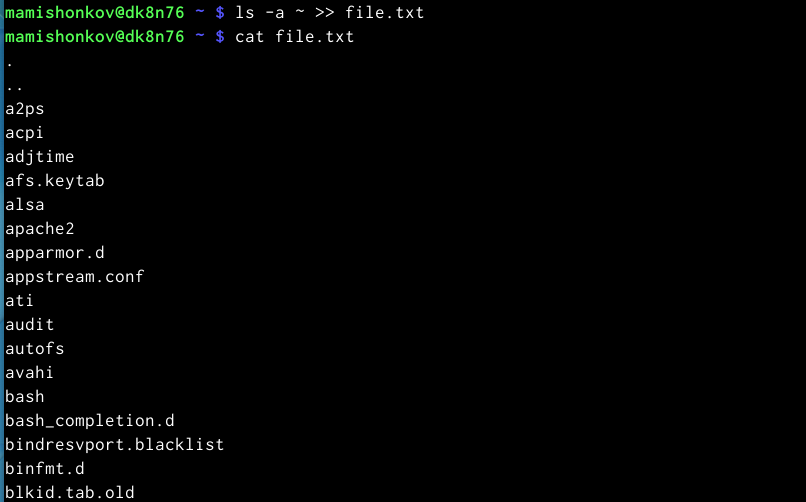

## Вывод имён файлов

- Вывел имена всех файлов из text.txt, имеющих расширение .conf, после чего записал их в новый текстовый файл conf.txt.

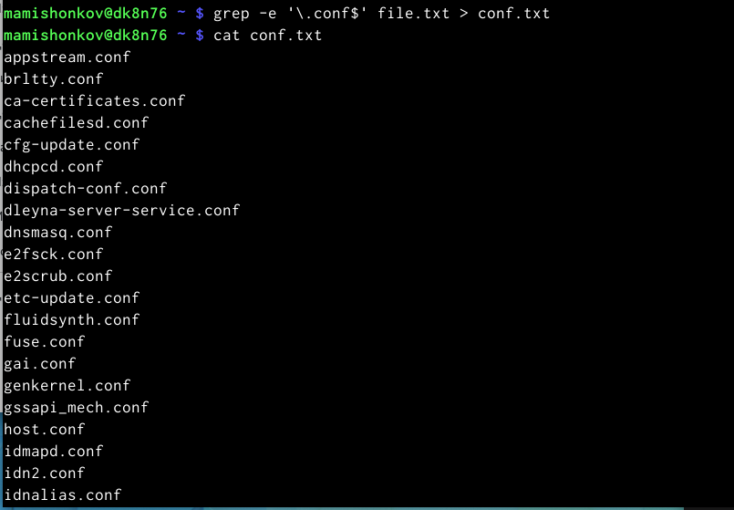

## Определение файлов

- Определил, какие файлы в домашнем каталоге имеют имена, начинающиеся с символа c разными способами.

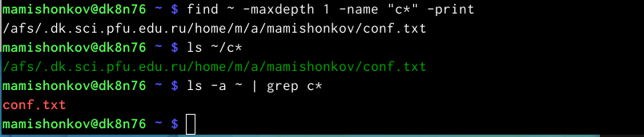

## Вывод названий файлов

- Вывел на экран имена файлов из каталога /etc, начинающиеся с символа h.

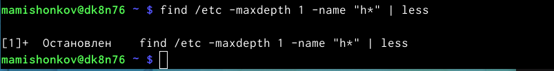

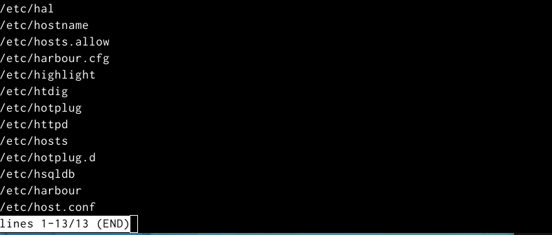

## Запуск процесса

- Запустил в фоновом режиме процесс, который будет записывать в файл ~/logfile файлы, имена которых начинаются с log.

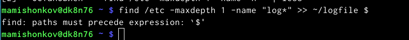

## Удаление файла

- Удалил файл ~/logfile.

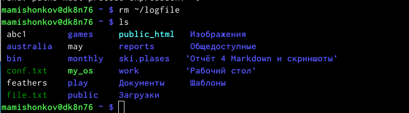

## Запуск редактора

- Запустил в консоли в фоновом режиме редактор gedit.

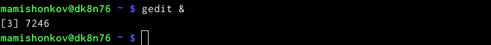

## Определение идентификатора процесса

- Определил идентификатор процесса gedit, используя команду ps, конвейер и фильтр grep. Узнать идентификатор можно также, используя команду "pgrep gedit" или "pidof gedit".

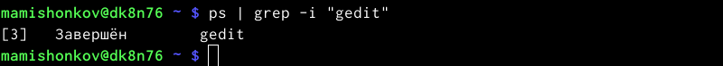

## Справка команды kill

- Прочёл справку команды kill, после чего использовал её для завершения процесса gedit.

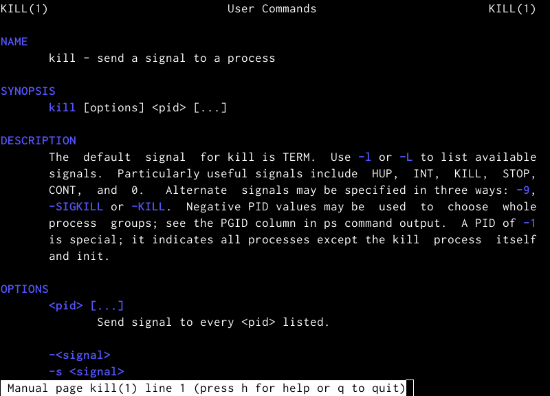

## Команда man kill

## Справка команды du

- Выполнил команду du, предварительно прочитав справку об этой команде.

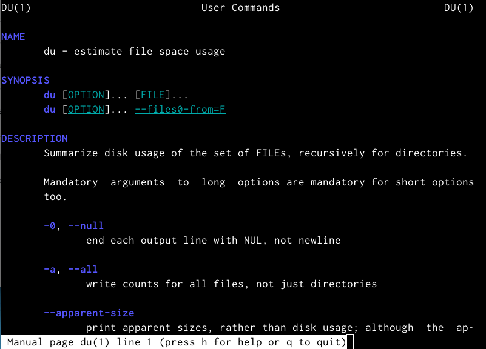

## Команда du

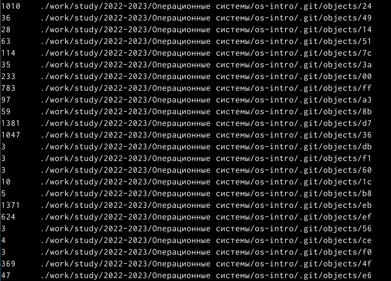

## Справка команды df

- Выполнил команду df, предварительно прочитав справку об этой команде.

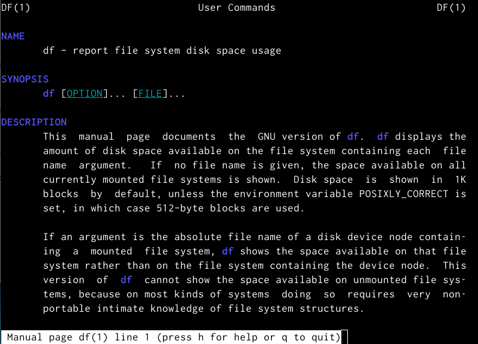

## Команда df

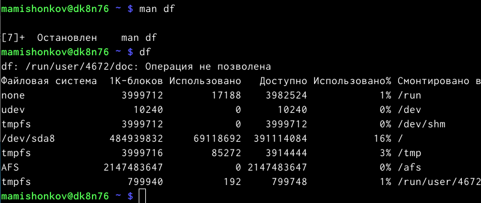

## Команда find

- Воспользовавшись справкой команды find, вывел имена всех директорий, имеющихся в домашнем каталоге.

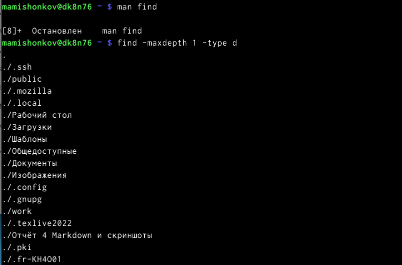

# Заключение

## Вывод

В ходе выполнения данной лабораторной работы я изучил инструменты поиска файлов и фильтрации текстовых данных, а также приобрёл практические навыки по иправлению процессами и заданиями, по проверке использования диска и обслуживанию файловых систем. 
