---
## Front matter
lang: ru-RU
title: Отчёт по лабораторной работе №8
subtitle: дисциплина "Операционные системы"
author:
  - Мишонков М. А.
institute:
  - Российский университет дружбы народов, Москва, Россия
date: 24 марта 2023

## i18n babel
babel-lang: russian
babel-otherlangs: english

## Formatting pdf
toc: false
toc-title: Содержание
slide_level: 2
aspectratio: 169
section-titles: true
theme: metropolis
header-includes:
 - \metroset{progressbar=frametitle,sectionpage=progressbar,numbering=fraction}
 - '\makeatletter'
 - '\beamer@ignorenonframefalse'
 - '\makeatother'
---

# Вводная часть

## Цель

Целью данной лабораторной работы является получение практических навыков работы с редактором vi, установленным по умолчанию практически во всех дистрибутивах.

# Основная часть

## Создание файла и вызов vi

- Создал файл lab06, перешёл в него и вызвал vi на редактирование файла.

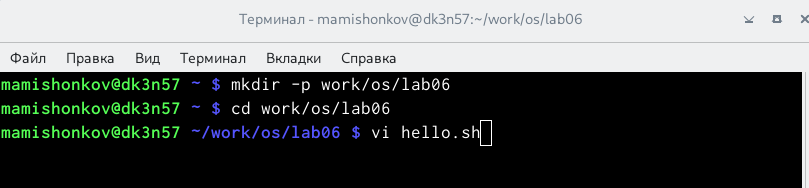

## Режим "вставка" для работы с текстом

- Нажал клавишу "i" и ввёл текст, указанный в лабораторной работе.

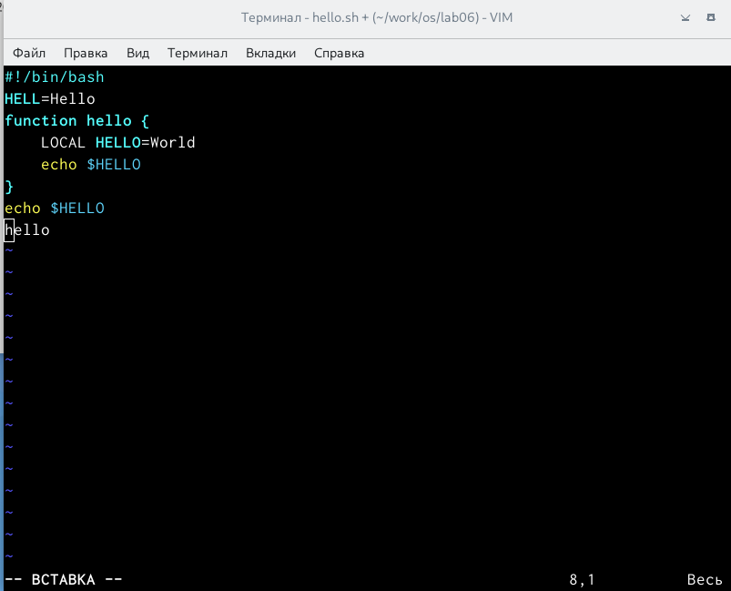

## Командный режим

- Нажал клавишу "esc", чтобы перейти в командный режим после завершения ввода текста.

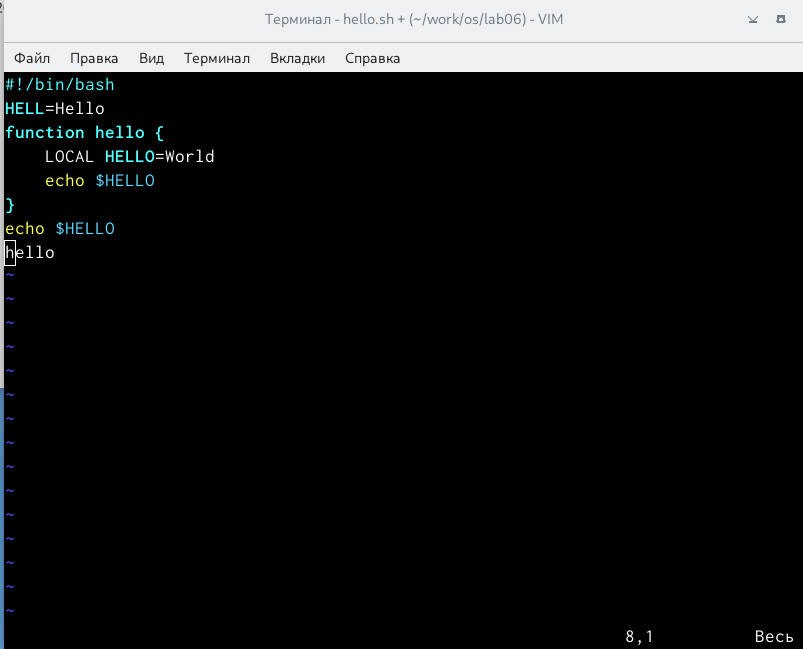

## Приглашение в виде двоеточия

- Нажал ":" для перехода в режим последней строки.

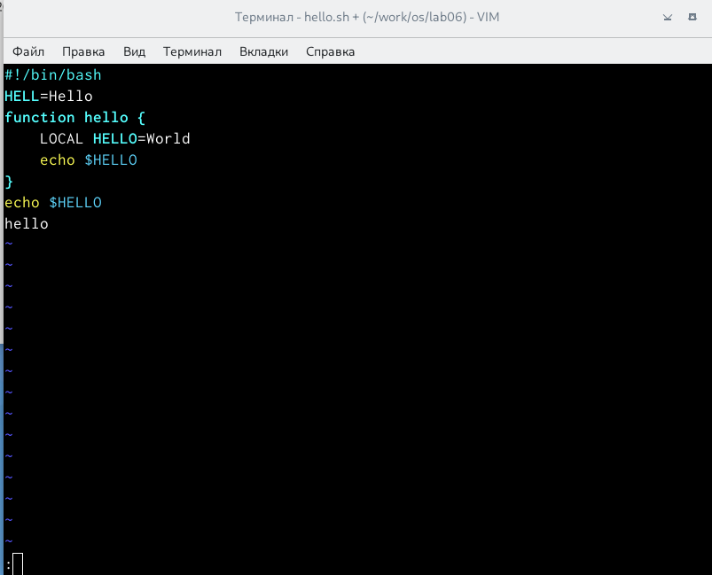

## Сохранение текста и завершение работы

- Нажал "w" (записать) и "q" (выйти), далее нажал клавишу "enter" для сохранения текста и завершения работы.

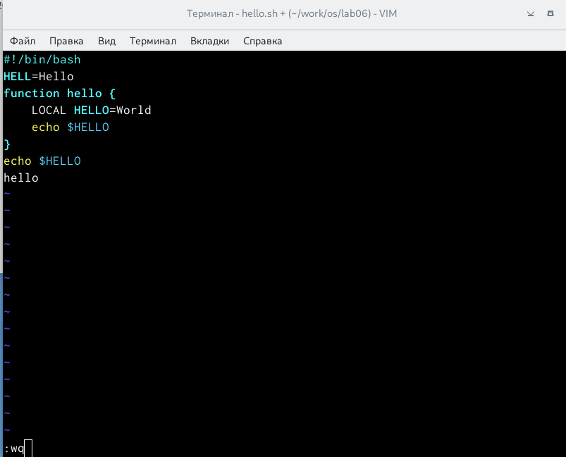

## Команда "chmod+x hello.sh"

- Чтобы сделать файл исполняемым, использовал команду "chmod+x hello.sh".

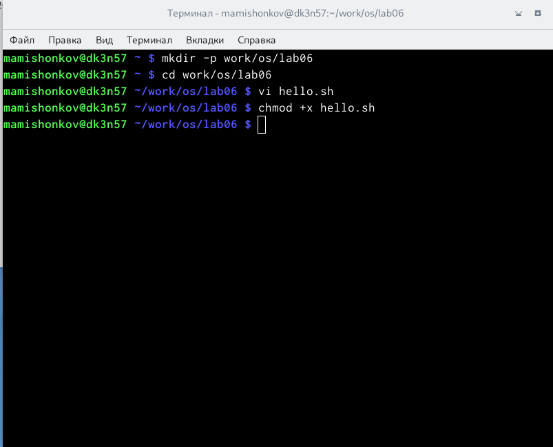

## Вызов редактора vi

- Вызвал редактор vi для рдактирования файла.

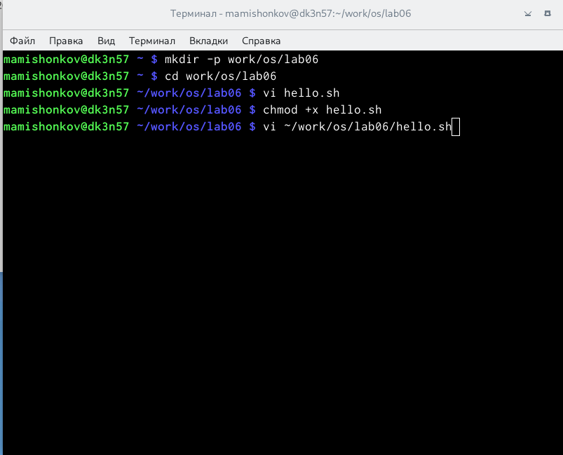

## Управление курсором

- При помощи стрелок установил курсов в конец слова HELL второй строки.

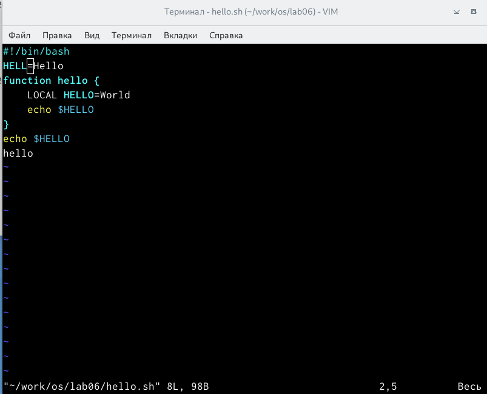

## Режим вставки

- Перешёл в режим вставки и заменил HELL на HELLO.

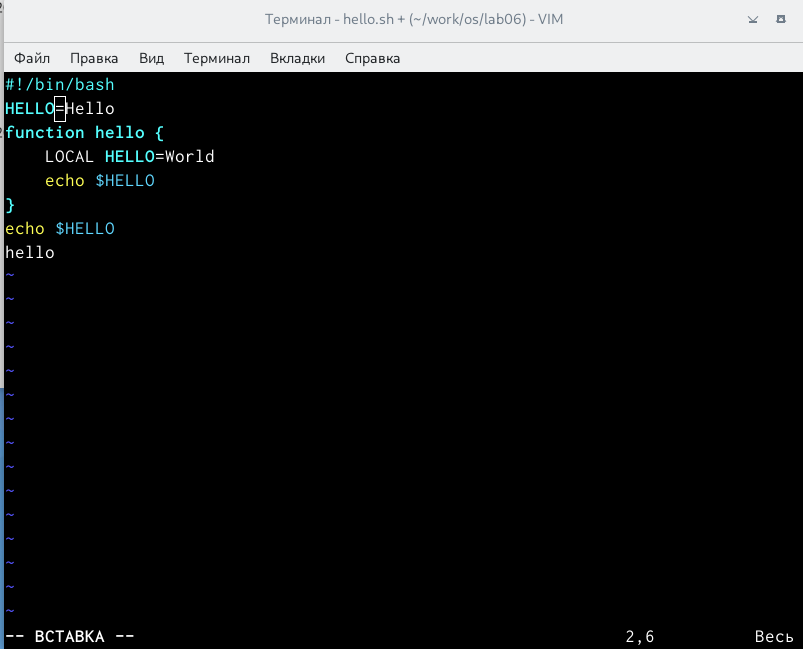

## Командный режим

- Нажал "esc" для возврата в командный режим.

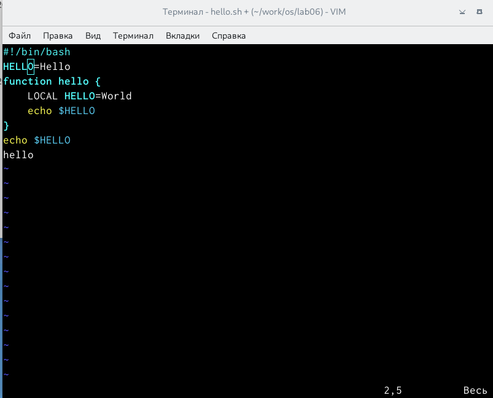

## Стирание слова

- Установил курсор на четвёртую строку и стёр слово LOCAL при помощи комбинаций клавиш "d" и "w".

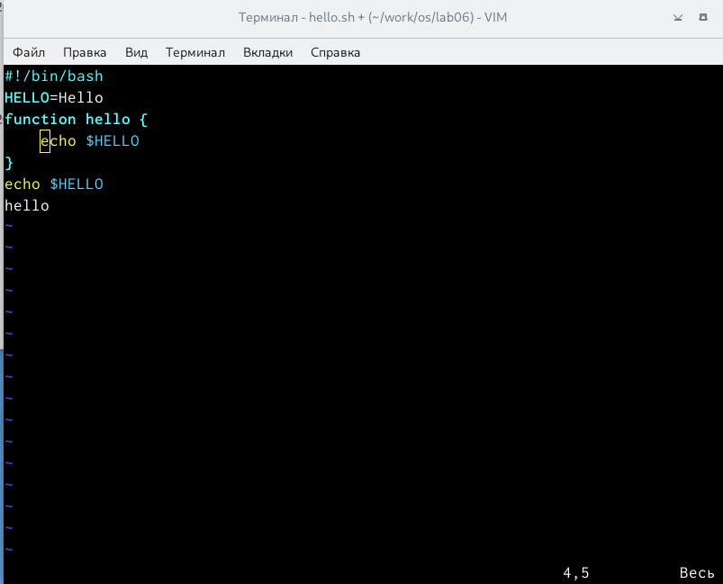

## Вставка слова

- Перешёл в режим вставки и набрал "local".

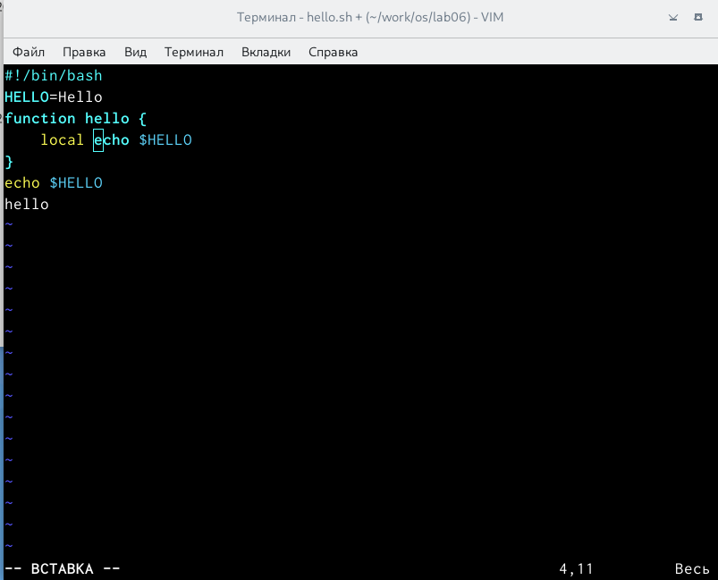

## Командный режим

- Нажал "esc" для возвращения в командный режим.

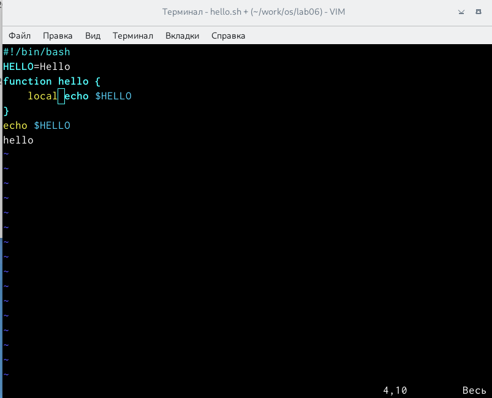

## Вставка строки

- Установил курсор на последней строке и вставил после неё строку.

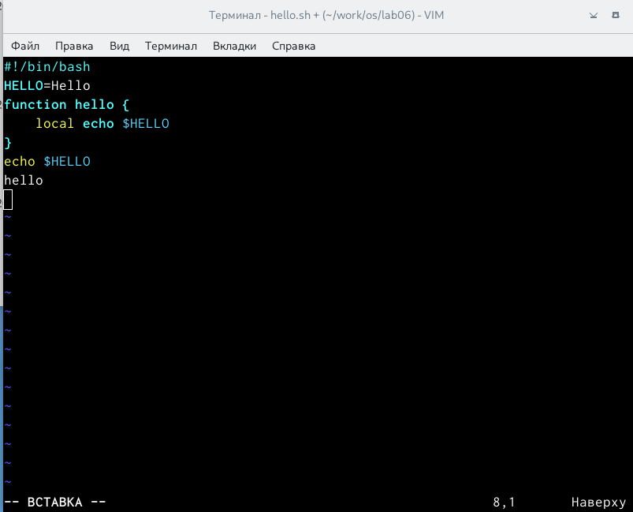

## Набор текста

- Набрал на месте вставленной строки текст "echo: $HELLO".

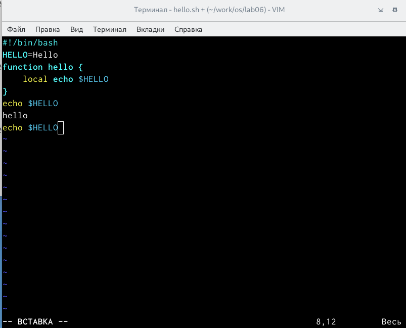

## Командный режим

- Нажал "esc" для возвращения в командный режим.

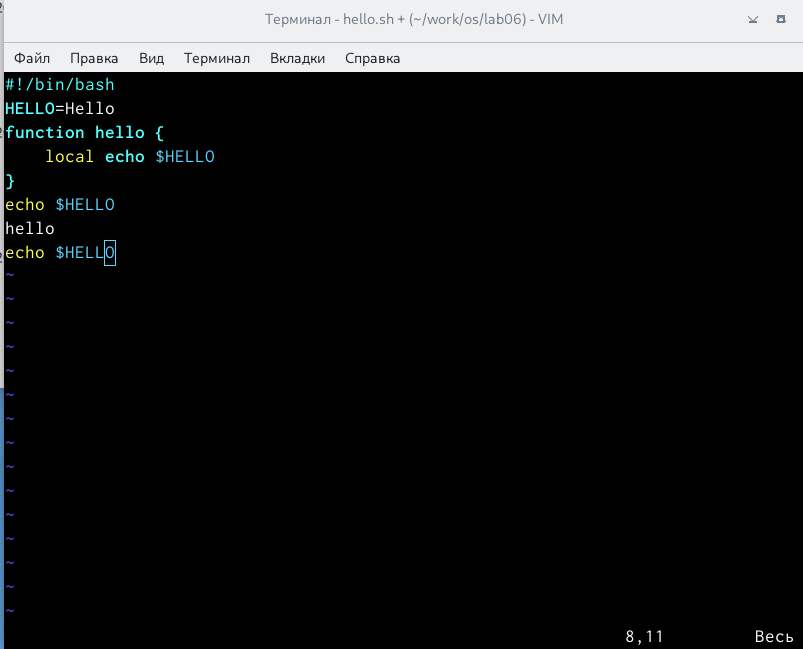

## Удаление последней строки

- Удалил последнюю строку, используя комбинацию клавиш "d" и "d".

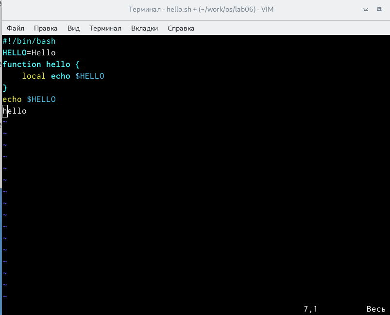

## Отмена последнего изменения

- Ввёл команду отмены изменений "u" для отмены последней команды.

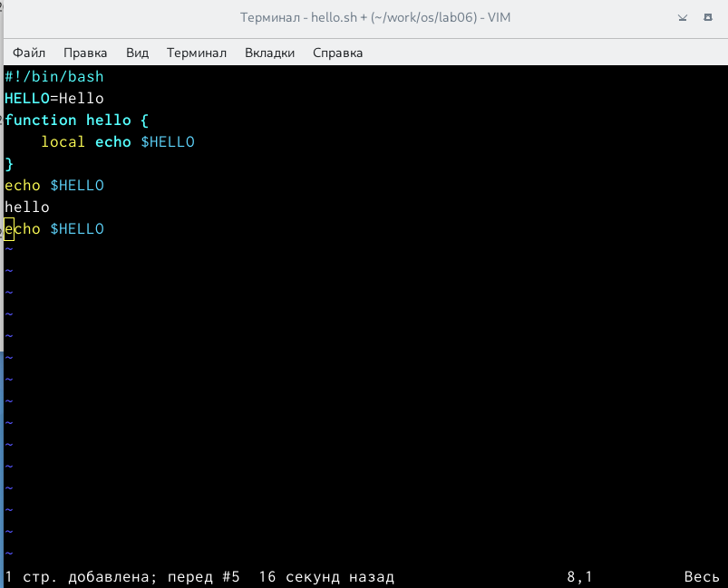

## Сохранение текста и завершение работы

- Нажал "w" и "q", далее нажал клавишу "enter" для сохранения текста и завершения работы.

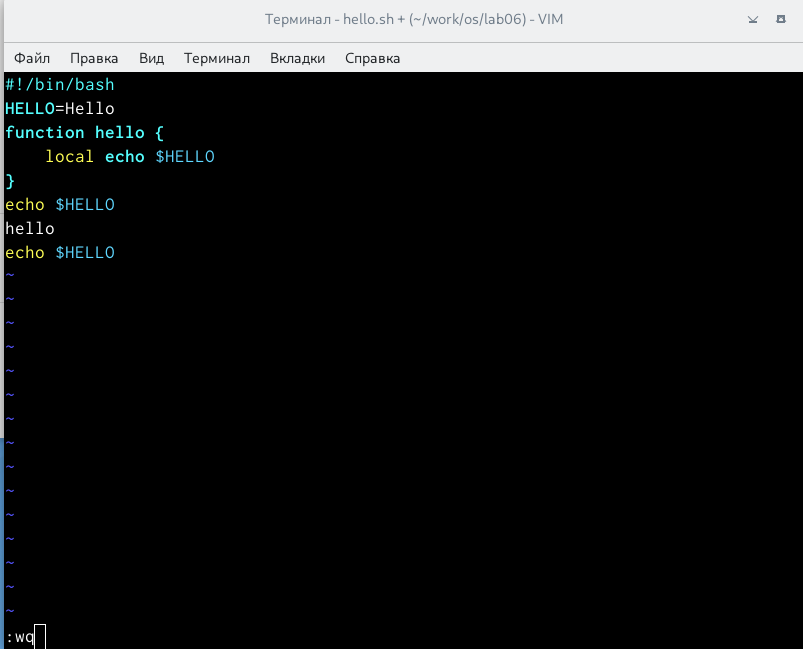

# Заключение

## Вывод

В ходе выполнения данной лаборатопрной работы я получил практические навыки работы с редактором vi, установленным по умолчанию практически во всех дистрибутивах.

