---
## Front matter
title: "Отчёт по лабораторной работе №8"
subtitle: "*дисциплина: Операционные системы*"
author: "Максим Александрович Мишонков"

## Generic otions
lang: ru-RU
toc-title: "Содержание"

## Bibliography
bibliography: bib/cite.bib
csl: pandoc/csl/gost-r-7-0-5-2008-numeric.csl

## Pdf output format
toc: true # Table of contents
toc-depth: 2
lof: true # List of figures
fontsize: 12pt
linestretch: 1.5
papersize: a4
documentclass: scrreprt
## I18n polyglossia
polyglossia-lang:
  name: russian
  options:
	- spelling=modern
	- babelshorthands=true
polyglossia-otherlangs:
  name: english
## I18n babel
babel-lang: russian
babel-otherlangs: english
## Fonts
mainfont: PT Serif
romanfont: PT Serif
sansfont: PT Sans
monofont: PT Mono
mainfontoptions: Ligatures=TeX
romanfontoptions: Ligatures=TeX
sansfontoptions: Ligatures=TeX,Scale=MatchLowercase
monofontoptions: Scale=MatchLowercase,Scale=0.9
## Biblatex
biblatex: true
biblio-style: "gost-numeric"
biblatexoptions:
  - parentracker=true
  - backend=biber
  - hyperref=auto
  - language=auto
  - autolang=other*
  - citestyle=gost-numeric
## Pandoc-crossref LaTeX customization
figureTitle: "Рис."
tableTitle: "Таблица"
listingTitle: "Листинг"
lofTitle: "Список иллюстраций"
lolTitle: "Листинги"
## Misc options
indent: true
header-includes:
  - \usepackage{indentfirst}
  - \usepackage{float} # keep figures where there are in the text
  - \floatplacement{figure}{H} # keep figures where there are in the text
---

# Цель работы

Целью данной лабораторной работы является получение практических навыков работы с редактором vi, установленным по умолчанию практически во всех дистрибутивах.

# Задание

Освоить редактор vi, установленный по умолчанию практически во всех дистирутивах.

# Теоретическое введение

**Vi** — текстовый редактор для консоли. Используется в Unix-подобных ОС.

Существует несколько версий vi: vi, elvis, vile и vim. Одна из них доступна практически во всех версиях Unix, а также и в Linux. 

Он обладает большим числом функций, включая подсветку синтаксиса, форматирование кода, мощный механизм поиска с заменой, макросы и многое другое.

В отличие от многих привычных редакторов, vi имеет модальный интерфейс. Это означает, что одни и те же клавиши в разных режимах работы выполняют разные действия.

В редакторе vi есть *два основных режима*: командный режим (включен по умолчанию) и режим вставки.

# Выполнение лабораторной работы

1. Создал файл lab06, перешёл в него и вызвал vi на редактирование файла. (рис. [@fig:001])

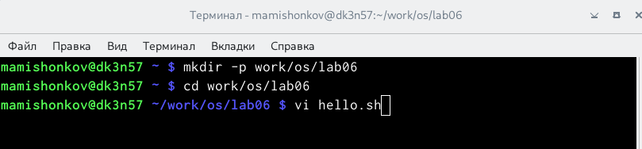{ #fig:001 width=70% }

2. Нажал клавишу "i" и ввёл текст, указанный в лабораторной работе. (рис. [@fig:002])

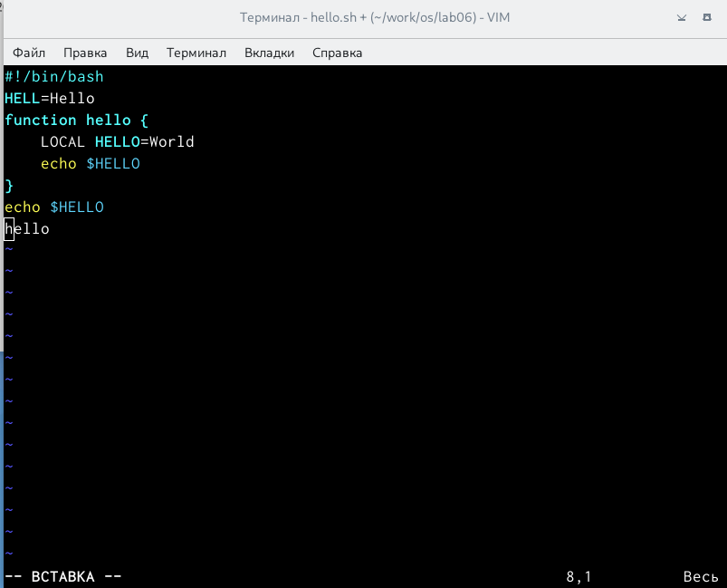{ #fig:002 width=70% }

3. Нажал клавишу "esc", чтобы перейти в командный режим после завершения ввода текста. (рис. [@fig:003])

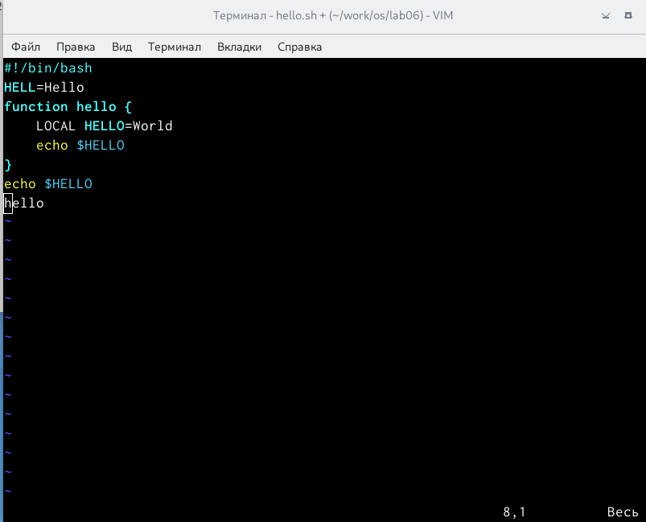{ #fig:003 width=70% }

4. Нажал ":" для перехода в режим последней строки. (рис. [@fig:004])

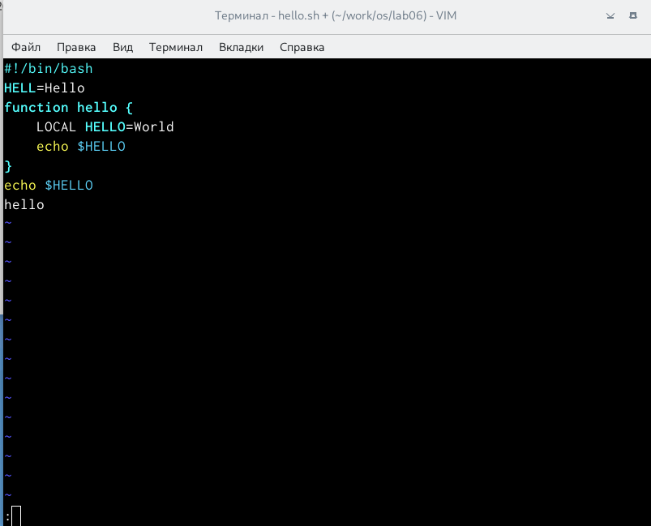{ #fig:004 width=70% }

5. Нажал "w" (записать) и "q" (выйти), далее нажал клавишу "enter" для сохранения текста и завершения работы. (рис. [@fig:005])

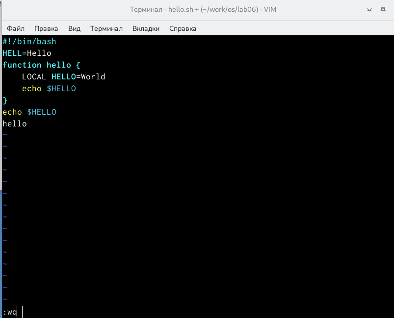{ #fig:005 width=70% }

6. Чтобы сделать файл исполняемым, использовал команду "chmod+x hello.sh". (рис. [@fig:006])

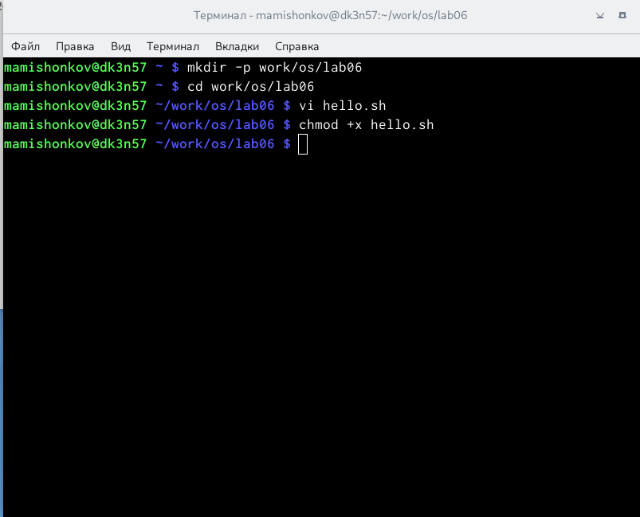{ #fig:006 width=70% }

7. Вызвал редактор vi для рдактирования файла. (рис. [@fig:007])

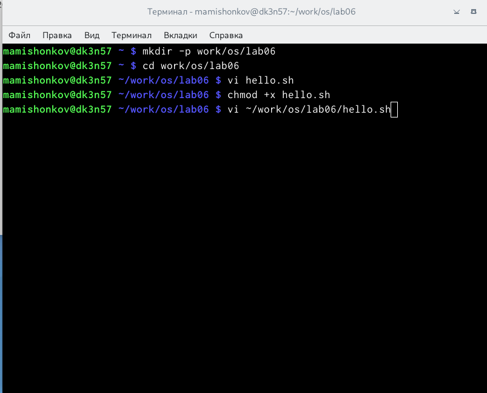{ #fig:007 width=70% }

8. При помощи стрелок установил курсов в конец слова HELL второй строки. (рис. [@fig:008])

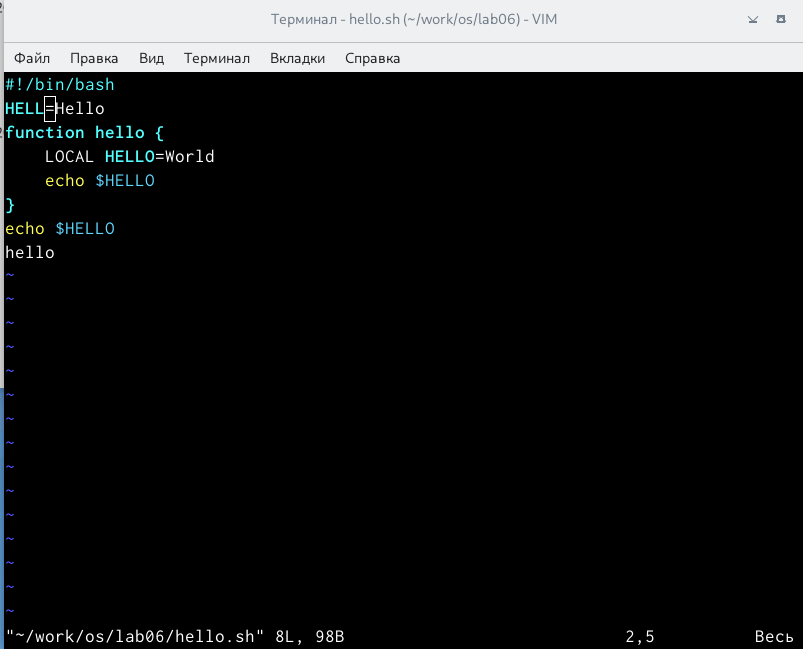{ #fig:008 width=70% }

9. Перешёл в режим вставки и заменил HELL на HELLO. (рис. [@fig:009])

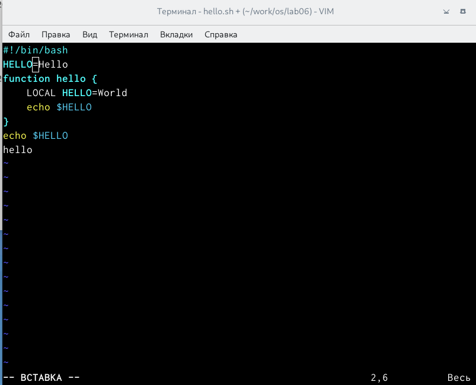{ #fig:009 width=70% }

10. Нажал "esc" для возврата в командный режим. (рис. [@fig:010])

{ #fig:010 width=70% }

11. Установил курсор на четвёртую строку и стёр слово LOCAL при помощи комбинаций клавиш "d" и "w". (рис. [@fig:011])

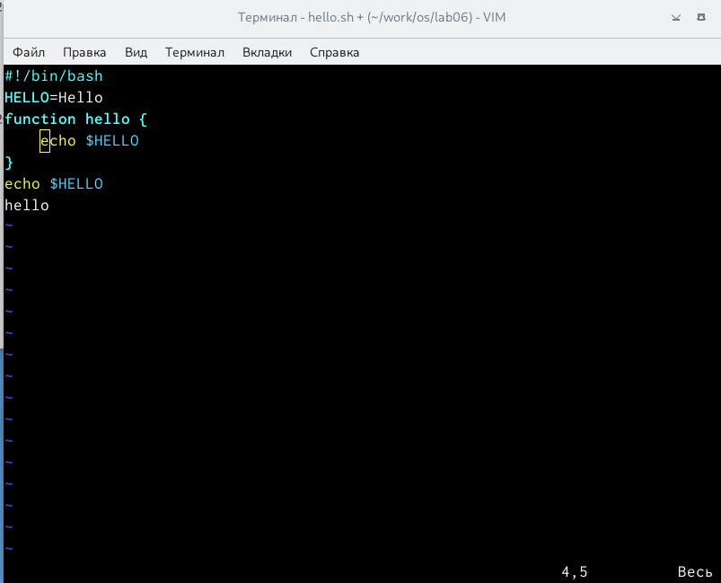{ #fig:011 width=70% }

12. Перешёл в режим вставки и набрал "local". (рис. [@fig:012])

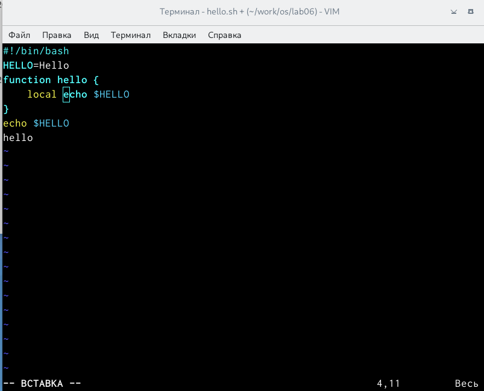{ #fig:012 width=70% }

13. Нажал "esc" для возвращения в командный режим. (рис. [@fig:013])

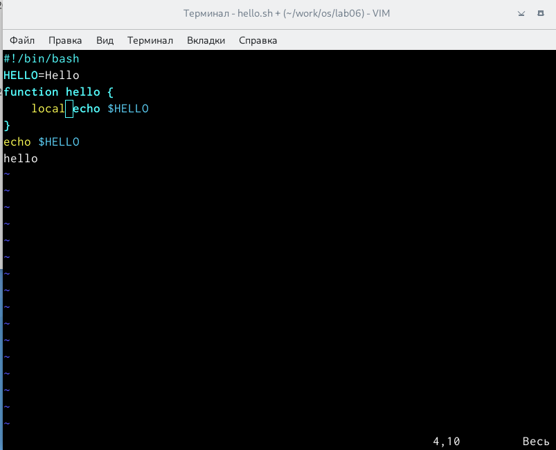{ #fig:013 width=70% }

14. Установил курсор на последней строке и вставил после неё строку. (рис. [@fig:014])

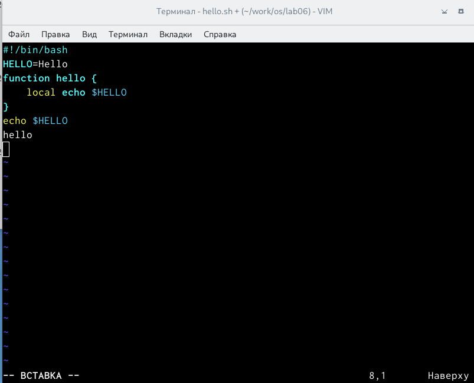{ #fig:014 width=70% }

15. Набрал на месте вставленной строки текст "echo: $HELLO". (рис. [@fig:015])

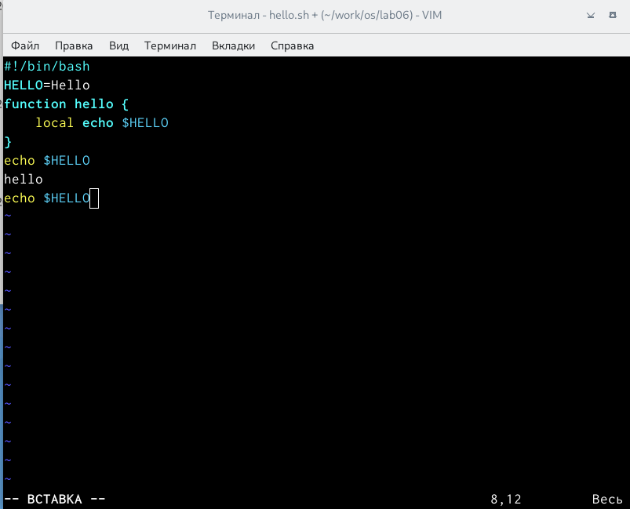{ #fig:015 width=70% }

16. Нажал "esc" для возвращения в командный режим. (рис. [@fig:016])

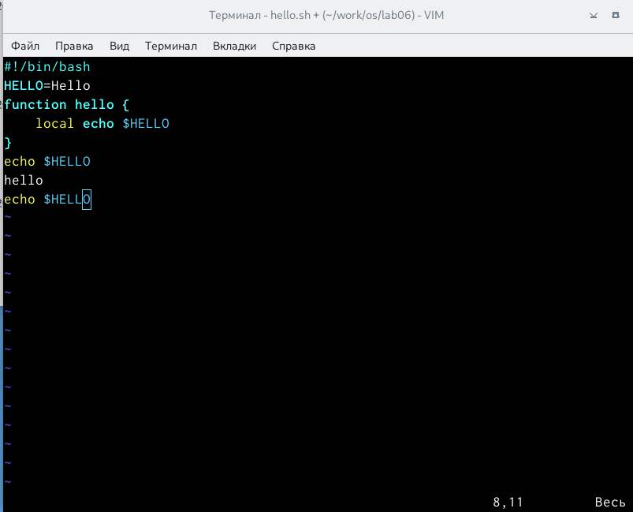{ #fig:016 width=70% }

17. Удалил последнюю строку, используя комбинацию клавиш "d" и "d". (рис. [@fig:017])

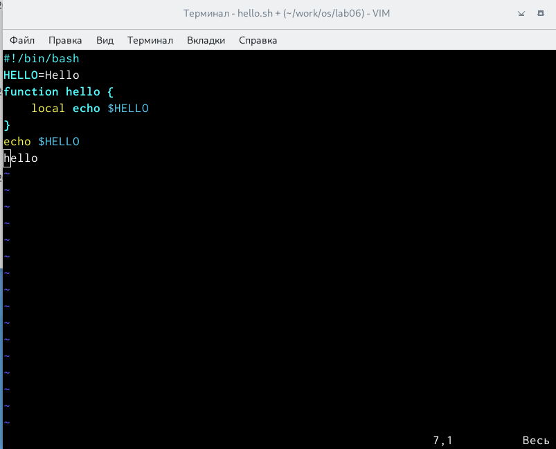{ #fig:017 width=70% }

18. Ввёл команду отмены изменений "u" для отмены последней команды. (рис. [@fig:018])

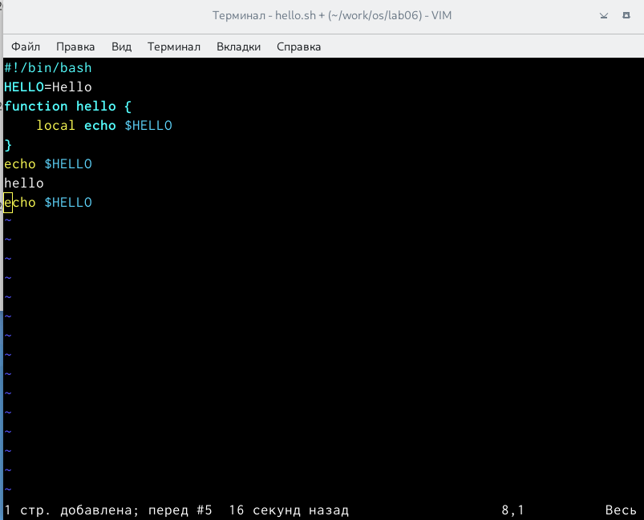{ #fig:018 width=70% }

19. Нажал "w" и "q", далее нажал клавишу "enter" для сохранения текста и завершения работы. (рис. [@fig:019])

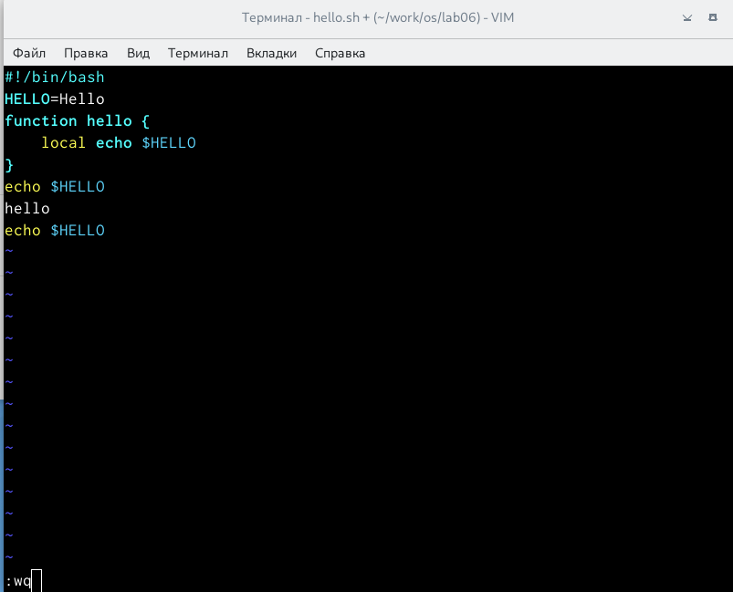{ #fig:019 width=70% }

**Контрольные вопросы:**

1.) Редактор vi имеет три режима работы:

- командный режим − предназначен для ввода команд редактирования и навигации по редактируемому файлу;

- режим вставки − предназначен для ввода содержания редактируемого файла;

- режим последней (или командной) строки − используется для записи изменений в файл и выхода из редактора.

2.) Чтобы выйти из редактора, не сохраняя произведённые изменения, нужно в режиме командной строки нажать клавиши «:» «q» «!»

3.) Команды позиционирования:

- «0»(ноль) − переход в начало строки;

- «$» − переход в конец строки;

- «G» − переход в конец файла;

- n«G» − переход на строку с номером n.

4.) При использовании прописных W и B под разделителями понимаются только пробел, табуляция и возврат каретки. При использовании строчных w и b под разделителями понимаются также любые знаки пунктуации.

5.) Чтобы из любого места редактируемого файла перейти в начало (конец) файла, нужно в режиме командной строки нажать клавиши «1» «G» («G»).

6.) 1. Вставка текста

- «а» − вставить текст после курсора;

- «А» − вставить текст в конец строки;

- «i» − вставить текст перед курсором;

- n «i» − вставить текст n раз;

- «I» − вставить текст в начало строки.

    2. Вставка строки

- «о» − вставить строку под курсором;

- «О» − вставить строку над курсором.

    3. Удаление текста

- «x» − удалить один символ в буфер;

- «d» «w» − удалить одно слово в буфер;

- «d» «$» − удалить в буфер текст от курсора до конца строки;

- «d» «0» − удалить в буфер текст от начала строки до позиции курсора;

- «d» «d» − удалить в буфер одну строку;

- n «d» «d» − удалить в буфер n строк.

    4. Отмена и повтор произведённых изменений

- «u» − отменить последнее изменение;

- «.» − повторить последнее изменение.

    5. Копирование текста в буфер

- «Y» − скопировать строку в буфер;

- n «Y» − скопировать n строк в буфер;

- «y» «w» − скопировать слово в буфер.

    6. Вставка текста из буфера

- «p» − вставить текст из буфера после курсора;

- «P» − вставить текст из буфера перед курсором.

    7. Замена текста

- «c» «w» − заменить слово;

- n «c» «w» − заменить nслов;

- «c» «$» − заменить текст от курсора до конца строки;

- «r» − заменить слово;

- «R» − заменить текст.

    8. Поиск текста

- «/» текст − произвести поиск вперёд по тексту указанной строки символов текст;

- «?» текст − произвести поиск назад по тексту указанной строки символов текст.

    9. Копирование и перемещение текста

- «:» n,m «d» – удалить строки с n по m;

- «:» i,j «m» k – переместить строки с i по j, начиная со строки k;

- «:» i,j «t» k – копировать строки с i по j в строку k;

- «:» i,j «w» имя-файла – записать строки с i по j в файл с именем имя-файла.

7). Чтобы отменить по одному предыдущему действию последовательно, необходимо нажать «u». Чтобы отменить все изменения, произведённые со времени последней записи, нужно нажать «:» «e» «!».

8). Команды редактирования в режиме командной строки

    1. Копирование и перемещение текста

- «:»n,m «d» − удалить строки с n по m;

- «:»i,j «m» k − переместить строки с i по j, начиная со строки k;

- «:»i,j «t» k − копировать строки с i по j в строку k;

- «:»i,j «w» имя-файла − записать строки с i по j в файл с именем имя-файла.

    2. Запись в файл и выход из редактора

- «:» «w» − записать изменённый текст в файл, не выходя из vi;

- «:» «w» имя-файла − записать изменённый текст в новый файл с именем имя-файла;

- «:» «w» «!» имя-файла − записать изменённый текст в файл с именем имя-файла;

- «:» «w» «q» − записать изменения в файл и выйти из vi;

- «:» «q» − выйти из редактора vi;

- «:» «q» «!» − выйти из редактора без записи;

- «:» «e» «!» − вернуться в командный режим, отменив все изменения, произведённые со времени последней записи.

    3. Опции

Опции редактора vi позволяют настроить рабочую среду. Для задания опций используется команда set (в режиме последней строки):

- «:»set all − вывести полный список опций;

- «:»set nu − вывести номера строк;

- «:»set list − вывести невидимые символы;

- «:»set ic − не учитывать при поиске, является ли символ прописным или строчным.

Если вы хотите отказаться от использования опции, то в команде set перед именем опции надо поставить no.

9.) Чтобы определить, не перемещая курсора, позицию, в которой заканчивается строка, нужно в командном режиме находясь на нужной строке нажать «$» и посмотреть на число после запятой в правом нижнем углу экрана.

10.) Опции редактора vi позволяют настроить рабочую среду. Для задания опций используется команда set (в режиме командной строки). Если вы хотите отказаться от использования опции, то в команде set перед именем опции надо поставить no. Чтобы просмотреть опции редактора vi, необходимо нажать «:» set all. Нажав «:» help “название_опции”, можно узнать назначение конкретной опции.

11.) В режиме командной строки внизу редактора присутствует «:», в режиме ввода – «--ВСТАВКА --», в командном режиме внизу ничего нет.

# Выводы

В ходе выполнения данной лаборатопрной работы я получил практические навыки работы с редактором vi, установленным по умолчанию практически во всех дистрибутивах.

