---
## Front matter
lang: ru-RU
title: Отчёт по лабораторной работе №9
subtitle: дисциплина "Операционные системы"
author:
  - Мишонков М. А.
institute:
  - Российский университет дружбы народов, Москва, Россия
date: 07 апреля 2023

## i18n babel
babel-lang: russian
babel-otherlangs: english

## Formatting pdf
toc: false
toc-title: Содержание
slide_level: 2
aspectratio: 169
section-titles: true
theme: metropolis
header-includes:
 - \metroset{progressbar=frametitle,sectionpage=progressbar,numbering=fraction}
 - '\makeatletter'
 - '\beamer@ignorenonframefalse'
 - '\makeatother'
---

# Вводная часть

## Цель

Целью данной лабораторной работы является получение практических навыков работы с редактором Emacs.

# Основная часть

## Вырезание строки текста

Открыл редактор Emacs при помощи команды "emacs &". Создал файл lab07.sh при помощи комбинации "Ctrl-x" "Ctrl-f" и ввёл в него необходимый текст. Проделав несколько операций с текстом, вырезал командой Ctrl-w выделенную командой Ctrl-space область текста.

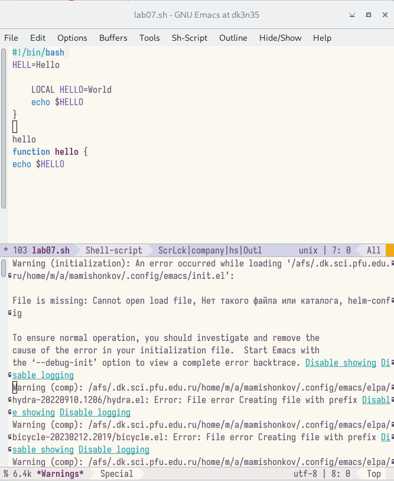

## Отмена последнего действия

Отменил последнее действие командой Ctrl-/.

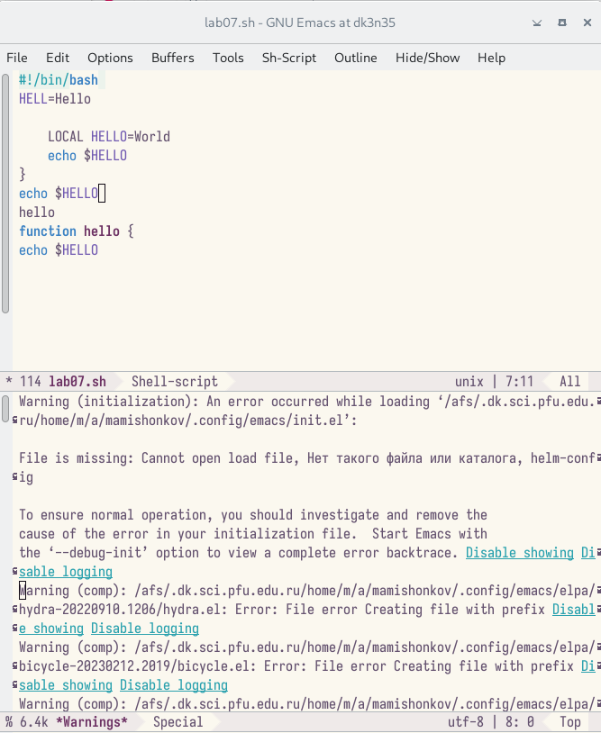

## Перемещение курсора

Переместил курсор в начало строки по команде Ctrl-a.

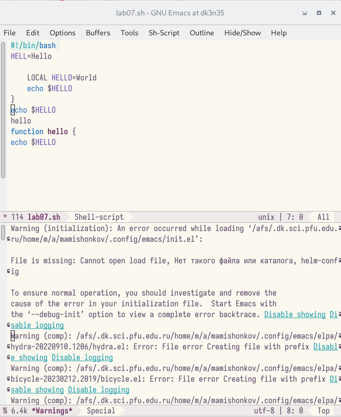

## Перемещение курсора

Переместил курсор в конец строки по команде Ctrl-e.

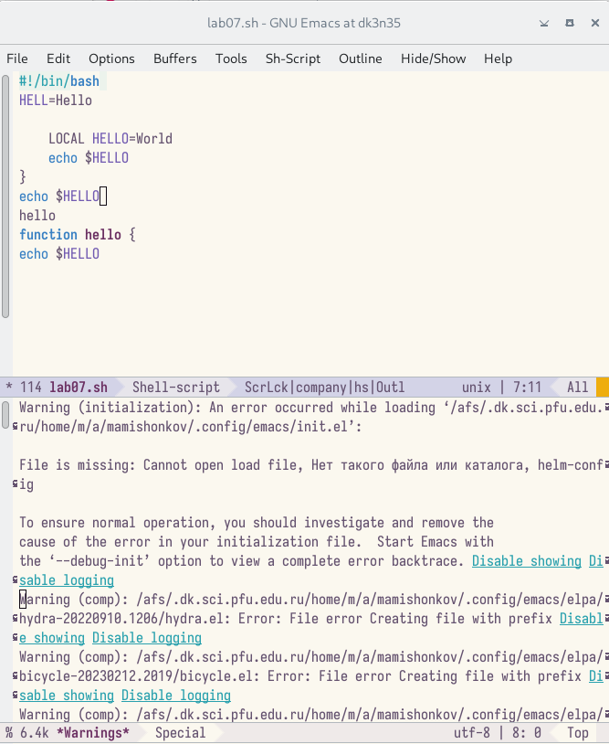

## Перемещение курсора

Переместил курсор в начало буфера по команде Alt-<.

## Перемещение курсора

Переместил курсор в конец буфера по команде Alt->.

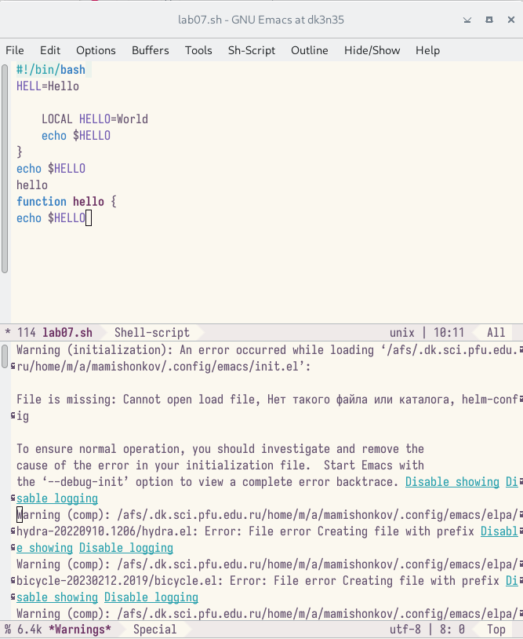

## Вывод списка активных буферов

Вывел список активных буферов на экран сочетанием клавиш "Ctrl-x""Ctrl-b".

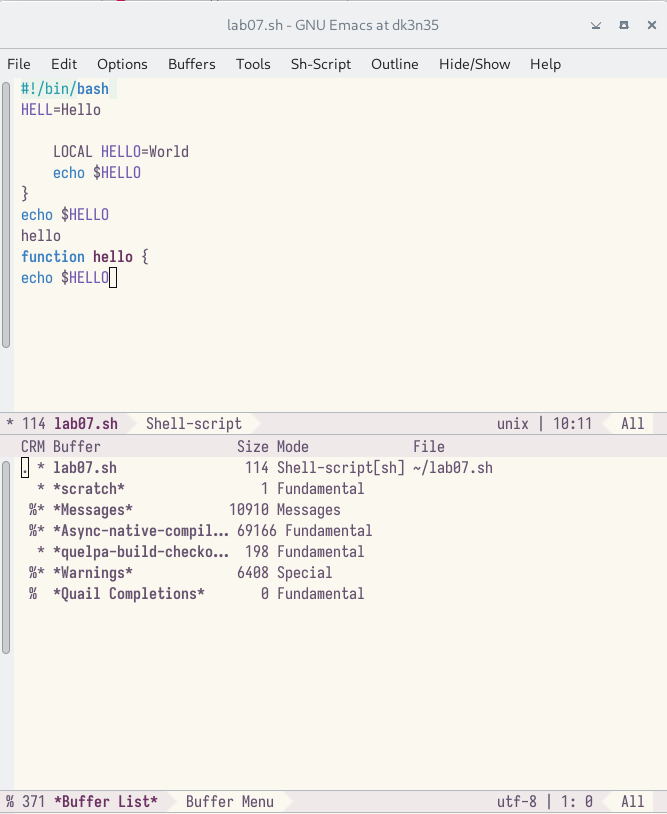

## Список активных буферов

Переместился во вновь открытое окно по команде Ctrl-xo и переключился на другой буфер нажатием клавиши "enter" после выбора необходимого буфера.

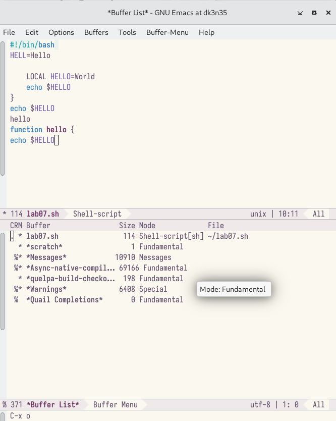

## Переключение на другой буфер

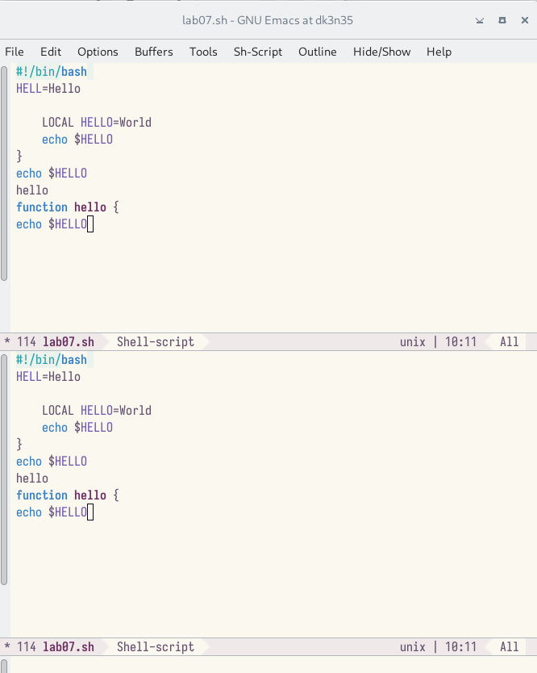

## Закрытие окна

Закрыл окно при помощи команды Ctrl-x0.

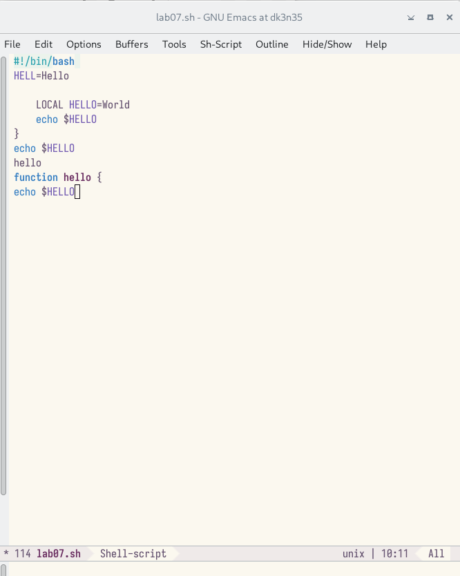

## Переключение между буферами

Вновь переключился между буферами, но уже без вывода их списка на экран (Ctrl-x b).

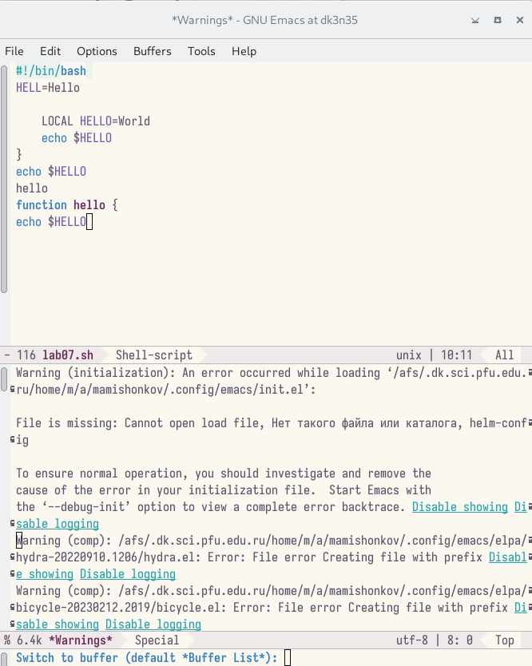

## Деление фрейма

Поделил фрейм на 4 части: разделил фрейм на два окна по вертикали (Ctrl-x 3), затем каждое из этих окон на две части по горизонтали (Ctrl-x 2).

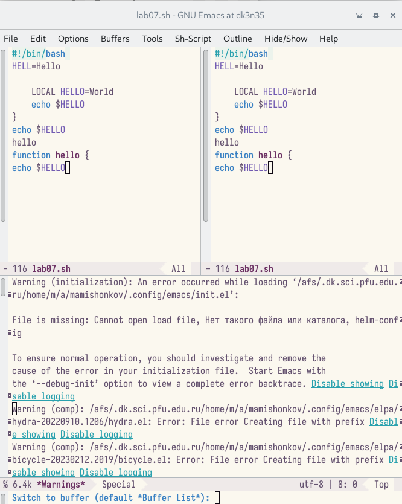

## Деление фрейма

## Деление фрейма

## Создание файлов

Создал в терминале 4 файла.

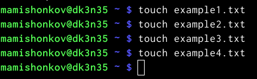

## Открытие файлов

В каждом из четырёх созданных окон открыл файл и ввёл небольшой текст.

## Ввод текста

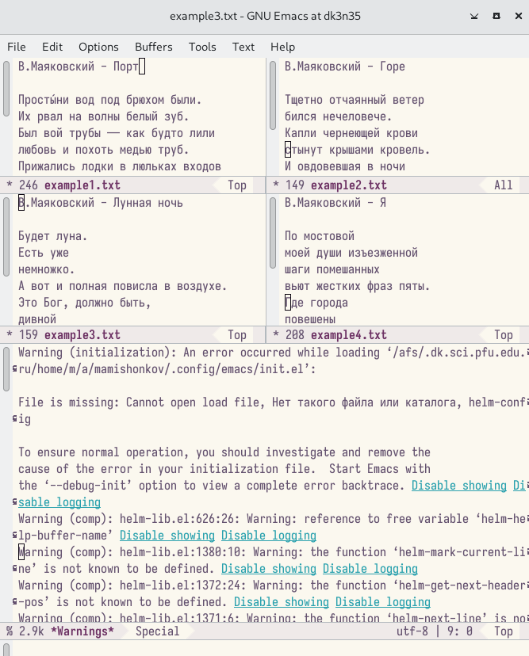

## Нахождение слов в тексте

Переключился в режим поиска по команде Ctrl-s и нашёл несколько слов, присутствующих в тексте.

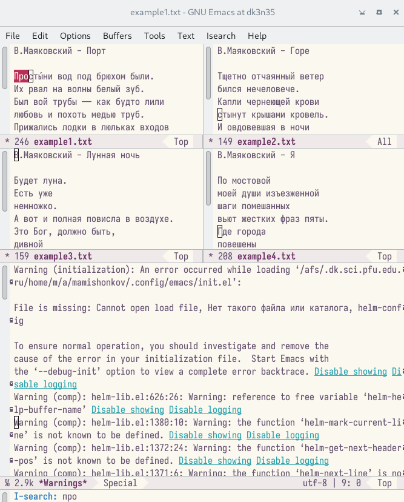

## Нахождение слов в тексте

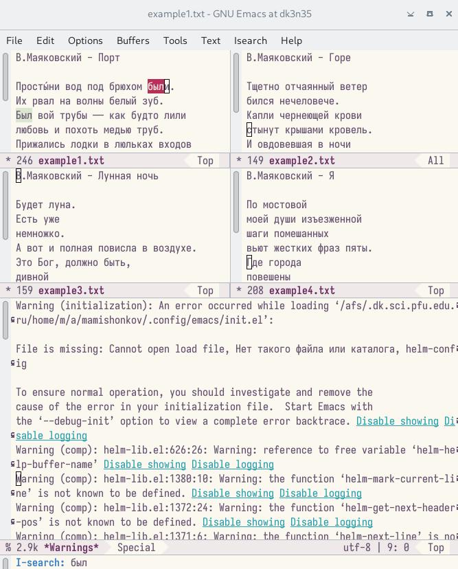

## Переключение между результатами поиска

Переключился между результатами поиска по команде Ctrl-s.

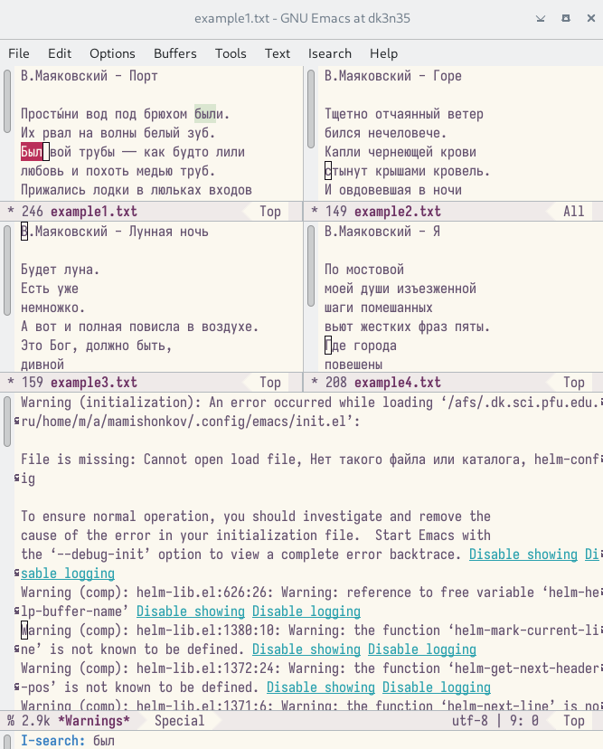

## Выход из режима поиска

Вышел из режима поиска по команде Ctrl-g.

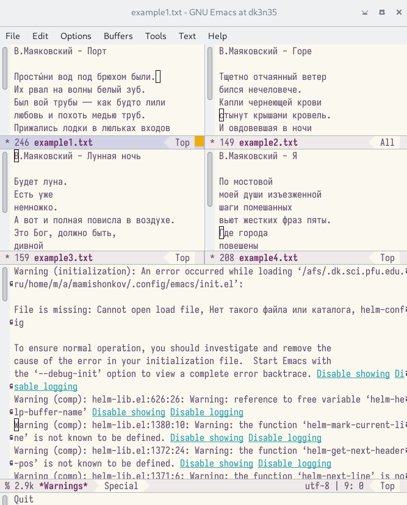

## Переход в режим поиска

Перешёл в режим поиска и замены по команде Alt-%, ввёл текст, который нужно найти и заменить, нажал enter и ввёл текст для замены. После подсветки результатов поиска нажал ! для подтверждения замены.

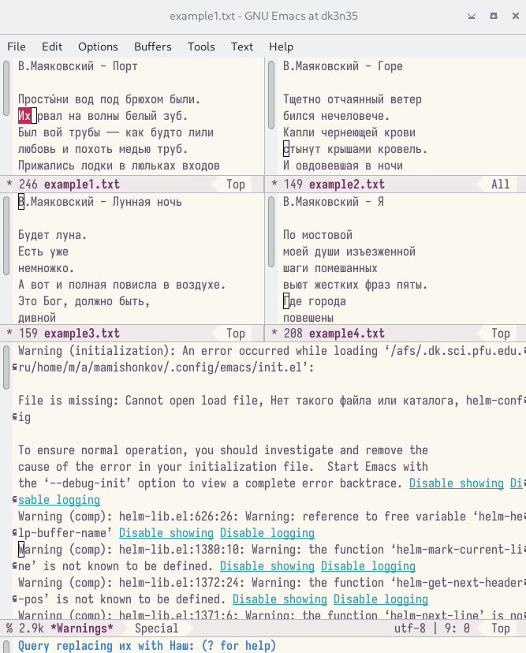

## Переход в режим поиска

## Другой режим поиска

Попробовал применить другой режим поиска, нажав Alt-so.

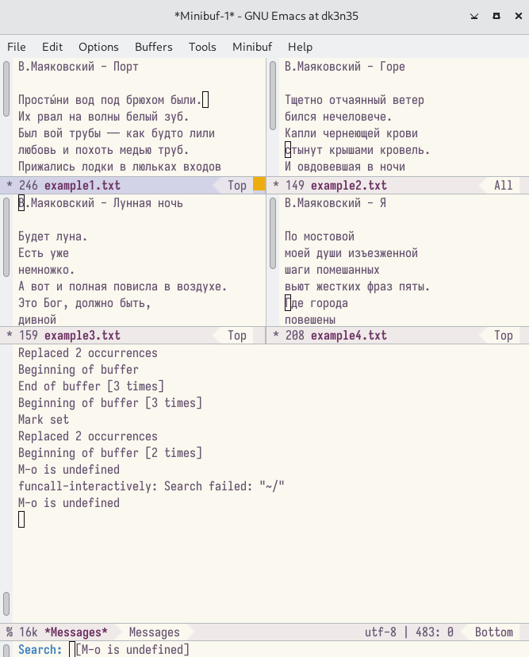

# Заключение 

## Вывод

В ходе выполнения данной лабораторной работы я получил практические навыки работы с редактором Emacs.

