---
## Front matter
lang: ru-RU
title: Отчёт по лабораторной работе №10
subtitle: дисциплина "Операционные системы"
author:
  - Мишонков М. А.
institute:
  - Российский университет дружбы народов, Москва, Россия
date: 14 апреля 2023

## i18n babel
babel-lang: russian
babel-otherlangs: english

## Formatting pdf
toc: false
toc-title: Содержание
slide_level: 2
aspectratio: 169
section-titles: true
theme: metropolis
header-includes:
 - \metroset{progressbar=frametitle,sectionpage=progressbar,numbering=fraction}
 - '\makeatletter'
 - '\beamer@ignorenonframefalse'
 - '\makeatother'
---

# Вводная часть

## Цель

Целью данной лабораторной работы является получение практических навыков работы с редактором Emacs.

# Основная часть

## Создание файла

- Создал файл, в котором буду писать первый скрипт, и открыл его в редакторе emacs, используя клавиши "Ctrl-x" и "Ctrl-f".

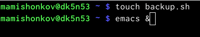

## Скрипт №1

- Написал скрипт, который при запуске будет делать резервную копию самого себя (то есть файла, в котором содержится его исходный код) в другую директорию back up в домашнем каталоге. При написании скрипта использовал архиватор bzip2.

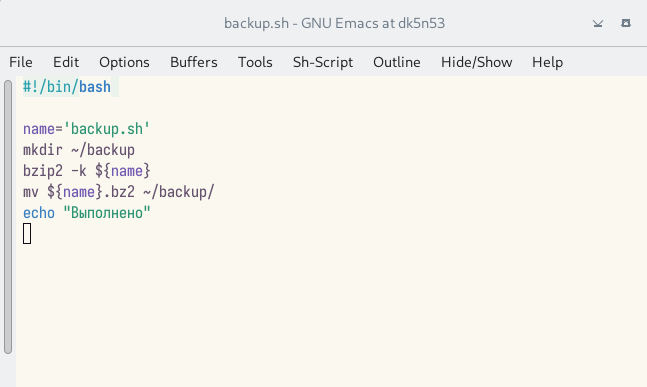

## Проверка работы скрипта

- Проверил работу скрипта, предварительно добавив для него право на выполнение. Проверил, появился ли каталог backup/, перейдя в него, посмотрел его содержимое и содержимое архива.Скрипт работает корректно. 

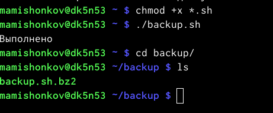

## Проверка работы скрипта

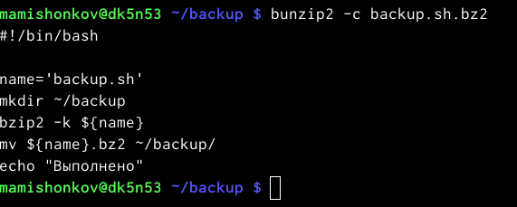

## Создание файла

- Создал файл, в котором буду писать второй скрипт, и открыл его в редакторе emacs.

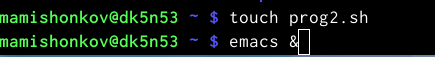

## Скрипт №2

- Написал скрипт, обрабатывающий любое произвольное число аргументов командной строки, в том числе превышающее десять.

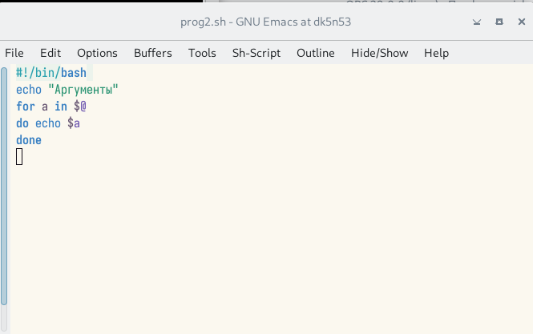

## Проверка работы скрипта

- Проверил работу скрипта, предварительно добавив для него право на выполнение. Вывел аргументы, количество которых меньше десяти и больше десяти. Скрипт работает корректно.

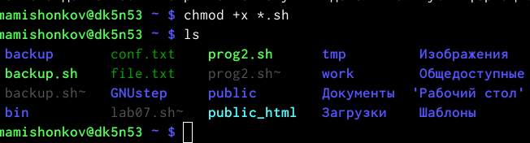

## Проверка работы скрипта

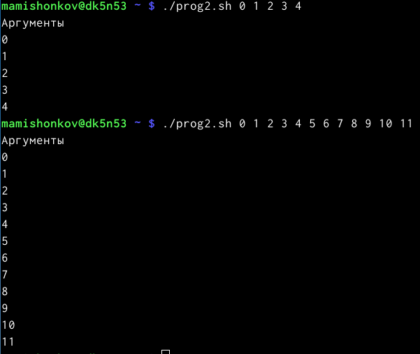

## Создание файла

- Создал файл, в котором буду писать третий скрипт, и открыл его в редакторе emacs.

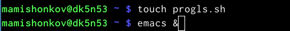

## Скрипт №3

- Написал командный файл - аналог команды ls (без использования самой команды и команды dir).он должен выдавать информацию о нужном каталоге и выводить информацию о возможностях доступа к файлам этого каталога.

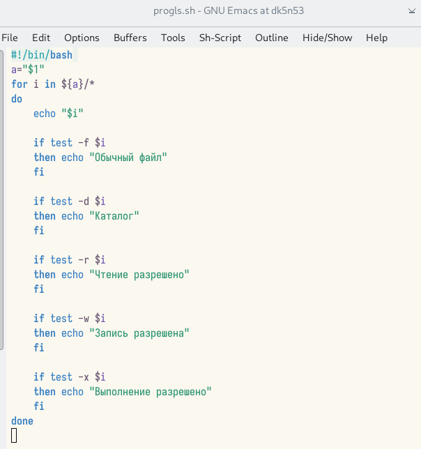

## Проверка работы скрипта

- Проверил работу скрипта, предварительно добавив для него право на выполнение. Скрипт работает корректно.

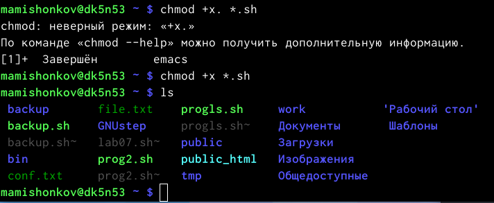

## Проверка работы скрипта

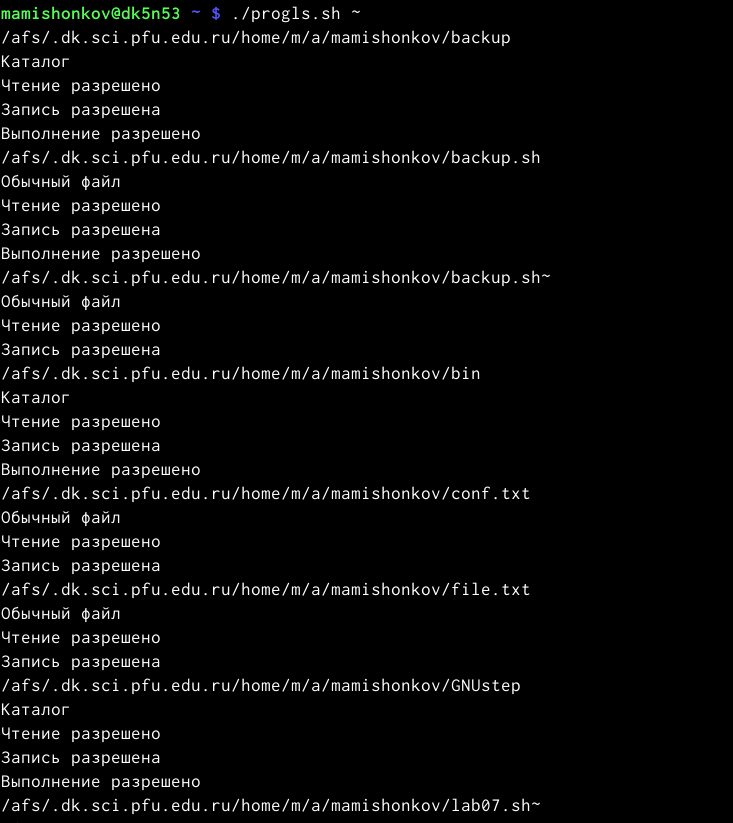

## Проверка работы скрипта

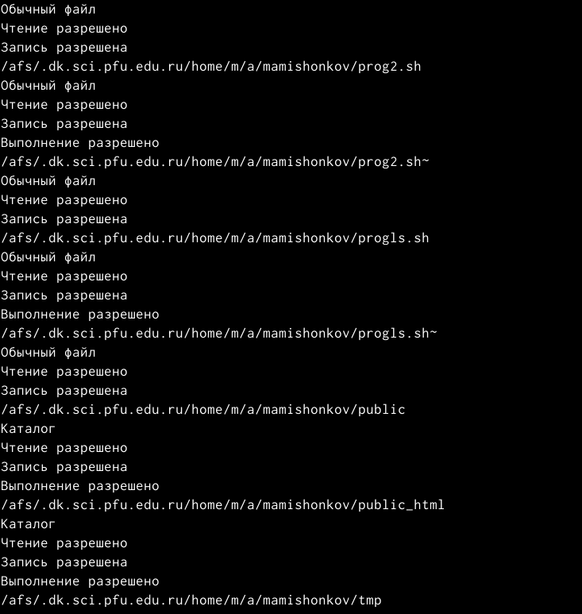

## Проверка работы скрипта

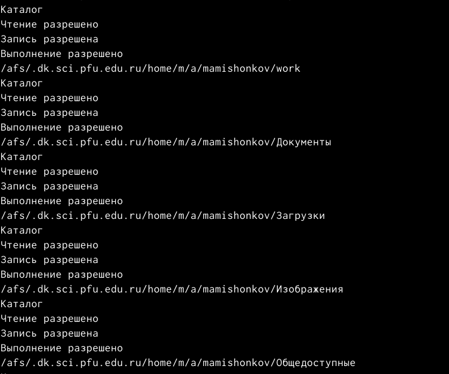

## Проверка работы скрипта

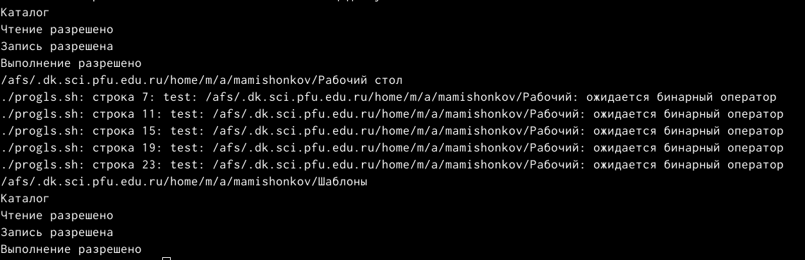

## Создание файла

- Создал файл, в котором буду писать четвёртый скрипт, и открыл его в редакторе emacs.

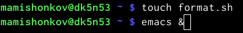

## Скрипт №3

- Написал командный файл, который получает в качестве аргумента командной строки формат файла и вычиляет количество таких файлов в указанной директории. Путь к директории так же передаётся в виде аргумента командной строки.

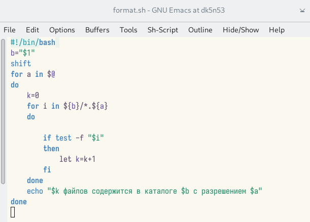

## Проверка работы скрипта

- Проверил работу скрипта, предварительно добавив для него право на выполнение и создав дополнительные файлы с разными расширениями. Скрипт работает корректно.

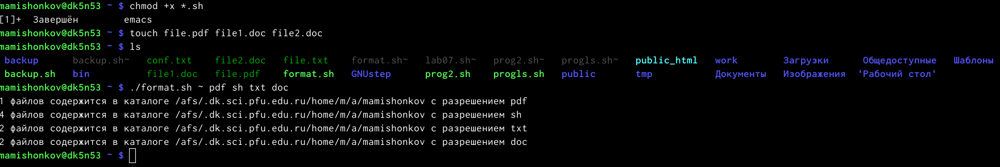

# Заключение 

## Вывод

В ходе выполнения данной лабораторной работы я изучил основы программирования в оболочке OC UNIX/Linux и приобрёл навыки написания небольших командных файлов.
