---
## Front matter
lang: ru-RU
title: Отчёт по лабораторной работе №11
subtitle: дисциплина "Операционные системы"
author:
  - Мишонков М. А.
institute:
  - Российский университет дружбы народов, Москва, Россия
date: 21 апреля 2023

## i18n babel
babel-lang: russian
babel-otherlangs: english

## Formatting pdf
toc: false
toc-title: Содержание
slide_level: 2
aspectratio: 169
section-titles: true
theme: metropolis
header-includes:
 - \metroset{progressbar=frametitle,sectionpage=progressbar,numbering=fraction}
 - '\makeatletter'
 - '\beamer@ignorenonframefalse'
 - '\makeatother'
---

# Вводная часть

## Цель

Целью выполнения данной лабораторной работы является изучение основ программирования в оболочке ОС UNIX, приобретение навыков написания сложных командных файлов с использованием логических управляющих конструкций и циклов.

# Основная часть

## Создание файла

- Создал файл для программы 1. 

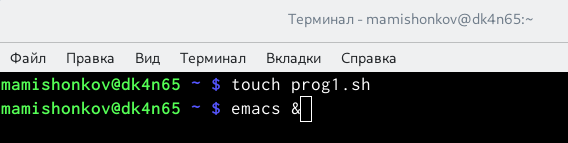

## Текст программы

- Написал текст программы 1.

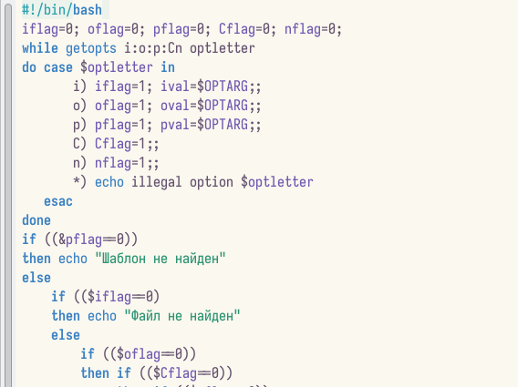

## Текст программы

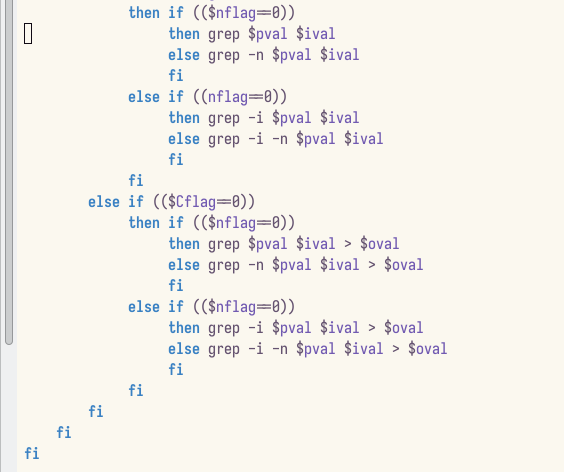

## Проверка работы написанной программы

- Проверил работу написанной программы.

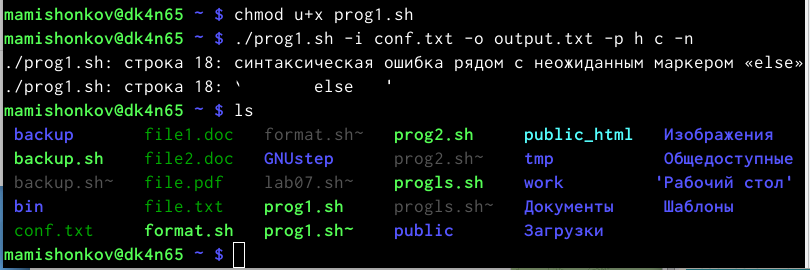

## Создание файла

- Создал файлы для программы 2.

## Текст программы

- Написал текст программы 2.

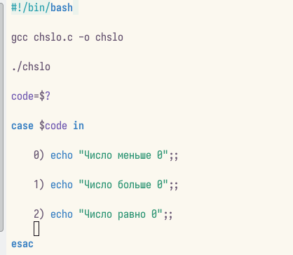

## Текст программы

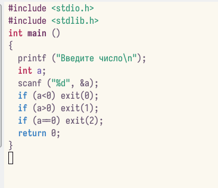

## Создание файла

- Создал файлы для программы 3.

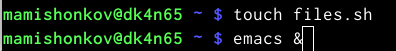

## Текст программы

- Написал текст программы 3.

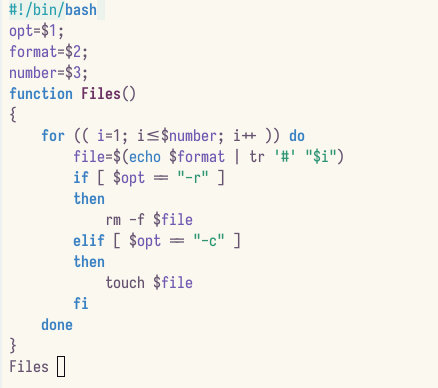

## Проверка работы написанной программы

- Проверил работу написанной программы.

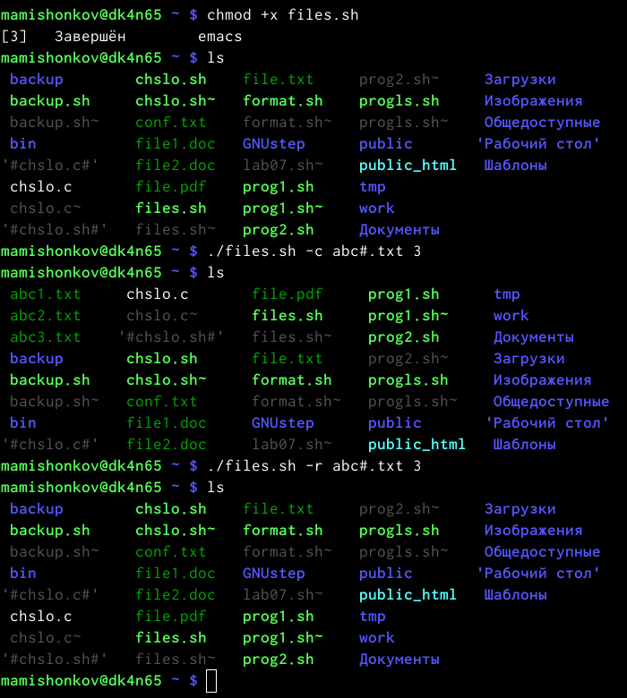

## Создание файла

- Создал файлы для программы 4.

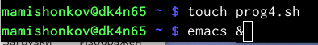

## Текст программы

- Написал текст программы 4.

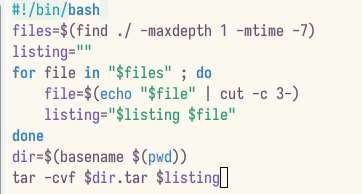

# Заключение

## Вывод

В ходе выполнения данной лабораторной работы я зучил основы программирования в оболочке ОС UNIX, научился писать сложные командные файлы с использованием логических управляющих конструкций и циклов.
