---
## Front matter
title: "Отчёт по лабораторной работе №11"
subtitle: "*дисциплина: Операционные системы*"
author: "Максим Александрович Мишонков"

## Generic otions
lang: ru-RU
toc-title: "Содержание"

## Bibliography
bibliography: bib/cite.bib
csl: pandoc/csl/gost-r-7-0-5-2008-numeric.csl

## Pdf output format
toc: true # Table of contents
toc-depth: 2
lof: true # List of figures
fontsize: 12pt
linestretch: 1.5
papersize: a4
documentclass: scrreprt
## I18n polyglossia
polyglossia-lang:
  name: russian
  options:
	- spelling=modern
	- babelshorthands=true
polyglossia-otherlangs:
  name: english
## I18n babel
babel-lang: russian
babel-otherlangs: english
## Fonts
mainfont: PT Serif
romanfont: PT Serif
sansfont: PT Sans
monofont: PT Mono
mainfontoptions: Ligatures=TeX
romanfontoptions: Ligatures=TeX
sansfontoptions: Ligatures=TeX,Scale=MatchLowercase
monofontoptions: Scale=MatchLowercase,Scale=0.9
## Biblatex
biblatex: true
biblio-style: "gost-numeric"
biblatexoptions:
  - parentracker=true
  - backend=biber
  - hyperref=auto
  - language=auto
  - autolang=other*
  - citestyle=gost-numeric
## Pandoc-crossref LaTeX customization
figureTitle: "Рис."
tableTitle: "Таблица"
listingTitle: "Листинг"
lofTitle: "Список иллюстраций"
lolTitle: "Листинги"
## Misc options
indent: true
header-includes:
  - \usepackage{indentfirst}
  - \usepackage{float} # keep figures where there are in the text
  - \floatplacement{figure}{H} # keep figures where there are in the text
---

# Цель работы

Целью выполнения данной лабораторной работы является изучение основ программирования в оболочке ОС UNIX, приобретение навыков написания сложных командных файлов с использованием логических управляющих конструкций и циклов.

# Задание

Изучить основы программирования в оболочке ОС UNIX, научиться писать сложные командные файлы с использованием логических управляющих конструкций и циклов.

# Теоретическое введение

Команда getopts осуществляет синтаксический анализ командной строки, выделяя флаги, и используется для объявления переменных. Синтаксис команды следующий: getopts option-string variable [arg ... ]

Флаги – это опции командной строки, обычно помеченные знаком минус; Например, -F является флагом для команды ls -F. Иногда эти флаги имеют аргументы, связанные с ними. Программы интерпретируют эти флаги, соответствующим образом изменяя свое поведение. Строка опций option-string — это список возможных букв и чисел соответствующего флага. Если ожидается, что некоторый флаг будет сопровождаться некоторым аргументом, то за этой буквой должно следовать двоеточие. Соответствующей переменной присваивается буква данной опции. Если команда getopts может распознать аргумент, она возвращает истину. Принято включать getopts в цикл while и анализировать введенные данные с помощью оператора case.

# Выполнение лабораторной работы

1. Создал файл для программы 1. (рис. [@fig:001])

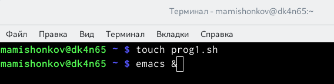{ #fig:001 width=70% }

2. Написал текст программы 1. (рис. [@fig:002], [@fig:003])

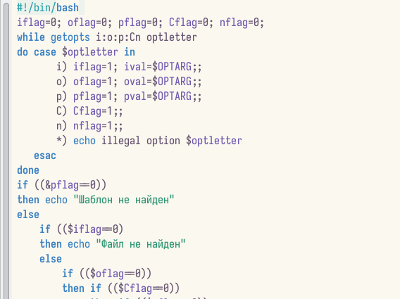{ #fig:002 width=70% }

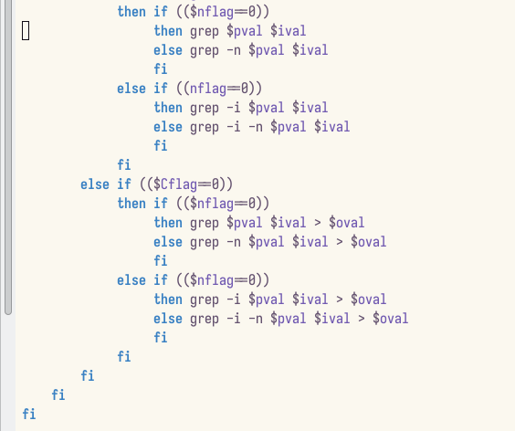{ #fig:003 width=70% }

3. Проверил работу написанной программы. (рис. [@fig:004])

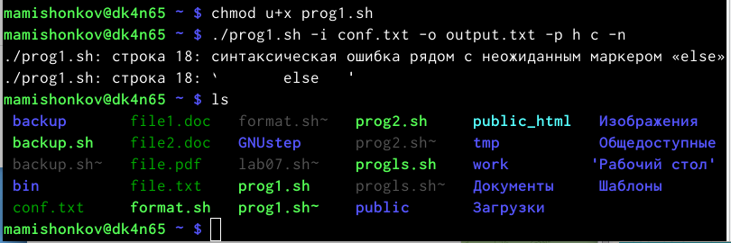{ #fig:004 width=70% }

4. Создал файлы для программы 2. (рис. [@fig:005])

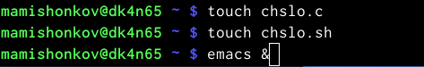{ #fig:005 width=70% }

5. Написал текст программы 2. (рис. [@fig:006], [@fig:007])

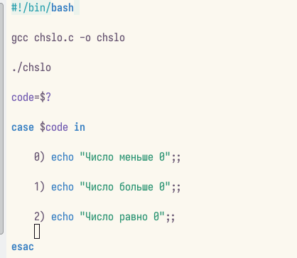{ #fig:006 width=70% }

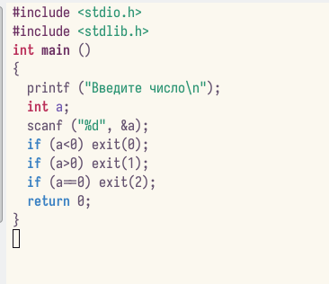{ #fig:007 width=70% }

6. Создал файлы для программы 3. (рис. [@fig:008])

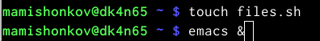{ #fig:008 width=70% }

7. Написал текст программы 3. (рис. [@fig:009])

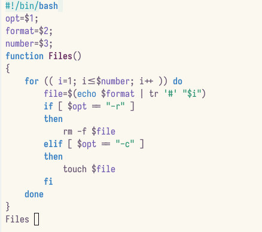{ #fig:009 width=70% }

8. Проверил работу написанной программы. (рис. [@fig:010])

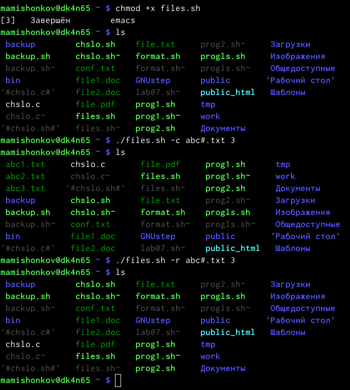{ #fig:010 width=70% }

9. Создал файлы для программы 4. (рис. [@fig:011])

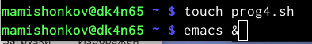{ #fig:011 width=70% }

10. Написал текст программы 4. (рис. [@fig:012])

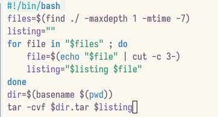{ #fig:012 width=70% }

**Контрольные вопросы:**

1. Каково предназначение команды getopts?

Команда getopts осуществляет синтаксический анализ командной строки, выделяя флаги, и используется для объявления переменных. Синтаксис команды следующий: getopts option-string variable [arg ... ]

Флаги – это опции командной строки, обычно помеченные знаком минус; Например, -F является флагом для команды ls -F. Иногда эти флаги имеют аргументы, связанные с ними. Программы интерпретируют эти флаги, соответствующим образом изменяя свое поведение. Строка опций option-string — это список возможных букв и чисел соответствующего флага. Если ожидается, что некоторый флаг будет сопровождаться некоторым аргументом, то за этой буквой должно следовать двоеточие. Соответствующей переменной присваивается буква данной опции. Если команда getopts может распознать аргумент, она возвращает истину. Принято включать getopts в цикл while и анализировать введенные данные с помощью оператора case.

2. Какое отношение метасимволы имеют к генерации имён файлов?

При перечислении имен файлов текущего каталога можно использовать следующие символы:

    ? — соответствует любому одному символу;

    [c1-c1] — соответствует любому символу, лексикографически на ходящемуся между символами c1 и с2;

    echo * — выведет имена всех файлов текущего каталога, что представляет собой простейший аналог команды ls;

    ls .c — выведет все файлы с последними двумя символами, равными .c;

    echo prog.? — выдаст все файлы, состоящие из пяти или шести символов, первыми пятью символами которых являются prog;

    [a-z] — соответствует произвольному имени файла в текущем каталоге, начинающемуся с любой строчной буквы латинского алфавита.

3. Какие операторы управления действиями вы знаете?

    Точка с запятой (;) Вы можете разместить две и более команд в одной и той же строке, разделив эти команды с помощью символа точки с запятой ;.

    Амперсанд (&) В том случае, если строка команды оканчивается символом амперсанда &, командная оболочка не будет ожидать завершения исполнения этой команды. Сразу же после ввода команды будет выведено новое приглашение командной оболочки, а сама команда будет исполняться в фоновом режиме. В момент завершения исполнения команды в фоновом режиме вы получите соответствующее сообщение.

    Cимвол доллара со знаком вопроса 

    Двойной амперсанд (&&) Командная оболочка будет интерпретировать последовательность символов && как логический оператор "И". При использовании оператора && вторая команда будет исполняться только в том случае, если исполнение первой команды успешно завершится (будет возвращен нулевой код завершения).

    Двойная вертикальная черта (||) Оператор || представляет логическую операцию "ИЛИ". Вторая команда исполняется только тогда, когда исполнение первой команды заканчивается неудачей (возвращается ненулевой код завершения).

    Комбинирование операторов && и || Вы можете использовать описанные логические операторы "И" и "ИЛИ" для создания структур условных переходов в рамках строк команд.

    Знак фунта (#) Все написанное после символа фунта (#) игнорируется командной оболочкой. Это обстоятельство оказывается полезным при возникновении необходимости в написании комментариев в сценариях командной оболочки, причем комментарии ни коим образом не будут влиять на процесс исполнения команд или процесс раскрытия команд командной оболочкой.

    Экранирование специальных символов () Символ обратного слэша \ позволяет использовать управляющие символы без их интерпретации командной оболочкой; процедура добавления данного символа перед управляющими символами называется экранированием символов.

4. Какие операторы используются для прерывания цикла?

Для управления ходом выполнения цикла служат команды break и continue [1] и точно соответствуют своим аналогам в других языках программирования. Команда break прерывает исполнение цикла, в то время как continue передает управление в начало цикло, минуя все последующие команды в теле цикла.

5. Для чего нужны команды false и true?

Команда true всегда возвращает ноль в качестве выходного статуса для индикации успеха.

Команда false всегда возвращает не-ноль в качестве выходного статуса для индикации неудачи.

6. Что означает строка if test -f man$s/$i.$s, встреченная в командном файле?

Веденная строка означает условие существования файла man$s/$i.$s

7. Объясните различия между конструкциями while и until.

Разница между циклом while (пока) и until (пока не) – это условие проверки. Пока ВЫПОЛНЯЕТСЯ условие проверки, цикл while будет продолжать работать. Однако цикл until будет выполняться только пока условие ЛОЖНО.

# Выводы

В ходе выполнения данной лабораторной работы я зучил основы программирования в оболочке ОС UNIX, научился писать сложные командные файлы с использованием логических управляющих конструкций и циклов.

