---
## Front matter
lang: ru-RU
title: Отчёт по лабораторной работе №12
subtitle: дисциплина "Операционные системы"
author:
  - Мишонков М. А.
institute:
  - Российский университет дружбы народов, Москва, Россия
date: 26 апреля 2023

## i18n babel
babel-lang: russian
babel-otherlangs: english

## Formatting pdf
toc: false
toc-title: Содержание
slide_level: 2
aspectratio: 169
section-titles: true
theme: metropolis
header-includes:
 - \metroset{progressbar=frametitle,sectionpage=progressbar,numbering=fraction}
 - '\makeatletter'
 - '\beamer@ignorenonframefalse'
 - '\makeatother'
---

# Вводная часть

## Цель

- Целью выполнения данной лабораторной работы является изучение основ программирования в оболочке ОС UNIX, приобретение навыков написания сложных командных файлов с использованием логических управляющих конструкций и циклов.

# Основная часть 

## Создание каталога и файла

- Создал рабочее пространство для скриптов данной лабораторной работы, создал файл для скрипта 1.

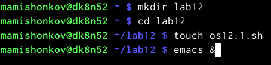

## Скрипт 1

- Написал скрипт 1.

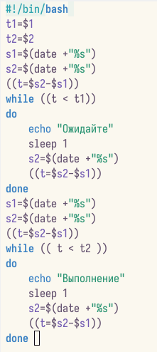

## Проверка работы скрипта 1

- Проверил работу скрипта 1.

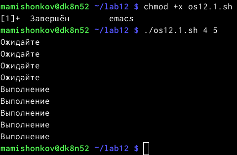

## Изменённый скрипт 1

- Изменил скрипт 1 так, чтобы его можно было выполнять в нескольких терминалах.

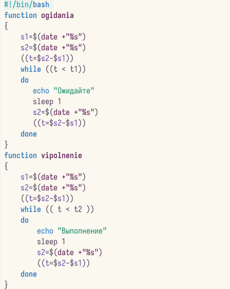

## Изменённый скрипт 1

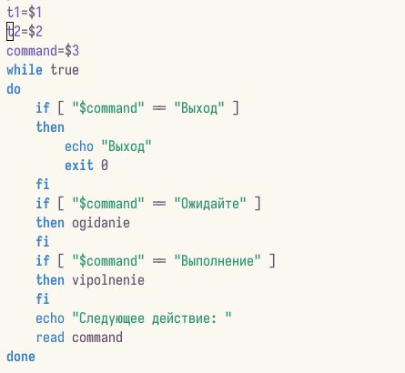

## Проверка работы изменённого скрипта 1

- Проверил работу изменённого скрипта 1.

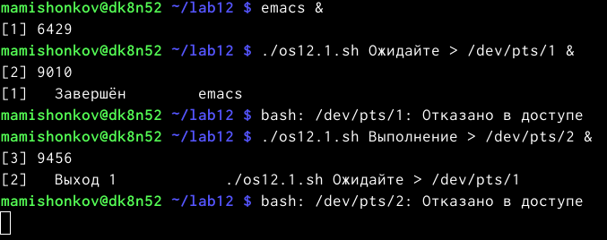

## Изучение содержимого файла

- Изучил содержимое файла "usr/share/man/man1".

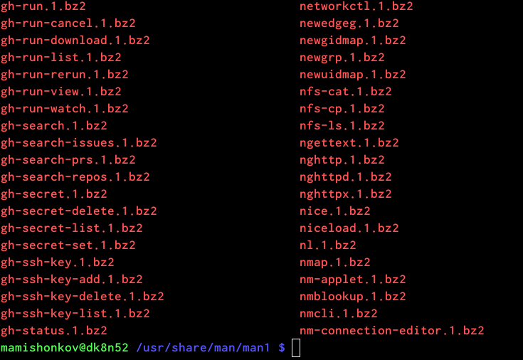

## Создание файла

- Создал файл для скрипта 2.

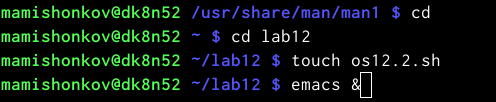

## Скрипт 2

- Написал скрипт 2.

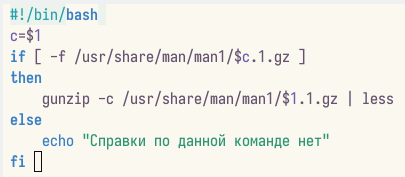

## Проверка работы скрипта 2

- Проверил работу скрипта 2.

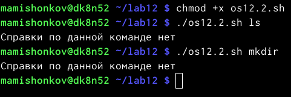

## Создание файла

- Создал файл для скрипта 3.

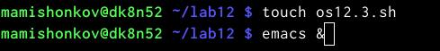

## Скрипт 3

- Написал скрипт 3.

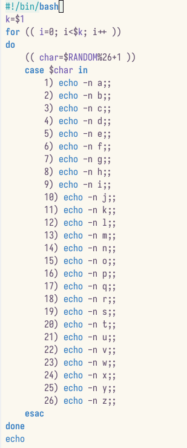

## Проверка работы скрипта 3

- Проверил работу скрипта 3.

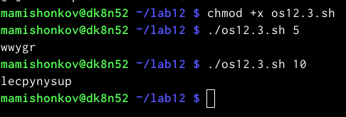

# Заключение 

## Вывод

В ходе выполнения данной лабораторной работы я изучил основы программирования в оболочке OC UNIХ, научился писать более сложные командные файлы с использованием логических управляющих конструкций и циклов.
