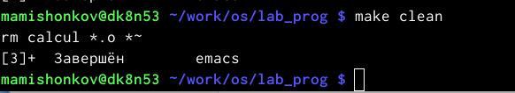

---
## Front matter
lang: ru-RU
title: Отчёт по лабораторной работе №13
subtitle: дисциплина "Операционные системы"
author:
  - Мишонков М. А.
institute:
  - Российский университет дружбы народов, Москва, Россия
date: 4 мая 2023

## i18n babel
babel-lang: russian
babel-otherlangs: english

## Formatting pdf
toc: false
toc-title: Содержание
slide_level: 2
aspectratio: 169
section-titles: true
theme: metropolis
header-includes:
 - \metroset{progressbar=frametitle,sectionpage=progressbar,numbering=fraction}
 - '\makeatletter'
 - '\beamer@ignorenonframefalse'
 - '\makeatother'
---

# Вводная часть

## Цель

- Целью данной лабораторной работы является приобретение простейших навыков разработки, анализа, тестирования и отладки приложений в ОС типа UNIX/Linux на примере создания на языке программирования С калькулятора с простейшими функциями. 

# Основная часть

## Создание каталога и файлов

- Создал рабочее пространство для данной лабораторной работы и необходимые файлы.

## Скрипт

- Написал текст программы в файле calculate.c.

## Скрипт

## Скрипт

- Написал текст программы в интерфейсном файле calculate.h, описывающем формат вызова функции калькулятора.

## Скрипт

- Написал текст программы в основном файле main.c, реализующем интерфейс пользователя к калькулятору.

## Компиляция программы

- Выполнил компиляцию программы посредством gcc.

## Скрипт

- Создал makefile c необходимым содержанием, который необходим для автоматической компиляции файлов cakculate.c, main.c, а также их объединения в один исполняемый файл calcul.

## Скрипт 

- Изменил файл, добавив в переменную CEFAGS "-g", которая необходима для компиляции объектных файлов и их использования в программе отладчика GDВ.

## Команда "make clean"

- Удалил исполняемый и объектный файлы из каталога при помощи команды "make clean".

## Компиляция файлов

- Выполнил компиляцию файлов.

## Отладчик

- Выполнил gdb отладку программы calcul. Ввёл команду "run" для запуска программы внутри отладчика.

## Команда "list"

- Для построчичного просмотра исходного кода использовал команду "list".

## Различные команды

- Проверил команды list (для просмотра строк основного файла), list calculate.c (для просмотра определённых строк не основного файла), break (для установки точки в файле), info breakpoints (для выведения информации об имеющихся точек останова).

## Запуск программы

- апустил программу внутри отладчика и убедился, что программа остановилась в момент прохождения точки останова. Посмотрел, чем равно на этом этапе значение переменной Numeral и сравнил его с результатом вывода на экран. Значения совпадают. Затем убрал точки останова. 

## Анализ программы 

- При помощи утилиты split проанализировал коды файлов calculate.c и main.c.

## Анализ программы

## Анализ программы

# Заключение 

## Вывод

В ходе выполнения данной лабораторной работы я приобрёл простейшие навыки разработки, анализа, тестирования и отладки приложений в ОС типа UNIX/Linux на примере создания на языке программирования С калькулятора с простейшими функциями. 
