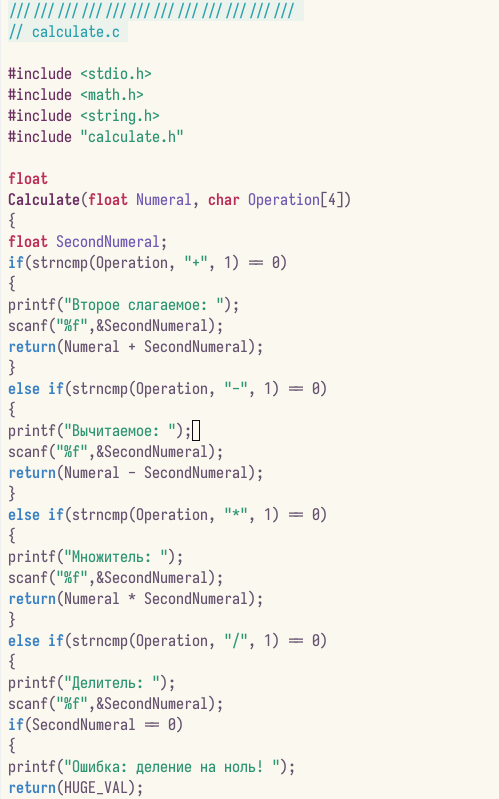
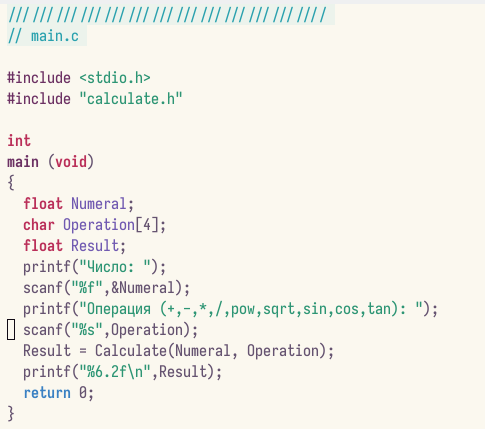
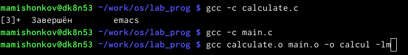
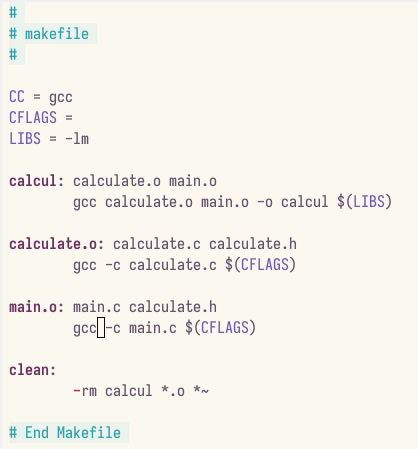
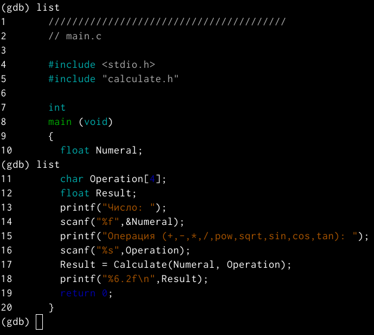
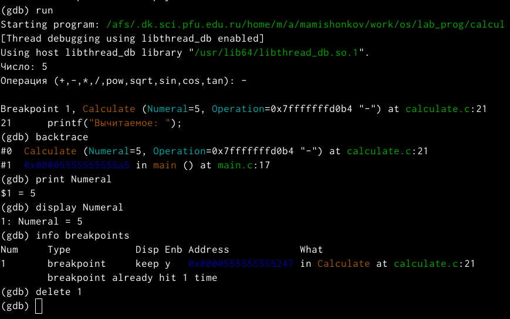

---
## Front matter
title: "Отчёт по лабораторной работе №13"
subtitle: "*дисциплина: Операционные системы*"
author: "Максим Александрович Мишонков"

## Generic otions
lang: ru-RU
toc-title: "Содержание"

## Bibliography
bibliography: bib/cite.bib
csl: pandoc/csl/gost-r-7-0-5-2008-numeric.csl

## Pdf output format
toc: true # Table of contents
toc-depth: 2
lof: true # List of figures
fontsize: 12pt
linestretch: 1.5
papersize: a4
documentclass: scrreprt
## I18n polyglossia
polyglossia-lang:
  name: russian
  options:
	- spelling=modern
	- babelshorthands=true
polyglossia-otherlangs:
  name: english
## I18n babel
babel-lang: russian
babel-otherlangs: english
## Fonts
mainfont: PT Serif
romanfont: PT Serif
sansfont: PT Sans
monofont: PT Mono
mainfontoptions: Ligatures=TeX
romanfontoptions: Ligatures=TeX
sansfontoptions: Ligatures=TeX,Scale=MatchLowercase
monofontoptions: Scale=MatchLowercase,Scale=0.9
## Biblatex
biblatex: true
biblio-style: "gost-numeric"
biblatexoptions:
  - parentracker=true
  - backend=biber
  - hyperref=auto
  - language=auto
  - autolang=other*
  - citestyle=gost-numeric
## Pandoc-crossref LaTeX customization
figureTitle: "Рис."
tableTitle: "Таблица"
listingTitle: "Листинг"
lofTitle: "Список иллюстраций"
lolTitle: "Листинги"
## Misc options
indent: true
header-includes:
  - \usepackage{indentfirst}
  - \usepackage{float} # keep figures where there are in the text
  - \floatplacement{figure}{H} # keep figures where there are in the text
---

# Цель работы

Целью данной лабораторной работы является приобретение простейших навыков разработки, анализа, тестирования и отладки приложений в ОС типа UNIX/Linux на примере создания на языке программирования С калькулятора с простейшими функциями. 

# Задание

Приобрести простейшие навыки разработки, анализа, тестирования и отладки приложений в ОС типа UNIX/Linux на примере создания на языке программирования С калькулятора с простейшими функциями. 

# Теоретическое введение

Процесс разработки программного обеспечения обычно разделяется на следующие этапы:

– планирование, включающее сбор и анализ требований к функционалу и другим характеристикам разрабатываемого приложения;

– проектирование, включающее в себя разработку базовых алгоритмов и спецификаций, определение языка программирования;

– непосредственная разработка приложения:

– кодирование — по сути создание исходного текста программы (возможно в нескольких вариантах);

– анализ разработанного кода;

– сборка, компиляция и разработка исполняемого модуля;

– тестирование и отладка, сохранение произведённых изменений;

– документирование.

Для создания исходного текста программы разработчик может воспользоваться любым удобным для него редактором текста: vi, vim, mceditor, emacs, geany и др.

После завершения написания исходного кода программы (возможно состоящей из нескольких файлов), необходимо её скомпилировать и получить исполняемый модуль.

Отладка — этап разработки компьютерной программы, на котором обнаруживают, локализуют и устраняют ошибки. Чтобы понять, где возникла ошибка, приходится узнавать текущие значения переменных и выяснять, по какому пути выполнялась программа.

# Выполнение лабораторной работы

1. Создал рабочее пространство для данной лабораторной работы и необходимые файлы. (рис. [@fig:001])

{ #fig:001 width=70% }

2. Написал текст программы в файле calculate.c. (рис. [@fig:002],[@fig:003])

{ #fig:002 width=70% }

{ #fig:003 width=70% }

3. Написал текст программы в интерфейсном файле calculate.h, описывающем формат вызова функции калькулятора. (рис. [@fig:004])

{ #fig:004 width=70% }

4. Написал текст программы в основном файле main.c, реализующем интерфейс пользователя к калькулятору. (рис. [@fig:005])

{ #fig:005 width=70% }

5. Выполнил компиляцию программы посредством gcc. (рис. [@fig:006])

{ #fig:006 width=70% }

6. Создал makefile c необходимым содержанием, который необходим для автоматической компиляции файлов cakculate.c, main.c, а также их объединения в один исполняемый файл calcul. (рис. [@fig:007])

{ #fig:007 width=70% }

7. Изменил файл, добавив в переменную CEFAGS "-g", которая необходима для компиляции объектных файлов и их использования в программе отладчика GDВ. (рис. [@fig:008])

{ #fig:008 width=70% }

8. Удалил исполняемый и объектный файлы из каталога при помощи команды "make clean". (рис. [@fig:009])

{ #fig:009 width=70% }

9. Выполнил компиляцию файлов. (рис. [@fig:010])

{ #fig:010 width=70% }

10. Выполнил gdb отладку программы calcul. Ввёл команду "run" для запуска программы внутри отладчика. (рис. [@fig:011])

{ #fig:011 width=70% }

11. Для построчичного просмотра исходного кода использовал команду "list". (рис. [@fig:012])

{ #fig:012 width=70% }

12. Проверил команды list (для просмотра строк основного файла), list calculate.c (для просмотра определённых строк не основного файла), break (для установки точки в файле), info breakpoints (для выведения информации об имеющихся точек останова). (рис. [@fig:013])

{ #fig:013 width=70% }

13. Запустил программу внутри отладчика и убедился, что программа остановилась в момент прохождения точки останова. Посмотрел, чем равно на этом этапе значение переменной Numeral и сравнил его с результатом вывода на экран. Значения совпадают. Затем убрал точки останова. (рис. [@fig:014])

{ #fig:014 width=70% }

14. При помощи утилиты split проанализировал коды файлов calculate.c и main.c. (рис. [@fig:015],[@fig:016],[@fig:017])

{ #fig:015 width=70% }

{ #fig:016 width=70% }

{ #fig:017 width=70% }

**Ответы на контрольные вопросы:**

1). Чтобы получить информацию о возможностях программ gcc, make, gdbи др.нужно воспользоваться командой manили опцией -help(-h)для каждой команды.

2). Процесс разработки программного обеспечения обычно разделяется на следующие этапы:

    планирование, включающее сбор и анализ требований к функционалу и другим характеристикам разрабатываемого приложения;
    проектирование, включающее в себя разработку базовых алгоритмов и спецификаций, определение языка программирования;
    непосредственная разработка приложения: oкодирование −по сути создание исходного текста программы (возможно в нескольких вариантах); –анализ разработанного кода; oсборка, компиляция и разработка исполняемого модуля; oтестирование и отладка, сохранение произведённых изменений;
    документирование. Для создания исходного текста программы разработчик может воспользоваться любым удобным для него редактором текста: vi, vim, mceditor, emacs, geanyи др. После завершения написания исходного кода программы (возможно состоящей из нескольких файлов), необходимо её скомпилировать и получить исполняемый модуль.

3). Для имени входного файла суффикс определяет какая компиляция требуется. Суффиксы указывают на тип объекта. Файлы с расширением (суффиксом) .cвоспринимаются gccкак программы на языке С, файлы с расширением .ccили .C−как файлы на языке C++, а файлы cрасширением .oсчитаются объектными.Например, в команде «gcc-cmain.c»:gccпо расширению (суффиксу) .cраспознает тип файла для компиляции и формирует объектный модуль −файл с расширением .o. Если требуется получить исполняемый файл с определённым именем (например, hello), то требуется воспользоваться опцией -oи в качестве параметра задать имя создаваемого файла: «gcc-ohellomaiВ ходе выполнения данной лабораторной работы я приобрелапростейшие навыки разработки, анализа, тестирования и отладки приложений в ОС типа UNIX/Linuxна примере создания на языке программирования С калькулятора с простейшими функциями.n.c».

4). Основное назначение компилятора языка Си в UNIX заключается в компиляции всей программы и получении исполняемого файла/модуля.

5). Для сборки разрабатываемого приложения и собственно компиляции полезно воспользоваться утилитой make. Она позволяет автоматизировать процесс преобразования файлов программы из одной формы в другую, отслеживает взаимосвязи между файлами.

6). Для работы с утилитой makeнеобходимо в корне рабочего каталога с Вашим проектом создать файл с названием makefileили Makefile, в котором будут описаны правила обработки файлов Вашего программного комплекса. В самом простом случае Makefile имеет следующий синтаксис: <цель_1> <цель_2> ... : <зависимость_1> <зависимость_2> ...<команда 1>...<команда n>Сначала задаётся список целей, разделённых пробелами, за которым идёт двоеточие и список зависимостей. Затем в следующих строках указываются команды. Строки с командами обязательно должны начинаться с табуляции. В качестве цели в Makefileможет выступать имя файла или название какого-то действия. Зависимость задаёт исходные параметры (условия) для достижения указанной цели. Зависимость также может быть названием какого-то действия. Команды − собственно действия, которые необходимо выполнить для достижения цели.Общий синтаксис Makefileимеет вид: target1 [target2...]:[:] [dependment1...][(tab)commands] [#commentary][(tab)commands] [#commentary]. Здесь знак # определяет начало комментария (содержимое от знака # и до конца строки не будет обрабатываться. Одинарное двоеточие указывает на то, что последовательность команд должна содержаться в одной строке. Для переноса можно в длинной строке команд можно использовать обратный слэш (). Двойное двоеточие указывает на то, что последовательность команд может содержаться в нескольких последовательных строках.Пример более сложного синтаксиса Makefile:## Makefile for abcd.c#CC = gccCFLAGS =# Compile abcd.c normalyabcd: abcd.c$(CC) -o abcd $(CFLAGS) abcd.cclean:-rm abcd *.o *~# EndMakefileforabcd.c. В этом примере в начале файла заданы три переменные: CC и CFLAGS. Затем указаны цели, их зависимости и соответствующие команды. В командах происходит обращение к значениям переменных. Цель с именем cleanпроизводит очистку каталога от файлов, полученных в результате компиляции. Для её описания использованы регулярные выражения.

7). Во время работы над кодом программы программист неизбежно сталкивается с появлением ошибок в ней. Использование отладчика для поиска и устранения ошибок в программе существенно облегчает жизнь программиста. В комплект программ GNUдля ОС типа UNIXвходит отладчик GDB(GNUDebugger). Для использования GDB необходимо скомпилировать анализируемый код программы таким образом, чтобы отладочная информация содержалась в результирующем бинарном файле. Для этого следует воспользоваться опцией -gкомпилятора gcc: gcc-cfile.c-g. После этого для начала работы с gdbнеобходимо в командной строке ввести одноимённую команду, указав в качестве аргумента анализируемый бинарный файл: gdbfile.o

8). Основные команды отладчика gdb:

    backtrace − вывод на экран пути к текущей точке останова (по сутивывод − названий всех функций);
    break − установить точку останова (в качестве параметра можетбыть указан номер строки или название функции);
    clear − удалить все точки останова в функции;
    continue − продолжить выполнение программы;
    delete − удалить точку останова;
    display − добавить выражение в список выражений, значения которых отображаются при достижении точки останова программы;
    finish − выполнить программу до момента выхода из функции;
    info breakpoints −вывести на экран список используемых точек останова;
    info watchpoints −вывести на экран список используемых контрольных выражений;
    list − вывести на экран исходный код (вВ ходе выполнения данной лабораторной работы я приобрелапростейшие навыки разработки, анализа, тестирования и отладки приложений в ОС типа UNIX/Linuxна примере создания на языке программирования С калькулятора с простейшими функциями. качестве параметра может быть указано название файла и через двоеточие номера начальнойи конечной строк);
    next − выполнить программу пошагово, но без выполнения вызываемых в программе функций;
    print − вывести значение указываемого в качестве параметра выражения;
    run − запуск программы на выполнение;
    set − установить новое значение переменной;
    step − пошаговое выполнение программы;
    watch − установить контрольное выражение, при изменении значения которого программа будет остановлена. Для выхода из gdbможно воспользоваться командой quit (или её сокращённым вариантом q) или комбинацией клавиш Ctrl-d. Более подробную информацию по работе с gdb можно получить с помощью команд gdb-hи mangdb.

9). Cхема отладки программы показана в 6 пункте лабораторной работы.

10). При первом запуске компилятор не выдал никаких ошибок, но в коде программы main.c допущена ошибка, которую компилятор мог пропустить (возможно, из-за версии 8.3.0-19): в строке scanf(“%s”, &Operation); нужно убрать знак &, потому что имя массивасимволов уже является указателемна первый элементэтого массива.

11). Система разработки приложений UNIX предоставляет различные средства, повышающие понимание исходного кода. К ним относятся: cscope −исследование функций, содержащихся в программе, lint −критическая проверка программ, написанных на языке Си.

12). Утилита splint анализирует программный код, проверяет корректность задания аргументов использованных в программе функций и типов возвращаемых значений, обнаруживает синтаксические и семантические ошибки. В отличие от компилятора Cанализатор splintгенерирует комментарии с описанием разбора кода программы и осуществляет общий контроль, обнаруживая такие ошибки, как одинаковые объекты, определённые в разных файлах, или объекты, чьи значения не используются в работt программы, переменные с некорректно заданными значениямии типами и многое другое.

# Выводы

В ходе выполнения данной лабораторной работы я приобрёл простейшие навыки разработки, анализа, тестирования и отладки приложений в ОС типа UNIX/Linux на примере создания на языке программирования С калькулятора с простейшими функциями. 
