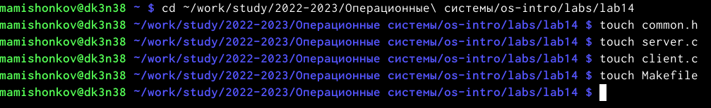
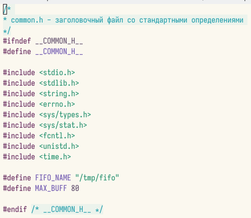
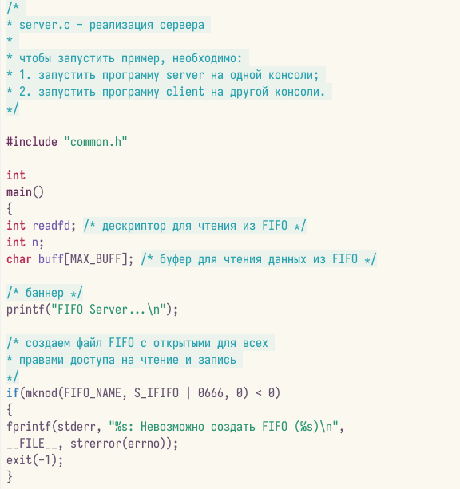
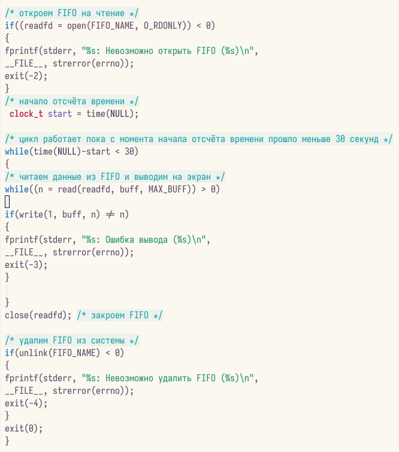
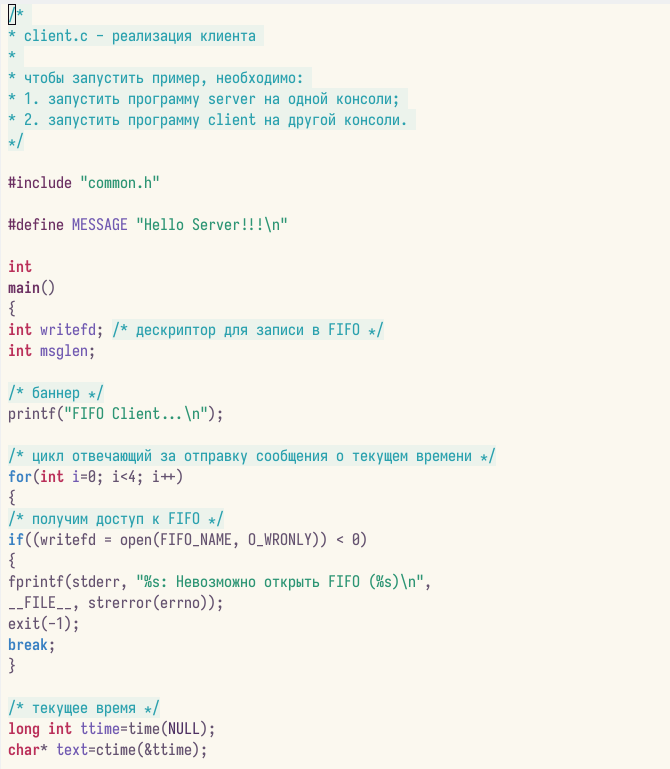
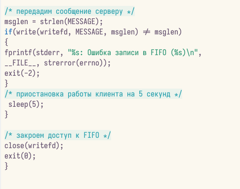
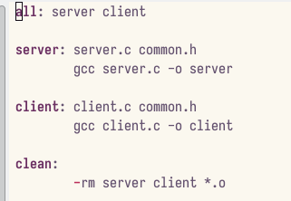
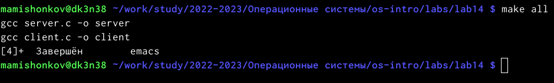
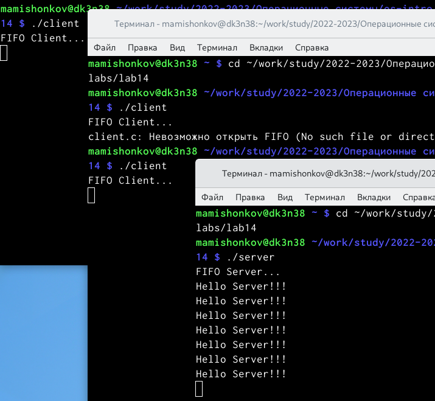

---
## Front matter
lang: ru-RU
title: Отчёт по лабораторной работе №14
subtitle: дисциплина "Операционные системы"
author:
  - Мишонков М. А.
institute:
  - Российский университет дружбы народов, Москва, Россия
date: 12 мая 2023

## i18n babel
babel-lang: russian
babel-otherlangs: english

## Formatting pdf
toc: false
toc-title: Содержание
slide_level: 2
aspectratio: 169
section-titles: true
theme: metropolis
header-includes:
 - \metroset{progressbar=frametitle,sectionpage=progressbar,numbering=fraction}
 - '\makeatletter'
 - '\beamer@ignorenonframefalse'
 - '\makeatother'
---

# Вводная часть

## Цель

- Целью выполнения данной лабораторной работе является приобретение навыков работы с именованными каналами. 

# Основная часть 

## Создание файлов

- Создал необходимые файлы.

## Файл "common.h"

- Изменил коды программ, данных в лабораторной работе. В файл common.h добавил стандартные заголовочные файлы: "unistd.h", "time.h". Это необходимо для работы других файлов. Этот файл является заголовочным, чтобы в остальных програмах не прописывать одно и то же каждый раз.

## Файл "server.c"

- В файл server.c добавил цикл "while" для контроля за верменем работы сервера. Разница между текущим временем и началом работы не должна превышать 30 секунд.

## Файл "server.c"

## Файл "client.c"

- В файл client.c добавил цикл, который отвечает за количество сообщений о текущем времени (4 сообщения). С промощью команды "sleep" приостановил работу клиента на 5 секунд.

## Файл "client.c"

## Файл "Makefile"

- Makefile оставил без изменений.

## Компиляция файлов

- Сделал компиляцию файлов с помощью команды "make all".

## Проверка работы

- Открыл три терминала для проверки работы файлов. В первом написал "./server", а в остальных - "./client". В результате каждый терминал вывел по 4 сообщения, а по истечение 30 секунд работа сервера была завершена. Всё работает верно.

# Заключение 

## Вывод

- В ходе выполнения данной лабораторной работы приобрёл навыки работы с именованными каналами. 

