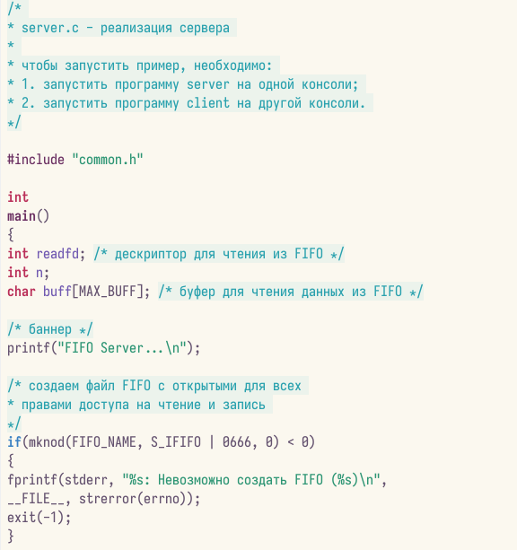
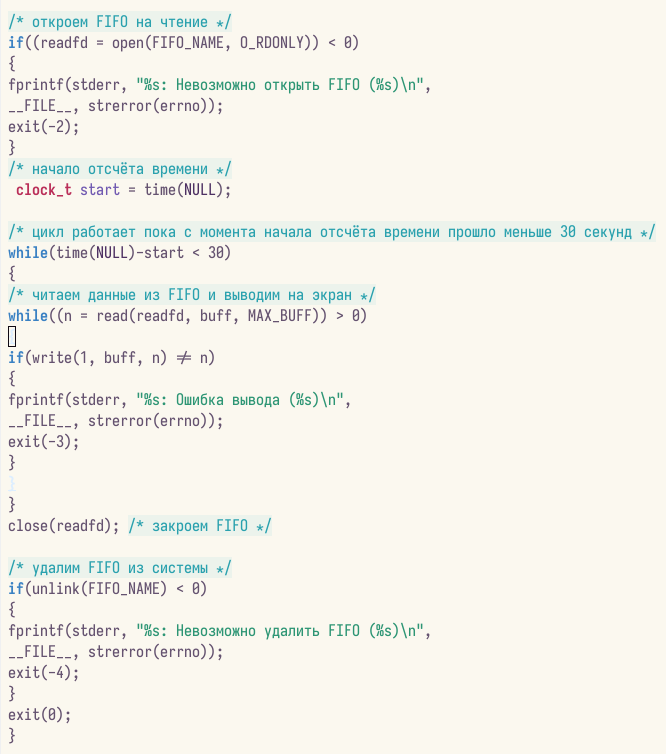
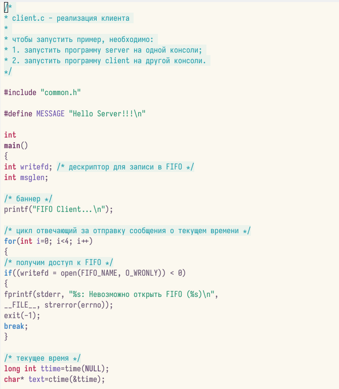
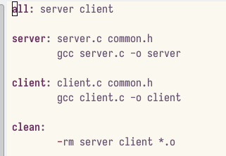
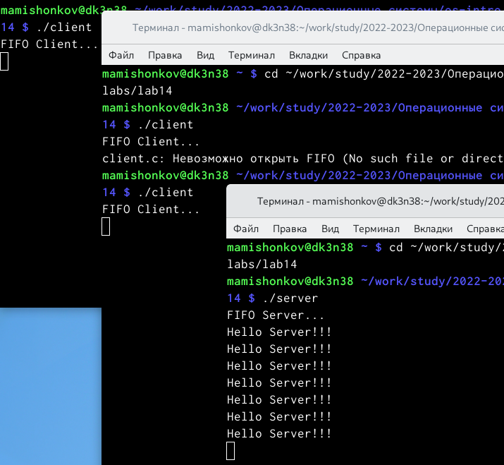

---
## Front matter
title: "Отчёт по лабораторной работе №14"
subtitle: "*дисциплина: Операционные системы*"
author: "Максим Александрович Мишонков"

## Generic otions
lang: ru-RU
toc-title: "Содержание"

## Bibliography
bibliography: bib/cite.bib
csl: pandoc/csl/gost-r-7-0-5-2008-numeric.csl

## Pdf output format
toc: true # Table of contents
toc-depth: 2
lof: true # List of figures
fontsize: 12pt
linestretch: 1.5
papersize: a4
documentclass: scrreprt
## I18n polyglossia
polyglossia-lang:
  name: russian
  options:
	- spelling=modern
	- babelshorthands=true
polyglossia-otherlangs:
  name: english
## I18n babel
babel-lang: russian
babel-otherlangs: english
## Fonts
mainfont: PT Serif
romanfont: PT Serif
sansfont: PT Sans
monofont: PT Mono
mainfontoptions: Ligatures=TeX
romanfontoptions: Ligatures=TeX
sansfontoptions: Ligatures=TeX,Scale=MatchLowercase
monofontoptions: Scale=MatchLowercase,Scale=0.9
## Biblatex
biblatex: true
biblio-style: "gost-numeric"
biblatexoptions:
  - parentracker=true
  - backend=biber
  - hyperref=auto
  - language=auto
  - autolang=other*
  - citestyle=gost-numeric
## Pandoc-crossref LaTeX customization
figureTitle: "Рис."
tableTitle: "Таблица"
listingTitle: "Листинг"
lofTitle: "Список иллюстраций"
lolTitle: "Листинги"
## Misc options
indent: true
header-includes:
  - \usepackage{indentfirst}
  - \usepackage{float} # keep figures where there are in the text
  - \floatplacement{figure}{H} # keep figures where there are in the text
---

# Цель работы

Целью выполнения данной лабораторной работе является приобретение навыков работы с именованными каналами. 

# Задание

Научиться работать с именованными каналами.

# Теоретическое введение

Одним из видов взаимодействия между процессами в операционных системах является обмен сообщениями. Под сообщением понимается последовательность байтов, передаваемая от одного процесса другому.

В операционных системах типа UNIX есть 3 вида межпроцессорных взаимодействий: общеюниксные (именованные каналы, сигналы), System V Interface Definition (SVID — разделяемая память, очередь сообщений, семафоры) и BSD (сокеты).

Для передачи данных между неродственными процессами можно использовать механизм именованных каналов (named pipes). Данные передаются по принципу FIFO (First In First Out) (первым записан — первым прочитан), поэтому они называются также FIFO pipes или просто FIFO. Именованные каналы отличаются от неименованных наличием идентификатора канала, который представлен как специальный файл (соответственно имя именованного канала — это имя файла). Поскольку файл находится на локальной файловой системе, данное IPC используется внутри одной системы.

# Выполнение лабораторной работы

1. Создал необходимые файлы. (рис. [@fig:001])

{ #fig:001 width=70% }

2. Изменил коды программ, данных в лабораторной работе. В файл common.h добавил стандартные заголовочные файлы: "unistd.h", "time.h". Это необходимо для работы других файлов. Этот файл является заголовочным, чтобы в остальных програмах не прописывать одно и то же каждый раз. (рис. [@fig:002])

{ #fig:002 width=70% }

3. В файл server.c добавил цикл "while" для контроля за верменем работы сервера. Разница между текущим временем и началом работы не должна превышать 30 секунд. (рис. [@fig:003],[@fig:004])

{ #fig:003 width=70% }

{ #fig:004 width=70% }

4. В файл client.c добавил цикл, который отвечает за количество сообщений о текущем времени (4 сообщения). С промощью команды "sleep" приостановил работу клиента на 5 секунд.(рис. [@fig:005],[@fig:006])

{ #fig:005 width=70% }

{ #fig:006 width=70% }

5. Makefile оставил без изменений. (рис. [@fig:007])

{ #fig:007 width=70% }

6. Далее делаем компиляцию файлов с помощью команды "make all". (рис. [@fig:008])

{ #fig:008 width=70% }

7. Открывал три терминала для проверки работы файлов. В первом написал "./server", а в остальных - "./client". В результате каждый терминал вывел по 4 сообщения, а по истечение 30 секунд работа сервера была завершена. Всё работает верно. (рис. [@fig:009])

{ #fig:009 width=70% }

**Контрольные вопросы:**

1). Именованные каналы отличаются от неименованных наличием идентификатора канала, который представлен как специальный файл (соответственно имя именованного канала −это имя файла). Поскольку файл находится на локальной файловой системе, данное IPC используется внутри одной системы.

2). Чтобы создать неименованный канал из командной строкинужно использовать символ |, служащий для объединения двух и более процессов: процесс_1 |процесс_2 | процесс_3...

3). Чтобы создать именованный канал из командной строкинужно использовать либо команду «mknod<имя_файла>», либо команду «mkfifo<имя_файла>».

4). Неименованный канал является средством взаимодействия между связанными процессами −родительским и дочерним. Родительский процесс создает канал при помощи системного вызова: «int pipe(int fd[2]);». Массив из двух целых чисел является выходным параметром этого системного вызова. Если вызов выполнился нормально, то этот массив содержит два файловых дескриптора. fd[0] является дескриптором для чтения из канала, fd[1] −дескриптором для записи в канал. Когда процесс порождает другой процесс, дескрипторы родительского процесса наследуются дочерним процессом, и, таким образом, прокладывается трубопровод между двумя процессами. Естественно, что один из процессов использует канал только для чтения, а другой −только для записи. Поэтому, если, например, через канал должны передаваться данные из родительского процесса в дочерний, родительский процесс сразу после запуска дочернего процесса закрывает дескриптор канала для чтения, а дочерний процесс закрывает дескриптор для записи. Если нужен двунаправленный обмен данными между процессами, то родительский процесс создает два канала, один из которых используется для передачи данных в одну сторону, а другой −в другую.

5). Файлы именованных каналов создаются функцией mkfifo() или функцией mknod:

    «intmkfifo(constchar*pathname, mode_tmode);», где первый параметр − путь, где будет располагаться FIFO (имя файла, идентифицирующего канал), второй параметр определяет режим работы с FIFO (маска прав доступа к файлу),
    «mknod (namefile, IFIFO | 0666, 0)», где namefile −имя канала, 0666 −к каналу разрешен доступ на запись и на чтение любому запросившему процессу),
    «int mknod(const char *pathname, mode_t mode, dev_t dev);».Функцияmkfifo() создает канал и файл соответствующего типа. Если указанный файл канала уже существует, mkfifo() возвращает -1. После создания файла канала процессы, участвующие в обмене данными, должны открыть этот файл либо для записи, любо для чтения.

6). При чтении меньшего числа байтов, чем находится в канале или FIFO, возвращается требуемое число байтов, остаток сохраняется для последующих чтений.При чтении большего числа байтов, чем находится в канале или FIFO, возвращается доступное число байтов. Процесс, читающий из канала, должен соответствующим образом обработать ситуацию, когда прочитано меньше, чем заказано.

7). Запись числа байтов, меньшего емкости канала или FIFO, гарантированно атомарно. Это означает, что в случае, когда несколько процессов одновременнозаписывают в канал, порции данных от этих процессов не перемешиваются.При записи большего числа байтов, чем это позволяет канал или FIFO, вызов write(2) блокируется до освобождения требуемого места. При этом атомарность операции не гарантируется. Если процесс пытается записать данные в канал, не открытый ни одним процессом на чтение, процессу генерируется сигнал SIGPIPE, а вызов write(2) возвращает 0 с установкой ошибки (errno=ERRPIPE) (если процесс не установил обработки сигнала SIGPIPE, производится обработка по умолчанию −процесс завершается).

8). Количество процессов, которые могут параллельно присоединяться к любому концу канала, не ограничено. Однако если два или более процесса записывают в канал данные одновременно, каждый процесс за один раз может записать максимум PIPE BUF байтов данных. Предположим, процесс (назовем его А) пытается записать X байтов данных в канал, в котором имеется место для Y байтов данных. Если X больше, чем Y, только первые Y байтов данных записываются в канал, и процесс блокируется. Запускается другой процесс (например. В); в это время в канале появляется свободное пространство (благодаря третьему процессу, считывающему данные из канала). Процесс В записывает данные в канал. Затем, когда выполнение процесса А возобновляется, он записывает оставшиеся X-Y байтов данных в канал. В результате данные в канал записываются поочередно двумя процессами. Аналогичным образом, если два (или более) процесса одновременно попытаются прочитать данные из канала, может случиться так, что каждый из них прочитает только часть необходимых данных.

9). Функция write записывает байты count из буфера buffer вфайл, связанный с handle. Операции write начинаются с текущей позиции указателя на файл (указатель ассоциирован с заданным файлом). Если файл открыт для добавления, операции выполняются в конец файла. После осуществления операций записи указатель нафайл(если он есть) увеличивается на количество действительно записанных байтов.Функция write возвращает число действительно записанныхбайтов. Возвращаемое значение должно быть положительным, но меньше числа count (например, когда размер для записи count байтоввыходит за пределы пространства на диске). Возвращаемое значение-1 указывает на ошибку; errno устанавливается в одно из следующихзначений:EACCES − файл открыт для чтения или закрыт длязаписи,EBADF− неверный handle-р файла,ENOSPC − на устройстве нет свободного места.Единица в вызове функции writeв программе server.cозначаетидентификатор (дескриптор потока) стандартного потока вывода.

10). Прототип функции strerror: «char * strerror( int errornum );». Функция strerror интерпретирует номер ошибки, передаваемый в функцию в качестве аргумента −errornum, в понятное для человека текстовое сообщение (строку). Откуда берутся эти ошибки? Ошибки эти возникают при вызове функций стандартных Си-библиотек. То есть хорошим тоном программирования будет − использование этой функции в паре с другой, и если возникнет ошибка, то пользователь или программист поймет,как исправить ошибку, прочитав сообщение функции strerror. Возвращенный указатель ссылается на статическую строку с ошибкой, которая не должна быть изменена программой. Дальнейшие вызовы функции strerror перезапишут содержание этой строки. Интерпретированные сообщения об ошибках могут различаться, это зависит от платформы и компилятора.

# Выводы

В ходе выполнения данной лабораторной работы приобрёл навыки работы с именованными каналами. 

