---
## Front matter
lang: ru-RU
title: Отчёт по первому этапу индивидуального проекта
subtitle: дисциплина "Операционные системы"
author:
  - Мишонков М. А.
institute:
  - Российский университет дружбы народов, Москва, Россия
date: 22 февраля 2023

## i18n babel
babel-lang: russian
babel-otherlangs: english

## Formatting pdf
toc: false
toc-title: Содержание
slide_level: 2
aspectratio: 169
section-titles: true
theme: metropolis
header-includes:
 - \metroset{progressbar=frametitle,sectionpage=progressbar,numbering=fraction}
 - '\makeatletter'
 - '\beamer@ignorenonframefalse'
 - '\makeatother'
---

# Вводная часть

## Цель работы

Целью данной работы является размещение на Github pages заготовки для персонального сайта.

# Основная часть

## Скачивание файла hugo

- Скачаем исполняемый файл hugo (hugo_extended_0.98.0_Linux-64bit.tar.gz) для генерации страниц сайта.

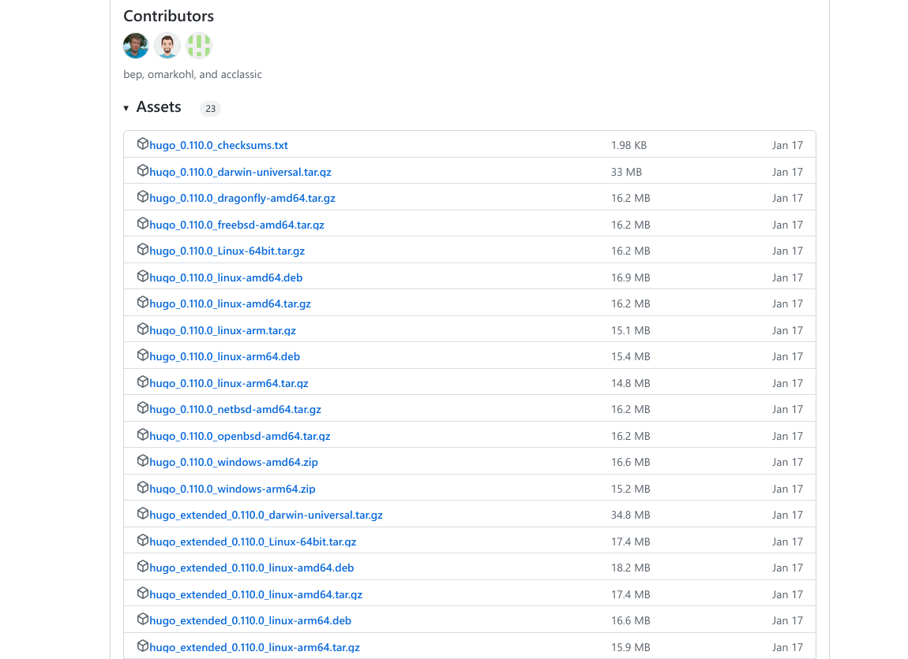

## Разархивация файла

- Перейдём в "Загрузки" и разархивируем файл.

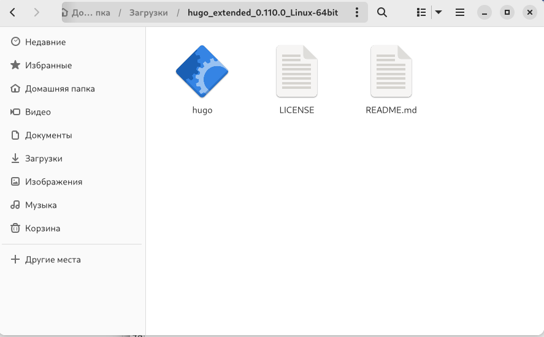

## Создание папки "bin" с файлом hugo

- Создадим папку "bin" с файлом hugo.

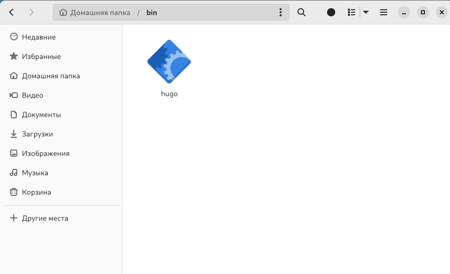

## Создание репозитория

- Создадим репозиторий blog на основе шаблона.

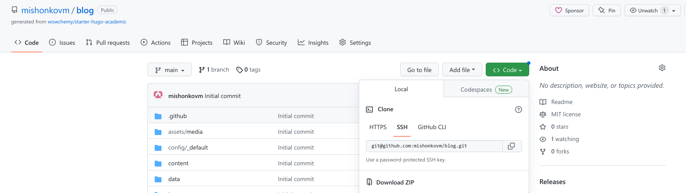

## Кланирование репозитория 

- Склонируем созданный репозиторий.

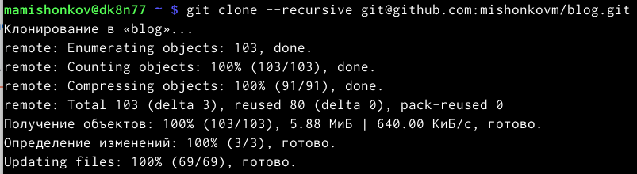

## Введение нужной команды в терминале 

- Перейдём в каталог "blog" и введём в терминале ~/bin/hugo server.

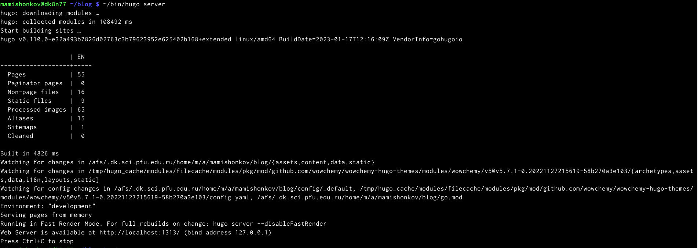

## Копирование ссылки

- Скопируем ссылку из предыдущего слайда и вставим её в браузер.

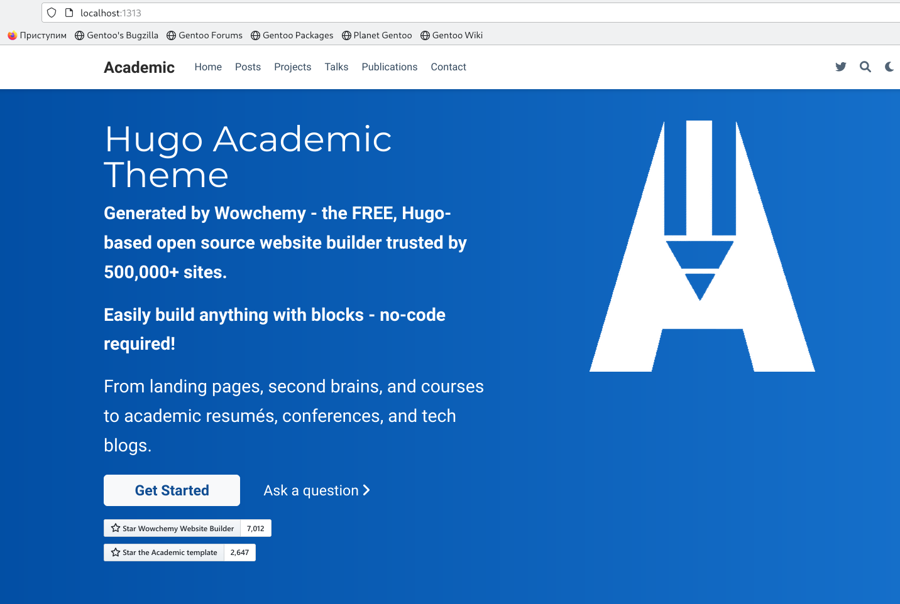

## Создание репозитория 

- Создадим репозиторий mishonkovm.github.io.

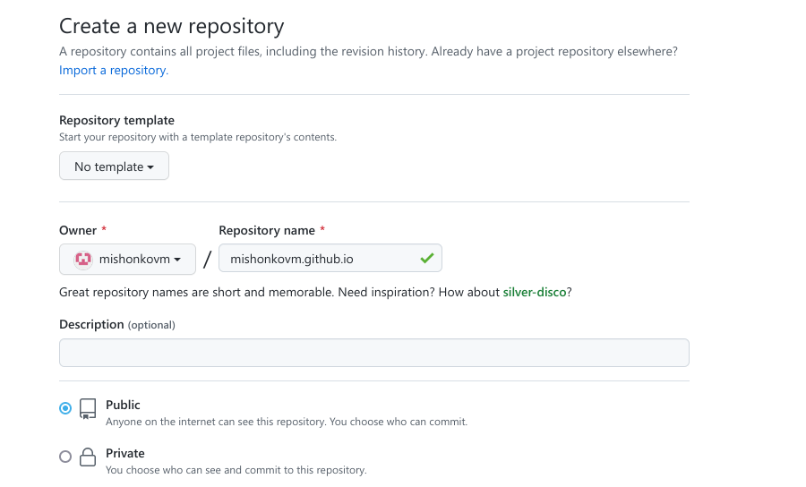

## Клонирование репозитория

- Перейдём в терминал и склонируем созданный репозиторий.

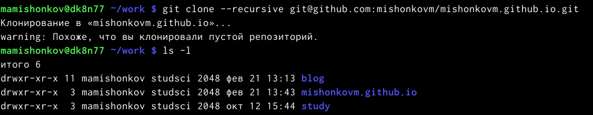

## Создание ветки 

- Перейдём в созданный каталог и введём в терминале команду git checkout -b main, чтобы создать ветку.

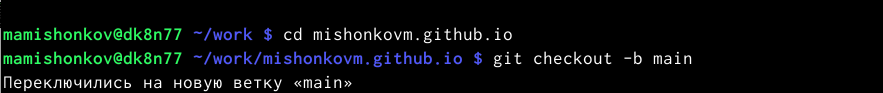

## Активация репозитория

- Создадим файл, чтобы активировать созданный репозиторий.

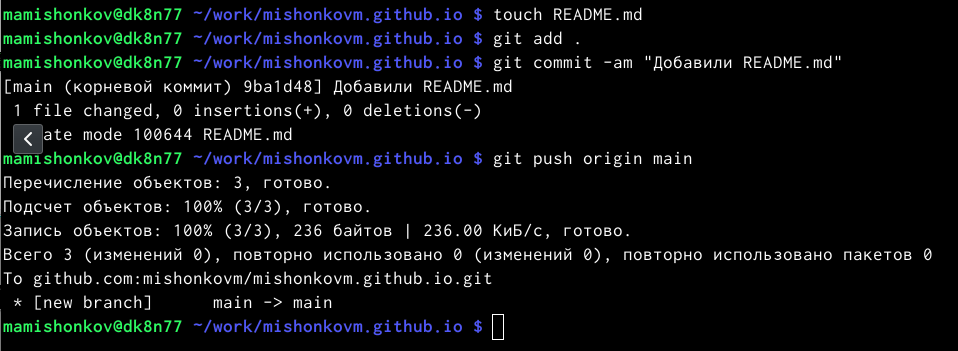

## Подключение репозитория к папке "public"

- Перейдём в каталог "blog" и введём в терминале команду git submodule add -b main git@github.com:mishonkovm/mishonkovm.github.io.git public, чтобы созданный репозиторий подключить к папке "public" внутри каталога "blog".

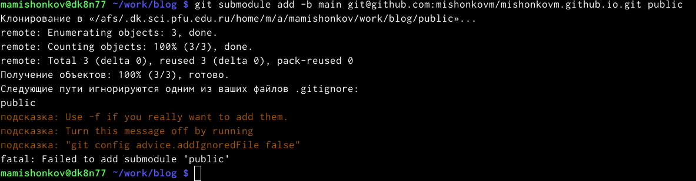

## Комментирование public 

- Откроем в mc файл .gitignore и скомментируем public, сохраним изменения.

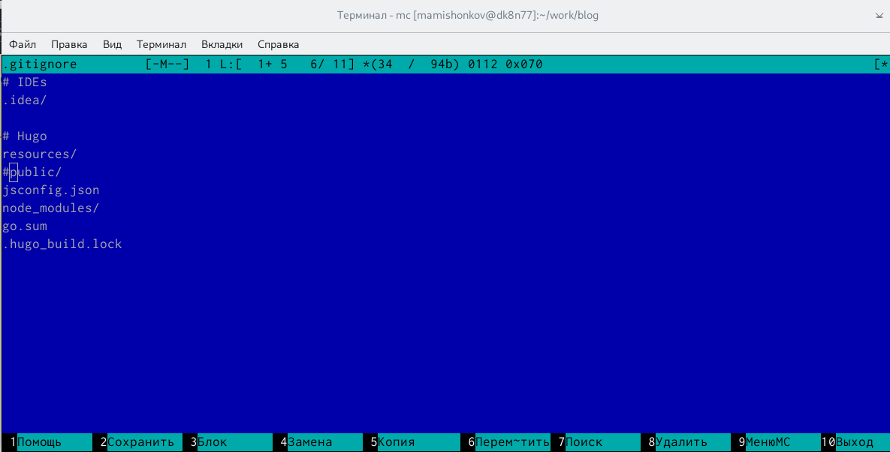

## Введение нужной команды

- Введём в терминал команду git submodule add -b main git@github.com:mishonkovm/mishonkovm.github.io.git public.

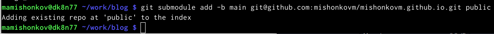

## Введение нужной команды

- Введём нужную команду, находясь в каталоге "blog", чтобы появились нужные файлы в папке "public".

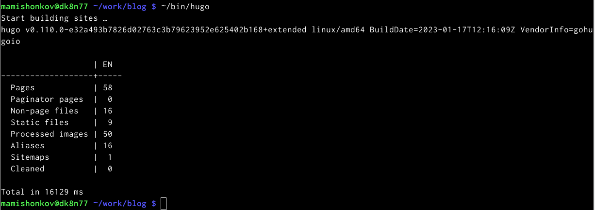

## Появившиеся файлы

- Видим, что файлы появились. 

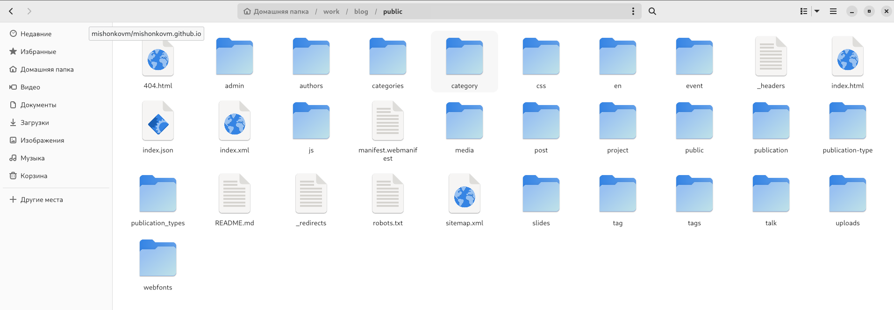

## Синхронизация файлов с репозиторием

- Синхронизируем появившиеся файлы с репозиторием, перейдя в папку "public".

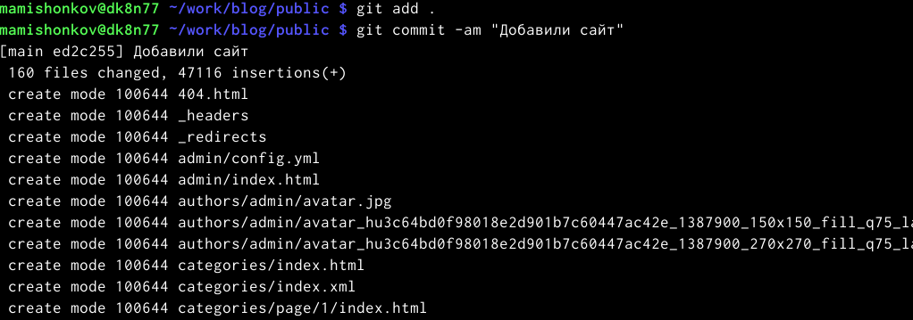

## Синхронизация файлов с репозиторием

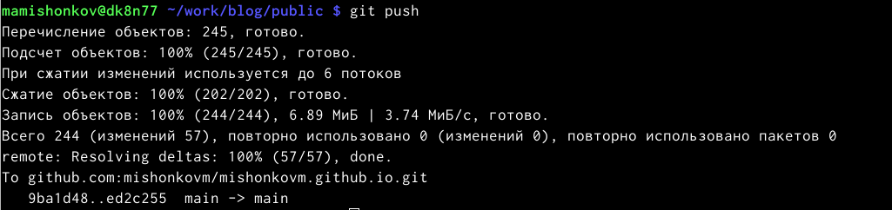

## Обновление репозитория

- Обновим репозиторий и проверим, что все файлы появились.

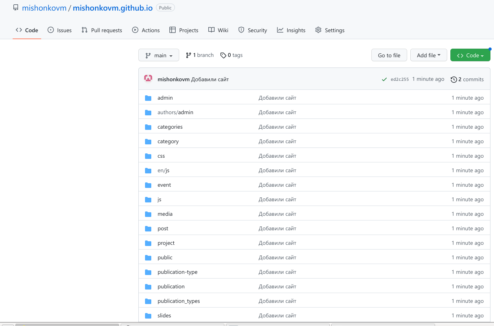

# Заключение

## Вывод

В ходе выполнения данной работы я разместил на Github pages заготовки для персонального сайта. Первый этап индивидуального проекта завершён. 
