---
## Front matter
lang: ru-RU
title: Отчёт по индивидуальному проекту
subtitle: stage 2
author:
  - Мишонков М. А.
institute:
 - Российский университет дружбы народов, Москва, Россия
date: 17 марта 2023

## i18n babel
babel-lang: russian
babel-otherlangs: english

## Formatting pdf
toc: false
toc-title: Содержание
slide_level: 2
aspectratio: 169
section-titles: true
theme: metropolis
header-includes:
 - \metroset{progressbar=frametitle,sectionpage=progressbar,numbering=fraction}
 - '\makeatletter'
 - '\beamer@ignorenonframefalse'
 - '\makeatother'
---

# Вводная часть

## Цель

Целью данной лабораторной работы является приобретение навыков работы с собственным сайтом.

# Основная часть

## Фотография владельца

- Разместил фотографию владельца сайта.

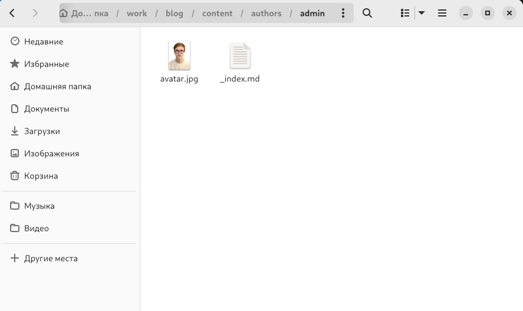

## Информация о себе

- Разместил краткое описание владельца сайта, информацию об интересах, информацию об образовании.

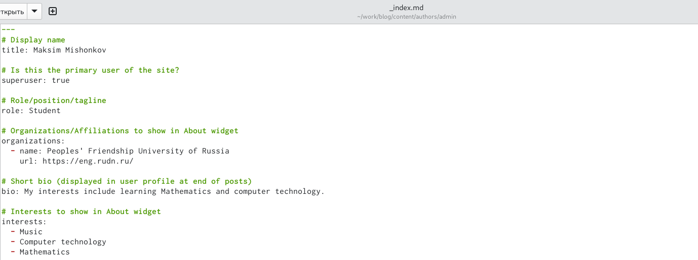

## Информация о себе

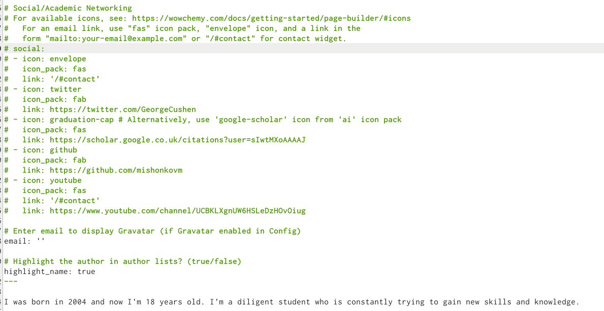

## Информация о себе

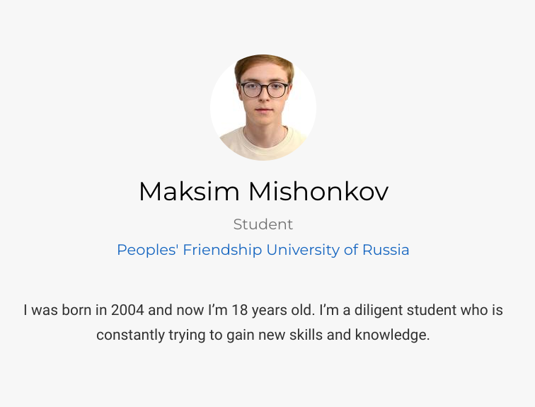

## Создание файла

- Создал файл last week.

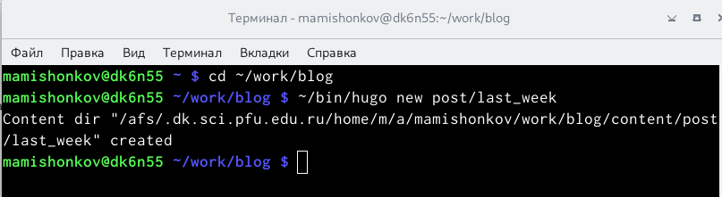

## Написание поста

- Сделал пост по прошедшей неделе.

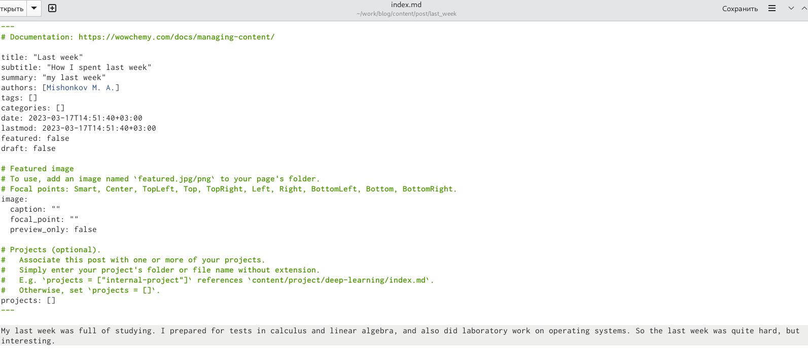

## Размещение поста

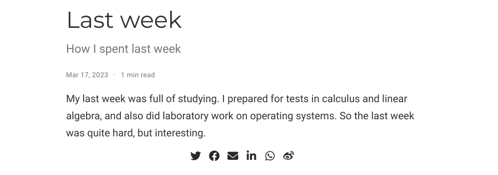

## Создание файла

- Создал файл Git.

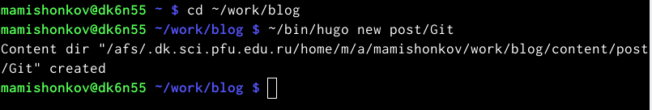

## Написание поста

- Сделал пост про систему контроля версий Git.

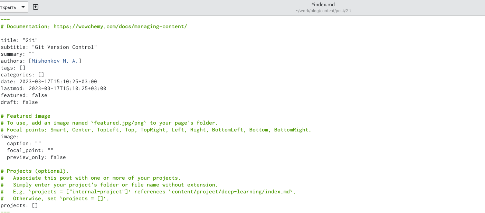

## Написание поста

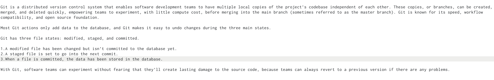

## Размещение поста

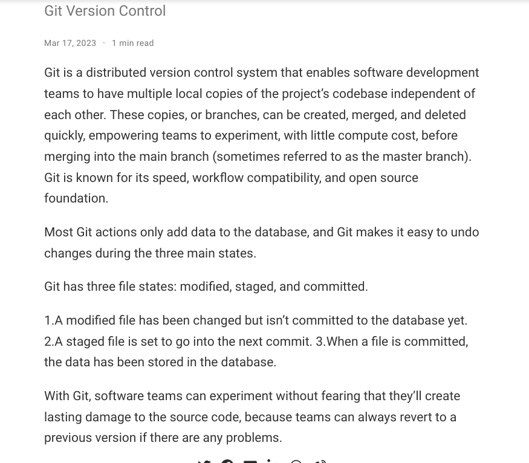

# Заключение 

## Вывод

В ходе выполнения данной лабораторной работы я приобрёл навыки создания собственного сайта.

