---
## Front matter
lang: ru-RU
title: Отчёт по индивидуальному проекту
subtitle: stage 3
author:
  - Мишонков M. A.
institute:
  - Российский университет дружбы народов, Москва, Россия
date: 07 апреля 2023

## i18n babel
babel-lang: russian
babel-otherlangs: english

## Formatting pdf
toc: false
toc-title: Содержание
slide_level: 2
aspectratio: 169
section-titles: true
theme: metropolis
header-includes:
 - \metroset{progressbar=frametitle,sectionpage=progressbar,numbering=fraction}
 - '\makeatletter'
 - '\beamer@ignorenonframefalse'
 - '\makeatother'
---

# Вводная часть

## Цель

Целью данной лабораторной работы является приобретение навыков работы с собственным сайтом (добавление собственных достижений)

# Основная часть

## Добавление информации о навыках

Добавил информацию о навыках.

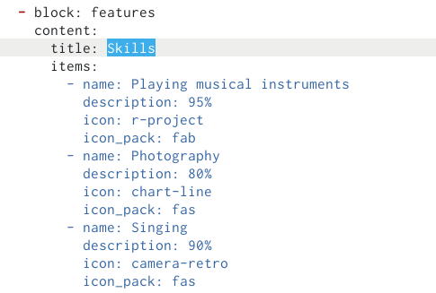

## Добавление информации о навыках

Добавил информацию об опыте.

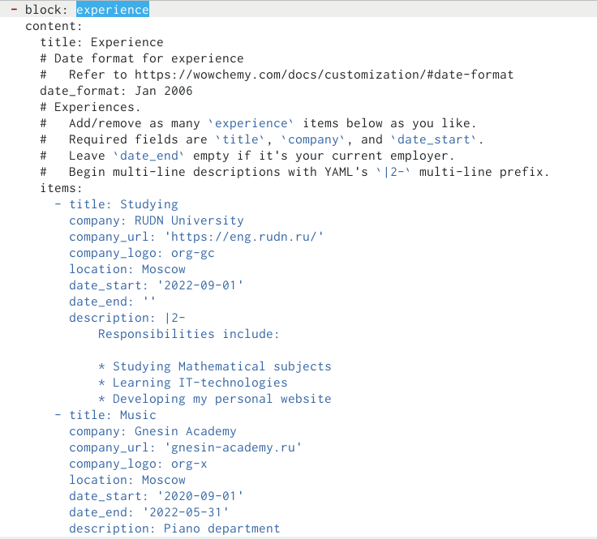

## Добавление информации о достижениях

Добавил информацию о достижениях.

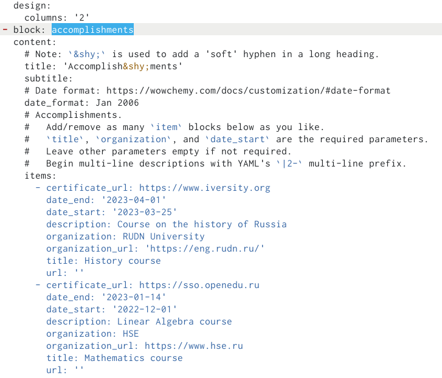

## Проверка изменений на сайте

Проверил изменения на сайте.

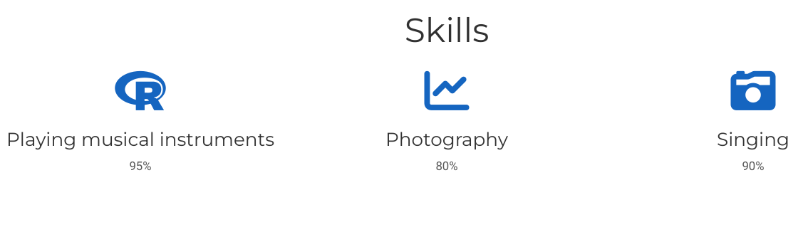

## Проверка изменений на сайте

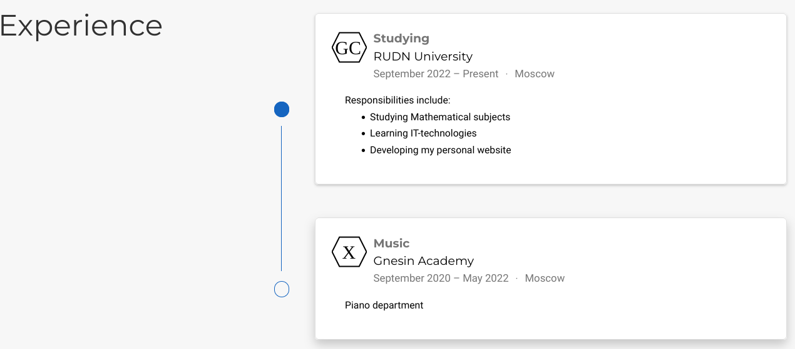

## Проверка изменений на сайте

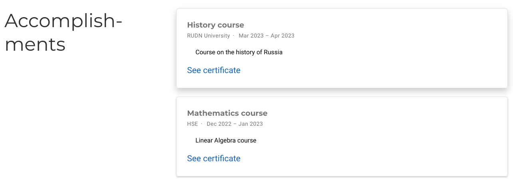

## Создание папки

Создал в терминале папку для поста о прошедшей неделе.

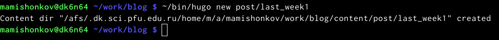

## Текст о прошедшей неделе

Написал текст о прошедшей неделе.

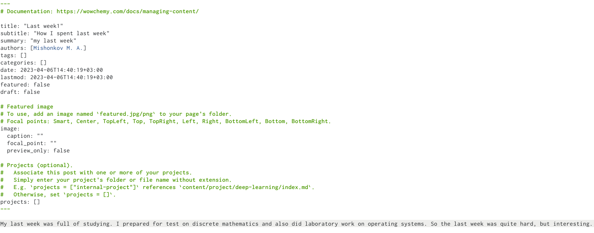

## Проверка изменений на сайте

Проверил изменения на сайте.

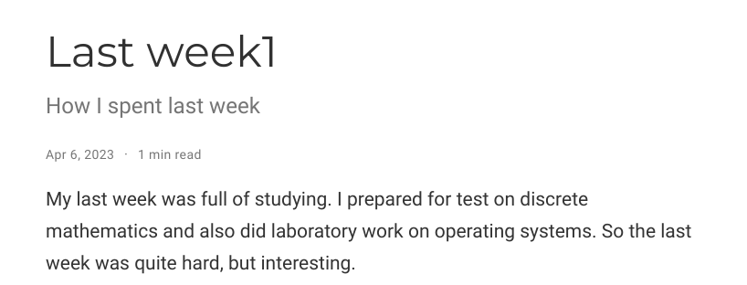

## Создание папки

Создал в терминале папку для поста про Markdown.

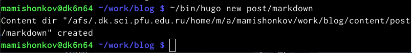

## Текст про Markdown

Написал текст про Markdown.

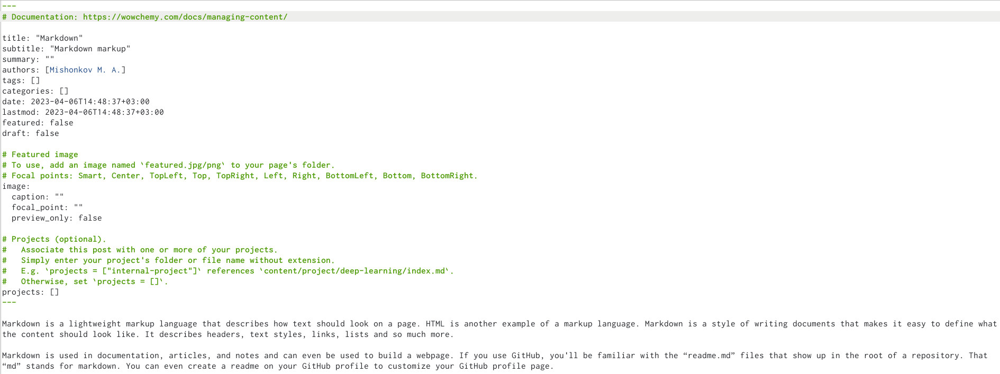

## Проверка изменений на сайте

Проверил изменения на сайте.

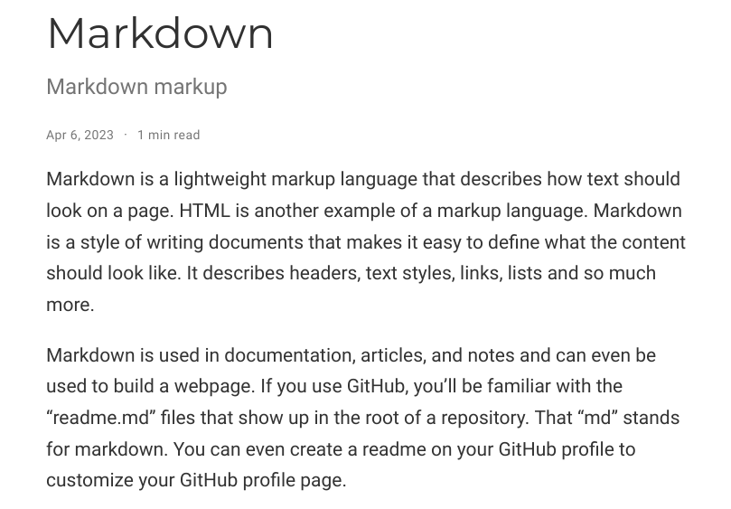

# Заключение 

## Вывод

В ходе выполнения данной лабораторной работы я добавил информацию о своих достижениях на сайт.
