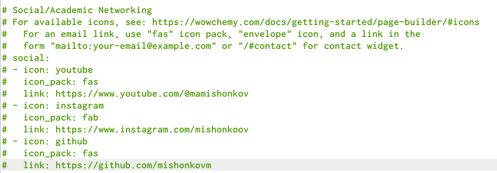
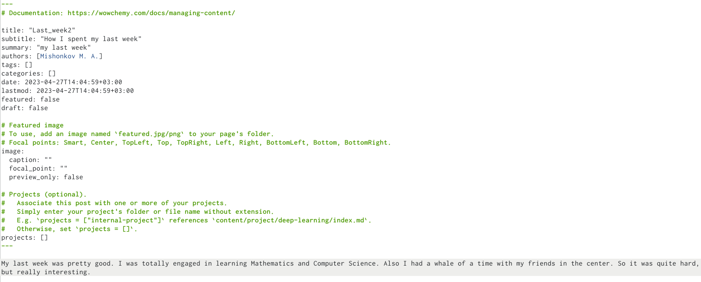
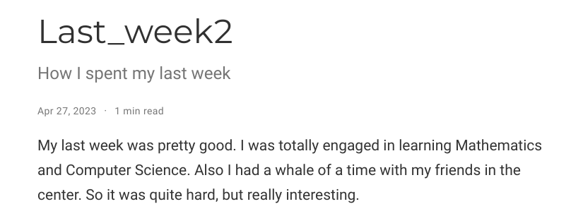
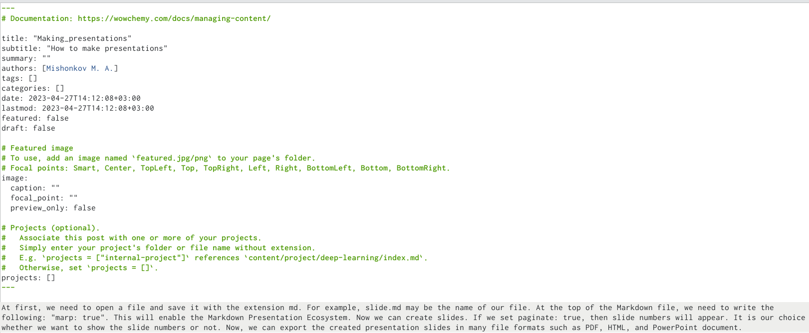
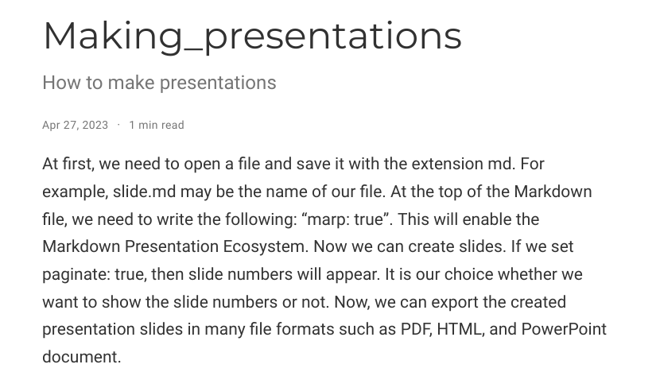

---
## Front matter
lang: ru-RU
title: Отчёт по индивидуальному проекту 
subtitle: stage 4
author:
  - Мишонков М. А.
institute:
  - Российский университет дружбы народов, Москва, Россия
date: 27 апреля 2023

## i18n babel
babel-lang: russian
babel-otherlangs: english

## Formatting pdf
toc: false
toc-title: Содержание
slide_level: 2
aspectratio: 169
section-titles: true
theme: metropolis
header-includes:
 - \metroset{progressbar=frametitle,sectionpage=progressbar,numbering=fraction}
 - '\makeatletter'
 - '\beamer@ignorenonframefalse'
 - '\makeatother'
---

# Вводная часть

## Цель

- Целью выполнения данного этапа индивидуального проекта является приобретение навыков по созданию собственного сайта (добавление ссылок и постов)

# Основная часть

## Добавление ссылок

- Добавил ссылки на аккаунт youtube, instagram и github.

## Добавление поста по прошедшей неделе

- Добавил пост по прошедшей неделе.

## Пост по прошедшей неделе на сайте

- Проверил добавление поста по прошедшей неделе на сайте.

## Добавление поста "making presentations"

- Добавил пост на тему "making presentations in markdown".

## Пост "making presentations" на сайте

- Проверил добавление поста на тему "making presentations in markdown" на сайте. 

# Заключение 

## Вывод

- В ходе выполнения данного этапа индивидуального проекта я приобрёл навыки по созданию собственного сайта (добавление ссылок и постов).
