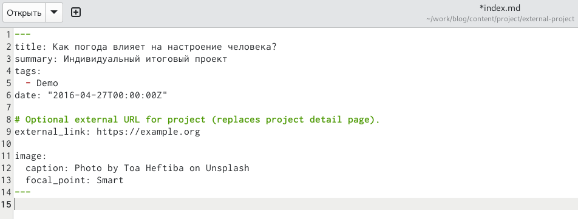
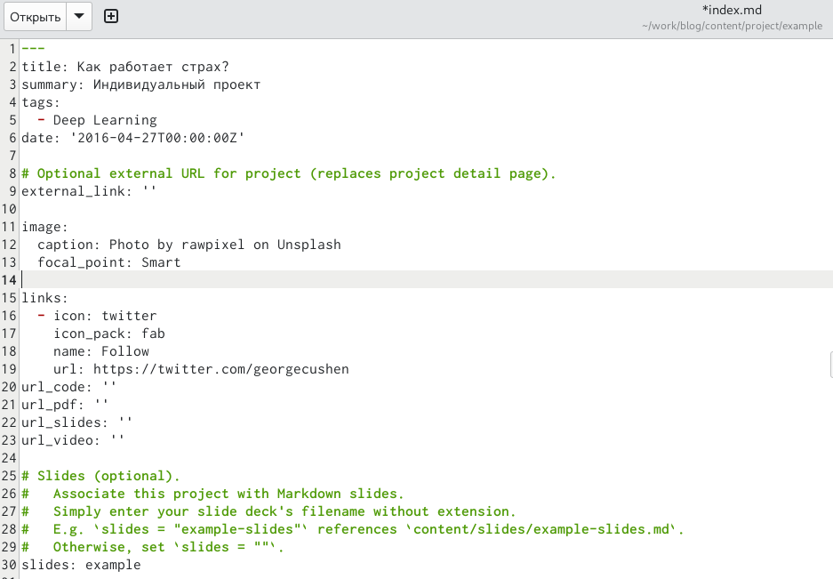
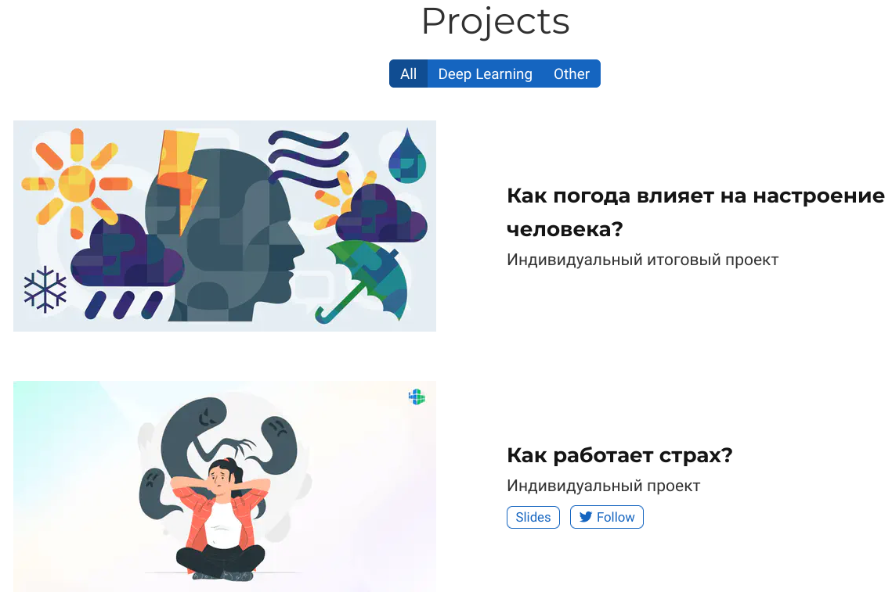
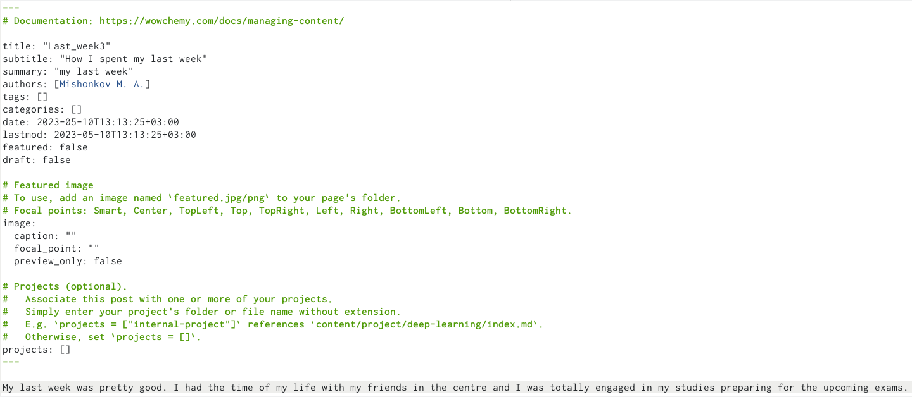
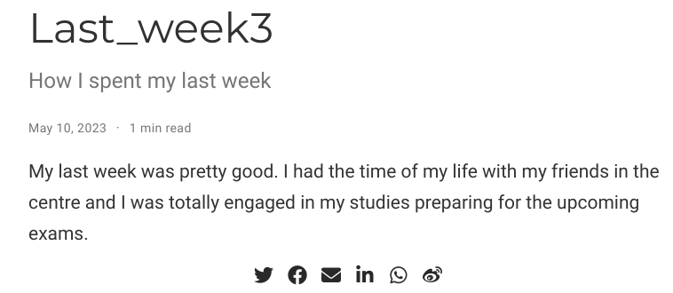
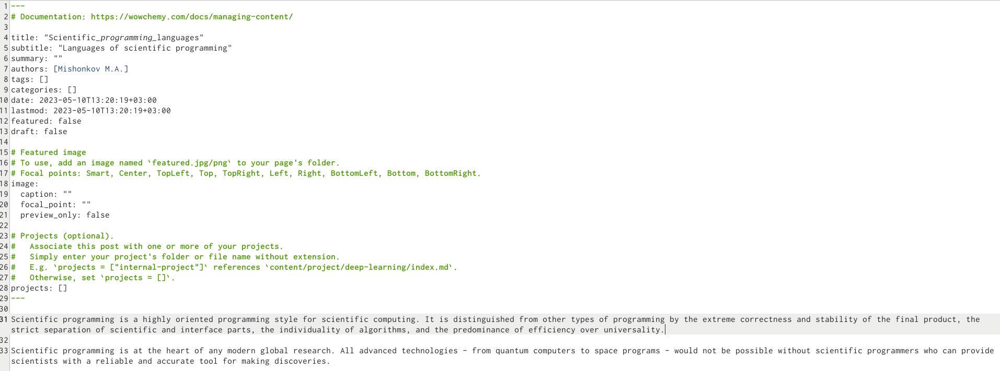
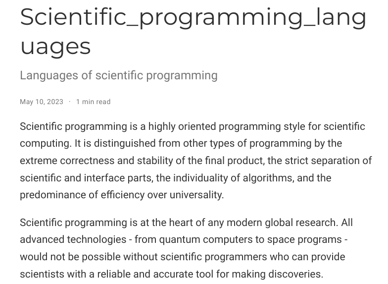

---
## Front matter
lang: ru-RU
title: Отчёт по индивидуальному проекту 
subtitle: stage 5
author:
  - Мишонков М. А.
institute:
  - Российский университет дружбы народов, Москва, Россия
date: 10 мая 2023

## i18n babel
babel-lang: russian
babel-otherlangs: english

## Formatting pdf
toc: false
toc-title: Содержание
slide_level: 2
aspectratio: 169
section-titles: true
theme: metropolis
header-includes:
 - \metroset{progressbar=frametitle,sectionpage=progressbar,numbering=fraction}
 - '\makeatletter'
 - '\beamer@ignorenonframefalse'
 - '\makeatother'
---

# Вводная часть

## Цель

- Целью выполнения данного этапа индивидуального проекта является приобретение навыков по созданию собственного сайта (создание постов и записей для персональных проектов).

# Основная часть

## Запись №1

- Сделал первую запись для персонального проекта.

## Запись №2

- Сделал вторую запись для персонального проекта.

## Проверка изменений на сайте

- Проверил изменения на сайте. 

## Пост по прошедшей неделе

- Сделал пост по прошедшей неделе.

## Проверка изменений на сайте

- Проверил изменения на сайте.

## Пост по языкам научного программирования

- Сделал пост на тему "Языки научного программирования".

## Проверка изменений на сайте

- Проверил изменения на сайте.

# Заключение

## Вывод

- В ходе выполения данного этапа индивидуального проекта я приобрёл навыки по созданию собственного сайта (создание постов и записей для персональных проектов).
